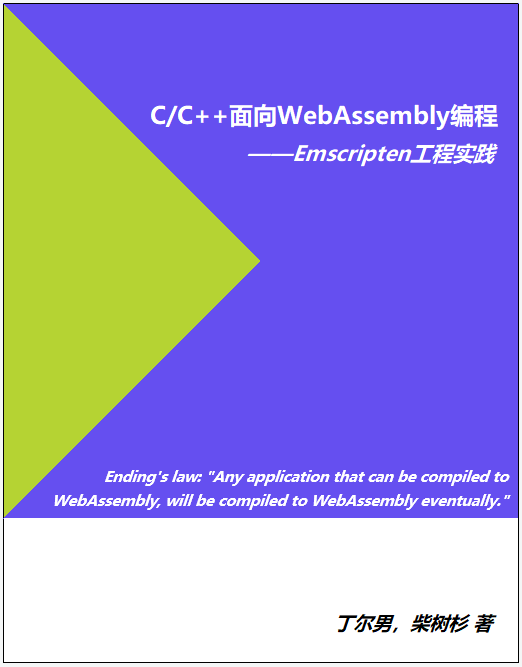

*推广: [《WebAssembly标准入门》开始预售了，欢迎关注！](https://github.com/chai2010/awesome-wasm-zh/blob/master/webassembly-primer.md)([京东购买](https://item.jd.com/12499372.html))*

----

# WebAssembly friendly programming with C/C++

- [English: WebAssembly friendly programming with C/C++](en/README.md)
- Author: Ending，Github [@3dgen](https://github.com/3dgen)
- Author: ChaiShushan，Github [@chai2010](https://github.com/chai2010)，Twitter [@chaishushan](https://twitter.com/chaishushan)
- Repo: https://github.com/3dgen/cppwasm-book

# C/C++面向WebAssembly编程

- [中文：C/C++面向WebAssembly编程](zh/README.md)
- 作者：丁尔男，Github [@3dgen](https://github.com/3dgen)
- 作者：柴树杉，Github [@chai2010](https://github.com/chai2010)，Twitter [@chaishushan](https://twitter.com/chaishushan)
- 项目地址：https://github.com/3dgen/cppwasm-book

# Community
QQ Group: 726475047

# License
