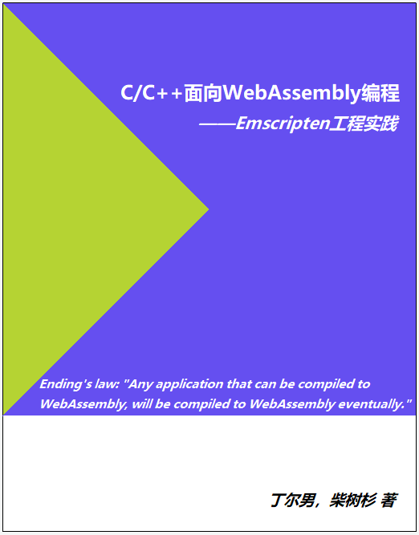

# C/C++面向WebAssembly编程

本书介绍了在工程化应用中使用C/C++进行WebAssembly开发的方法。关于WebAssembly的基础知识可以参考《WebAssembly标准入门》，发售地址：
- 异步：[https://www.epubit.com/book/detail/40619](https://www.epubit.com/book/detail/40619)
- 京东：[https://item.jd.com/12499372.html](https://item.jd.com/12499372.html)

----

- 作者：丁尔男，Github [@3dgen](https://github.com/3dgen)
- 作者：柴树杉，Github [@chai2010](https://github.com/chai2010)，Twitter [@chaishushan](https://twitter.com/chaishushan)
- 项目地址：https://github.com/3dgen/cppwasm-book

## 前言

> *Ending's law: "Any application that can be compiled to WebAssembly, will be compiled to WebAssembly eventually."*

WebAssembly是新一代的Web虚拟机标准，C/C++程序可以通过Emscripten工具链编译为WebAssembly二进制格式.wasm，进而导入网页中供JavaScript调用——这意味着使用C/C++编写的程序将可以直接运行在网页中。

本书从Emscripten基本使用开始介绍了C/C++开发WebAssembly模块的方法；并且以作者在实际工程项目中获取的一手经验为基础，提出了一些一般性的设计原则和技术框架。

笔者认为，一个理想的面向Web的C/C++工程应该对编译目标不敏感——既可以被编译为NativeCode直接运行，也可以被编译为WebAssembly在网页中运行，二者的切换只需要更改运行环境设置，如此方可充分利用现有IDE环境强大的开发、调试、分析、测试等功能，提高工程质量、降低开发成本。

但WebAssembly的运行环境毕竟与本地环境有着巨大的差异，因此为了达到上述理想目标，从整体框架到接口设计甚至到函数间的数据交换层面都必须充分考虑Web环境的特点（或者说限制），而这正是本书所贯彻的“WebAssembly友好”的内涵所在。

## 在线阅读

- [SUMMARY.md](SUMMARY.md)
- https://3dgen.cn/cppwasm-book

## 参考资料

- [《WebAssembly标准入门》](https://www.epubit.com/book/detail/40619)
- WebAssembly资料精选：[https://github.com/chai2010/awesome-wasm-zh](https://github.com/chai2010/awesome-wasm-zh)

## 关注微信公众号 (wasm-hackers) 或 QQ群 (726475047)

----

## 当前进度

* 第0章 WebAssembly简介

* 第1章 [Emscripten快速入门](ch1-quick-guide/readme.md)
  * [x] [1.1 安装Emscripten](ch1-quick-guide/ch1-01-install.md)
  * [x] [1.2 你好，世界！](ch1-quick-guide/ch1-02-helloworld.md)
  * [x] [1.3 胶水代码初探](ch1-quick-guide/ch1-03-glue-code.md)
  * [x] [1.4 编译目标及编译流程](ch1-quick-guide/ch1-04-compile.md)

* 第2章 [C与JavaScript互操作](ch2-c-js/readme.md)
  * [x] [2.1 JavaScript调用C函数](ch2-c-js/ch2-01-js-call-c.md)
  * [x] [2.2 JavaScript函数注入C](ch2-c-js/ch2-02-implement-c-api-in-js.md)
  * [x] [2.3 单向透明的内存模型](ch2-c-js/ch2-03-mem-model.md)
  * [x] [2.4 JavaScript与C交换数据](ch2-c-js/ch2-04-data-exchange.md)
  * [x] [2.5 EM_ASM系列宏](ch2-c-js/ch2-05-em-asm.md)
  * [x] [2.6 emscripten_run_script系列函数](ch2-c-js/ch2-06-run-script.md)
  * [x] [2.7 ccall/cwrap](ch2-c-js/ch2-07-ccall-cwrap.md)
  * [x] [2.8 补充说明](ch2-c-js/ch2-08-ext.md)

* 第3章 [Emscripten运行时](ch3-runtime/readme.md)
  * [x] [3.1 main函数与生命周期](ch3-runtime/ch3-01-main.md)
  * [x] [3.2 消息循环](ch3-runtime/ch3-02-message-loop.md)
  * [x] [3.3 文件系统](ch3-runtime/ch3-03-fs.md)
  * [x] [3.4 内存管理](ch3-runtime/ch3-04-mem.md)
  * [x] [3.5 Module定制及其他](ch3-runtime/ch3-05-module.md)
  * [x] [3.6 小结](ch3-runtime/ch3-06-summary.md)

* 第4章 [WebAssembly友好的一般性方法](ch4-techniques/readme.md)
  * [x] [4.1 消息循环分离](ch4-techniques/ch4-01-msg-loop-detach.md)
  * [x] [4.2 内存对齐](ch4-techniques/ch4-02-align.md)
  * [x] [4.3 使用C接口导出C++对象](ch4-techniques/ch4-03-export-obj.md)
  * [x] [4.4 C++对象生命周期控制](ch4-techniques/ch4-04-obj-life-cycle.md)
  * [x] [4.5 使用C接口注入JavaScript对象](ch4-techniques/ch4-05-import-js-obj.md)
  * [x] [4.6 小心int64](ch4-techniques/ch4-06-int64-issue.md)
  * [x] [4.7 忘掉文件系统](ch4-techniques/ch4-07-forget-about-fs.md)

* 第5章 [网络IO](ch5-net/readme.md)
  * [x] [5.1 WebSocket](ch5-net/ch5-01-websocket.md)
  * [ ] 5.2 ajax
  * [ ] 5.3 fetch
  * [ ] 5.4 一个通用的网络IO小框架

* 第6章 多线程
  * [ ] 6.1 JavaScript中的多线模型
  * [ ] 6.2 一个例子
  * [ ] 6.3 一个通用的多线程小框架

* 第7章 GUI及交互
  * [ ] 7.1 canvas
  * [ ] 7.2 鼠标事件
  * [ ] 7.3 键盘事件
  * [ ] 7.4 触屏事件

* 第8章 工程管理
  * [ ] 8.1 使用Makefile
  * [ ] 8.2 静态库

----

## 版权声明

自有版权，转载请联系作者。

