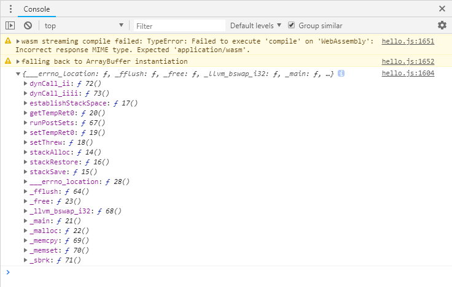

# 1.3 胶水代码初探

打开上一节（1.2）中由Emscripten生成的JavaScript胶水代码`hello.js`，我们可以发现，大多数的操作，都围绕全局对象`Module`展开，而该对象正是Emscripten程序运行时的核心所在。

> **tips** 跳过1.3.1以及1.3.2不会影响后续章节的阅读。但如果您对Emscripten模块载入等细节感兴趣，本节内容将有助于理解胶水代码的结构。随着Emscripten的版本升级，其生成的胶水代码有可能发生变化，本节展示的代码均基于Emscripten 1.38.11。

## 1.3.1 WebAssembly汇编模块载入

WebAssembly汇编模块（既`.wasm`文件）的载入是在`doNativeWasm`函数中完成的。其核心部分如下：

```js
    function instantiateArrayBuffer(receiver) {
      getBinaryPromise().then(function(binary) {
        return WebAssembly.instantiate(binary, info);
      }).then(receiver).catch(function(reason) {
        err('failed to asynchronously prepare wasm: ' + reason);
        abort(reason);
      });
    }
    // Prefer streaming instantiation if available.
    if (!Module['wasmBinary'] &&
        typeof WebAssembly.instantiateStreaming === 'function' &&
        !isDataURI(wasmBinaryFile) &&
        typeof fetch === 'function') {
      WebAssembly.instantiateStreaming(fetch(wasmBinaryFile, { credentials: 'same-origin' }), info)
        .then(receiveInstantiatedSource)
        .catch(function(reason) {
          // We expect the most common failure cause to be a bad MIME type for the binary,
          // in which case falling back to ArrayBuffer instantiation should work.
          err('wasm streaming compile failed: ' + reason);
          err('falling back to ArrayBuffer instantiation');
          instantiateArrayBuffer(receiveInstantiatedSource);
        });
    } else {
      instantiateArrayBuffer(receiveInstantiatedSource);
    }
```

这一堆让人眼花缭乱的代码其实只干了这几件事：

1. 尝试使用`WebAssembly.instantiateStreaming()`方法创建wasm模块的实例；
1. 如果流式创建失败，则改用`WebAssembly.instantiate()`方法创建实例；
1. 成功实例化后的返回值交由`receiveInstantiatedSource()`方法处理。

`receiveInstantiatedSource()`相关代码如下：

```js
    function receiveInstance(instance, module) {
      exports = instance.exports;
      if (exports.memory) mergeMemory(exports.memory);
      Module['asm'] = exports;
      Module["usingWasm"] = true;
      removeRunDependency('wasm-instantiate');
    }

    ......

    function receiveInstantiatedSource(output) {
      // 'output' is a WebAssemblyInstantiatedSource object which has both the module and instance.
      // receiveInstance() will swap in the exports (to Module.asm) so they can be called
      assert(Module === trueModule, 'the Module object should not be replaced during async compilation - perhaps the order of HTML elements is wrong?');
      trueModule = null;
      receiveInstance(output['instance'], output['module']);
    }

```

`receiveInstantiatedSource()`方法调用了`receiveInstance()`方法，后者的这条指令：

```js
      Module['asm'] = exports;
```

将wasm模块实例的导出对象传给了`Module`的子对象`asm`。倘若我们在上述函数中手动添加打印实例导出对象的代码：

```js
    function receiveInstance(instance, module) {
      ... ...
      Module['asm'] = exports;
      console.log(Module['asm']);  //print instance.exports
      ... ...
```

浏览器控制台将输出：



由此可见，上述一系列代码运行后，Module['asm']中保存了WebAssembly实例的导出对象——而导出函数恰是WebAssembly实例供外部调用最主要的入口。

## 1.3.2 导出函数封装

为了方便调用，Emscripten为C/C++中导出的函数提供了封装，在`hello.js`中，我们可以找到大量这样的封装代码：

```js
... ...
var _main = Module["_main"] = function() {
  assert(runtimeInitialized, 'you need to wait for the runtime to be ready (e.g. wait for main() to be called)');
  assert(!runtimeExited, 'the runtime was exited (use NO_EXIT_RUNTIME to keep it alive after main() exits)');
  return Module["asm"]["_main"].apply(null, arguments) };
var _malloc = Module["_malloc"] = function() {
  assert(runtimeInitialized, 'you need to wait for the runtime to be ready (e.g. wait for main() to be called)');
  assert(!runtimeExited, 'the runtime was exited (use NO_EXIT_RUNTIME to keep it alive after main() exits)');
  return Module["asm"]["_malloc"].apply(null, arguments) };
... ...
```

在Emscripten中，C函数导出时，函数名前会添加下划线“_”，由此可知上述代码分别提供了`main()`以及`malloc()`函数的封装；而`var _main`以及`Module._main`对应的，都是`hello.cc`中的`main()`函数。我们可以在浏览器控制台中手动执行`_main()`以及`Module._main()`对此进行检验：


不出所料，二者都执行了C代码中的`main()`函数，输出了“你好，世界！”。

## 1.3.3 异步加载

WebAssembly实例是通过`WebAssembly.instantiateStreaming()`/`WebAssembly.instantiate()`方法创建的，而这两个方法均为异步调用，这意味着.js文件加载完成时Emscripten的Runtime并未准备就绪。倘若我们修改`test.html`，载入.js后立即执行`Module._main()`：

```html
  <body>
    <script src="hello.js"></script>
    <script>
      Module._main();
    </script>
  </body>
```

控制台将输出以下错误信息：

```
Assertion failed: you need to wait for the runtime to be ready (e.g. wait for main() to be called)
```

解决这一问题需要建立一种Runtime准备就绪时的通知机制，为此Emscripten提供了多种解决方案，最简单的方法是在`main()`函数中发出通知，但是对多数纯功能性的模块来说，`main()`函数并不是必须的，因此笔者较常使用方法的是不依赖于`main()`函数的`onRuntimeInitialized`回调，该方法的例子如下：

```html
  <body>
    <script>
      Module = {};
      Module.onRuntimeInitialized = function() {
        //do sth.
        Module._main();
      }
    </script>
    <script src="hello.js"></script>
  </body>
```

其基本思路是在`Module`初始化前，向`Module`中注入一个名为`onRuntimeInitialized`的方法，Emscripten的Runtime就绪后，将会回调该方法。在`hello.js`中，我们可以观察到该回调的调用过程：

```js
function run(args) {
  ... ...
    ensureInitRuntime();

    preMain();

    if (Module['onRuntimeInitialized']) Module['onRuntimeInitialized']();

    if (Module['_main'] && shouldRunNow) Module['callMain'](args);

    postRun();
  ... ...
}
```

> **tips** 本书例子代码中，将大量使用`onRuntimeInitialized`回调方法作为测试函数入口。