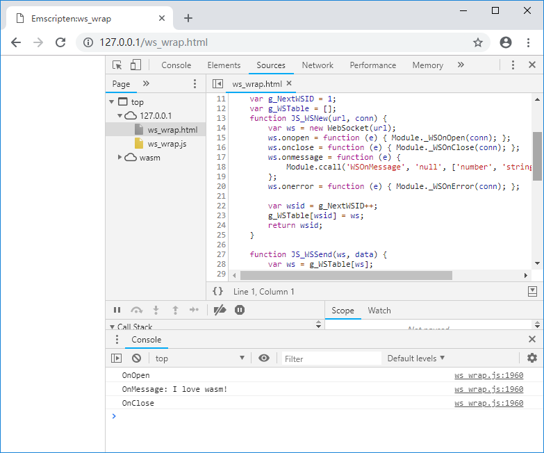

# 5.1 WebSocket

本节将介绍在Emscripten中使用WebSocket的方法。

## 5.1.1 WebSocket简介

WebSocket协议在2011年已成为国际标准，目前主流浏览器均已支持。与HTTP协议相比，WebSocket有如下特点：

1. WebSocket是长连接协议，一次握手连接成功后，可以多次发送数据；
1. 不同于HTTP只能由客户端发起单向请求，WebSocket是双向协议，连接建立后，客户端和服务器都可以主动向对方发送数据；
1. WebSocket既可以发送文本数据，也可以发送二进制数据；
1. WebSocket没有同源限制；
1. 非加密的WebSocket以`ws`为协议标识符，使用TCP协议封装；加密的WebSocket以`wss`为协议标识符，使用TLS协议封装。

为了方便测试，我们先创建一个简单的WebSocket echo服务。笔者在此选择Go语言来创建该服务，代码如下：

```go
//ws_echo.go
package main

import (
	"fmt"
	"log"
	"net/http"
	"syscall"

	"golang.org/x/net/websocket"

	"os"
	"os/signal"
)

func main() {
	log.Println("ws_echo start...")

	wsPort := 40001
	go func() {
		log.Println(fmt.Sprint("WebSocket:", wsPort, " Listening ..."))
		http.Handle("/ws_echo", websocket.Handler(webSocketHandler))
		err := http.ListenAndServe(fmt.Sprint(":", wsPort), nil)
		if err != nil {
			panic("ListenAndServe: " + err.Error())
		}
	}()

	httpPort := 80
	go func() {
		log.Println(fmt.Sprint("http:", httpPort, " Listening ..."))
		err := http.ListenAndServe(fmt.Sprint(":", httpPort),
			http.FileServer(http.Dir("./")))
		if err != nil {
			panic("ListenAndServe: " + err.Error())
		}
	}()

	ch := make(chan os.Signal, 1)
	signal.Notify(ch, syscall.SIGINT, syscall.SIGTERM)
	log.Printf("ws_echo quit (%v)\n", <-ch)
}

func webSocketHandler(ws *websocket.Conn) {
	ws.PayloadType = websocket.TextFrame
	defer ws.Close()

	rtemp := make([]byte, 32768)
	for {
		n, err := ws.Read(rtemp)
		if err != nil {
			log.Println("Error:Read:", err)
			return
		}

		n, err = ws.Write(rtemp[:n])
	}
}
```

上述代码在80端口启动了当前文件夹的静态页面服务用于发布测试用的html文件；并在40001端口的`/ws_echo`路径启动了WebSocket echo服务，该服务建立WebSocket连接后，会将客户端发来的数据原样发回去。安装Go语言环境后，使用下列命令启动程序：

```
go run ws_echo.go
```

## 5.1.2 在JavaScript中使用WebSocket

在JavaScript中使用`WebSocket()`构造函数创建WebSocket对象，`WebSocket.send()`方法用于发送数据，`WebSocket.onmessage()`属性用于指定处理接收到的数据的回调函数，例如：

```js
//websocket_js.html
	var ws = new WebSocket("ws://localhost:40001/ws_echo");
	ws.onopen = function(e) {
	  console.log("ws.onopen");
	  ws.send("Hello world!");
	}
	
	ws.onmessage = function(e) {
	  console.log("ws.onmessage: " + e.data);
	  ws.close();
	}
	
	ws.onclose = function(e) {
	  console.log("ws.onclose");
 	}
    
    ws.onerror = function(e) {
	  console.log("ws.onerror");
	}
```

上述代码创建了与`ws://localhost:40001/ws_echo`的WebSocket连接，连接成功后发送了"Hello world!"，WebSocket echo服务将收到的数据发回后，`ws.onmessage()`将收到的数据通过日志打印：


## 5.1.3 WebSocket对象的C接口封装

通过前述介绍可知：与大多数JavaScript异步IO操作类似，WebSocket是通过异步回调的方式处理数据接收、连接状态变更等行为，因此WebSocket对象的C接口封装分为两个部分：

1. 由JavaScript实现，供C调用。包括创建WebSocket对象、发送数据等主动行为；
1. 由C实现，供JavaScript调用。包括各种事件的回调。

来看C部分的代码：

```cpp
//ws_wrap.cpp
struct WS_WRAPPER;
struct WS_CONNECTOR;

//imp by JavaScript, call by C:
EM_PORT_API(struct WS_WRAPPER*) WSNew(const char *url, struct WS_CONNECTOR *conn);
EM_PORT_API(int) WSSend(struct WS_WRAPPER *ws, const char *data);
EM_PORT_API(void) WSDelete(struct WS_WRAPPER *ws);

class CWSConnector{
public:
	CWSConnector(const char *url){
		m_ws = WSNew(url, (struct WS_CONNECTOR*)this);
	}
	virtual ~CWSConnector(){
		if (m_ws){
			WSDelete(m_ws);
			m_ws = NULL;
		}
	}
	
	void OnOpen(){
		printf("OnOpen\n");
		WSSend(m_ws, "I love wasm!");
	}
	
	void OnClose(){
		printf("OnClose\n");
	}
	
	void OnMessage(const char* data){
		printf("OnMessage: %s\n", data);
		WSDelete(m_ws);
		m_ws = NULL;
	}
	
	void OnError(){
		printf("OnError\n");
	}
	
	struct WS_WRAPPER *m_ws;
};

//imp by C, call by JavaScript:
EM_PORT_API(void) WSOnOpen(struct WS_CONNECTOR *conn){
	if (conn == NULL) return;
	CWSConnector *pc = (CWSConnector*)conn;
	pc->OnOpen();
}

EM_PORT_API(void) WSOnClose(struct WS_CONNECTOR *conn){
	if (conn == NULL) return;
	CWSConnector *pc = (CWSConnector*)conn;
	pc->OnClose();
}

EM_PORT_API(void) WSOnMessage(struct WS_CONNECTOR *conn, const char* data){
	if (conn == NULL) return;
	CWSConnector *pc = (CWSConnector*)conn;
	pc->OnMessage(data);
}

EM_PORT_API(void) WSOnError(struct WS_CONNECTOR *conn){
	if (conn == NULL) return;
	CWSConnector *pc = (CWSConnector*)conn;
	pc->OnError();
}

int main(){
	new CWSConnector("ws://localhost:40001/ws_echo");
}
```

注意函数`WSNew(const char *url, struct WS_CONNECTOR *conn)`的参数：在创建WebSocket封装对象时，除了提供欲连接WebSocket服务的`url`，还额外传入了`struct WS_CONNECTOR *conn`，后续事件回调时，与该WebSocket对象关联的`conn`会作为事件参数传入。这样当程序同时启动了多个WebSocket连接时，可以为每个WebSocket连接分配一个专用的类实例用于处理其事件。

导入库部分代码如下：

```js
//pkg.js
mergeInto(LibraryManager.library, {
    WSNew: function (url, conn) {
        return JS_WSNew(Pointer_stringify(url), conn);
    },

    WSSend: function (ws, data) {
        return JS_WSSend(ws, Pointer_stringify(data));
    },
	
	WSDelete: function (ws) {
		return JS_WSDelete(ws);
	}
})
```

导入库调用的JavaScript方法如下：

```js
//ws_wrap.html
	var g_NextWSID = 1;
	var g_WSTable = [];	
	function JS_WSNew(url, conn) {
		var ws = new WebSocket(url);
		ws.onopen = function (e) { Module._WSOnOpen(conn); };
		ws.onclose = function (e) { Module._WSOnClose(conn); };
		ws.onmessage = function (e) {
			Module.ccall('WSOnMessage', 'null', ['number', 'string'], [conn, e.data]);
		};
		ws.onerror = function (e) { Module._WSOnError(conn); };
	
		var wsid = g_NextWSID++;
		g_WSTable[wsid] = ws;
		return wsid;
	}
	
	function JS_WSSend(ws, data) {
		var ws = g_WSTable[ws];
		ws.send(data);
	}
	
	function JS_WSDelete(ws) {
		var ws = g_WSTable[ws];
		ws.close();
	}
```

整套程序综合应用了导出C++对象（4.3节）、JavaScript对象注入C（4.5节）、ccall（2.7节）等技术。使用下列命令编译：

```
emcc  ws_wrap.cpp --js-library pkg.js -s "EXTRA_EXPORTED_RUNTIME_ME
THODS=['ccall']" -o ws_wrap.js
```

启动WebSocket echo服务，浏览页面，控制台输出如下：



出于简化代码考虑，本节给出的例子未处理`main()`函数内存泄漏、反复调用`WSNew()`导致`g_NextWSID`溢出等情况。由于IO操作往往与程序逻辑强相关，实际项目中需要考虑的问题多种多样，在此无法尽述。