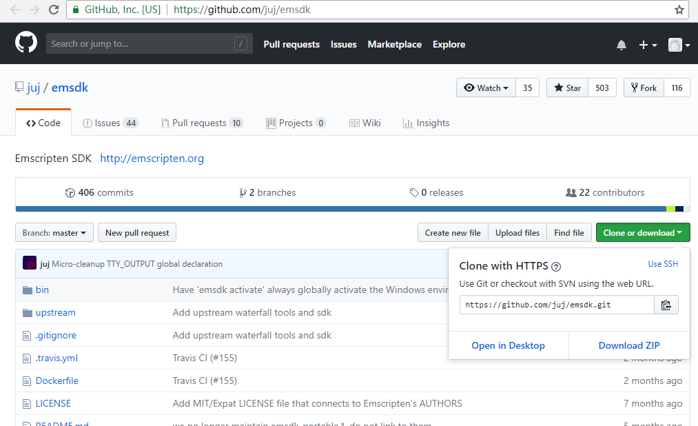

# 1.1 Installing Emscripten

Emscripten includes the complete set of tools include LLVM/Node.js/Python/Java/etc. that required to compile C/C++ code into WebAssembly, which does not depend on any other compiler environment.

## 1.1.1 Installing Emscripten using the `emsdk` command line

Emsdk is a set of Python 2 based scripts, so you need to install Python 2.7.12 or newer first . Python download address: [https://www.python.org/downloads/] (https://www.python.org/downloads/)

### `Downloading emsdk`

Once Python is ready, download the emsdk toolkit. If you're familiar with git, just use the following command to clone the emsdk library to local folder:

```
git clone https://github.com/juj/emsdk.git
```

If you are not familiar with git, you can visit [https://github.com/juj/emsdk](https://github.com/juj/emsdk) then download the emsdk library and extract it via "Clone or download" at the top right of the page. Figure:



### `Installing and activating Emscripten`

For MacOS or Linux users, `cd` into the folder where emsdk is located in a terminal and execute the following command:

```
./emsdk update
./emsdk install latest
```

Emsdk will download and install the latest components of Emscripten from the Internet automatically. After the installation is complete, execute the following command to activate Emscripten:

```
./emsdk activate latest
```

Everytime a new terminal instance was created, you should `cd` into the folder where emsdk is located, and execute the following command to activate Emscripten environment variables for the current terminal:

```
source ./emsdk_env.sh
```

The installation on Windows is basically the same, the difference is to use `emsdk.bat` instead of `emsdk`, use `emsdk_env.bat` instead of `source./emsdk_env.sh`. The following commands are used to install and activate Emscripten:

```
emsdk.bat update
emsdk.bat install latest
emsdk.bat activate latest
```

The following commands are used to activate Emscripten environment variables:

```
emsdk_env.bat
```

> **tips** Installation and activation only need to be run once. On Windows, if you want to register Emscripten's environment variables as global variables, you can run `emsdk.bat activate latest --global` as an administrator. This will change the system environment variables so that you don't need to run `emsdk_env.bat` in every newly created terminal, this method has potential side effects: it changes environment variables to Emscripten's built-in Node.js/Python/Java, and if other versions of these components are installed on the system, conflicts may arise.

## 1.1.2 Installing Emscripten in a Docker environment

If you are familiar with Docker, you can also install Emscripten in a Docker environment. Emscripten in the Docker is completely isolated and does not have any impact on the host environment. The `apiaryio/emcc` image provides a complete Embscripten package.

For example, the following command will compile hello.c using `emcc`:

```
$ docker run --rm -it -v `pwd`:/src apiaryio/emcc emcc hello.c
```

The parameter `--rm` indicates that the container resource is deleted after the end of the run. The parameter `-it` indicates the standard input and output of the orientation container to the command line environment. The parameter `-v 'pwd':/src` indicates that the current directory is mapped to The /src directory of the container. The following `apiaryio/emcc` is the name of the corresponding mirror of the container, which contains the Emscripten development environment. The final emcc parameter represents the command that is running in the container, which is consistent with the local emcc command.

## 1.1.3 Verifying the installation

`emcc` is the core command of Emscripten. If the installation and activation is correct, execute `emcc -v` and you'll see version information like this:

```
emcc -v
emcc (Emscripten gcc/clang-like replacement + linker emulating GNU ld) 1.38.11
clang version 6.0.1  (emscripten 1.38.11 : 1.38.11)
Target: x86_64-pc-windows-msvc
Thread model: posix
InstalledDir: E:\Tool\emsdk\clang\e1.38.11_64bit
INFO:root:(Emscripten: Running sanity checks)
```

For more details on the installation of Emscripten, you can visit: [http://kripken.github.io/emscripten-site/docs/getting_started/downloads.html] (http://kripken.github.io/emscripten-site/ Docs/getting_started/downloads.html)

Emscripten has officially supported WebAssembly since v1.37.3, users who have installed older versions of Emscripten should upgrade to the latest. The contents of this book are based on Emscripten 1.38.11.