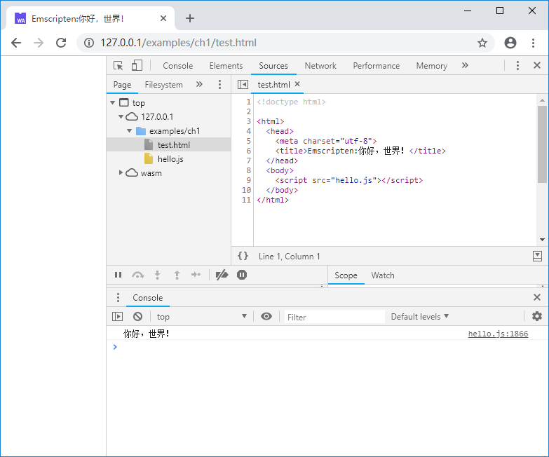

# 1.2 Hello, world!

This section starts with the classic "Hello, world!" example and shows you how to use Emscripten to compile C/C++ code and run tests.

## 1.2.1 Building wasm

Create a new C source file named `hello.cc`. To correctly identify the Chinese string, save it with UTF8 encoding:

```c
//hello.cc
#include <stdio.h>

int main() {
    printf("你好，世界！\n");
    return 0;
}
```

> **info** "你好，世界！" is "Hello, world!" in Chinese.

Open the terminal, use the `emsdk_env` command described in section 1.1 to set up the Emscripten environment variable, `cd` to the folder where `hello.cc` is located, and execute the following command:

```
emcc hello.cc
```

Two files will be created under the folder: `a.out.wasm` and `a.out.js`. The `a.out.wasm` is the WebAssembly binary code file compiled from the C source file; `a.out.js` is the glue code generated by Emscripten, which contains the Emscripten runtime environment and the WebAssembly wrap code, import `a.out.js` will automatically complete the complicated works such as: downloading and compiling WebAssembly Module, instantiating Module, initiating Emscripten runtime, and so on.

The `-o` option can be used to specify the output file name of `emcc`. The following command will output `hello.wasm` and `hello.js`:

```
emcc hello.cc -o hello.js
```

## 1.2.2 Running on web page

Unlike native code, the WebAssembly binary code compiled from C/C++ cannot be run directly. We need to import it into the web page and browse it through the browser.

create a new web page named `test.html` in the same folder:

```html
<!doctype html>

<html>
  <head>
    <meta charset="utf-8">
    <title>Emscripten:你好，世界！</title>
  </head>

  <body>
    <script src="hello.js"></script>
  </body>
</html>
```

After serving up the folder, use the browser to open `test.html`, open the developer panel, we will see the following output in the console:



## 1.2.3 Run in Node.js

The WebAssembly can be run not only on web pages, but also in Node.js v8.0 and above. Emscripten comes with the Node.js environment, so we can test the program just using `node`:

```
> node hello.js
你好，世界！
```

## 1.2.4 Generate test page using Emscripten

When using the `emcc` command, if the output file suffix is specified as `.html`, then Emscripten will not only generate the WebAssembly binary code(.wasm), glue code(.js), but also generate an additional Emscripten test page, for example if you use the following command:

```
emcc hello.cc -o hello.html
```

You will get `hello.wasm`, `hello.js`, and `hello.html`. Where `hello.wasm`, `hello.js` are consistent with the contents of the file obtained with `-o hello.js`. After serving up the folder, use the browser to open `hello.html`, the page displays as follows:


Below the page is an input and output area that simulates a standard console. The smaller black area above it is a canvas that can be used to simulate a graphical interface. The page automatically loads hello.js and correctly outputs "你好，世界！" on the console.

The test pages generated by Emscripten are easy to use, but the amount of code is large, which is not conducive to explanation. Therefore this book uses manually written web pages for testing.