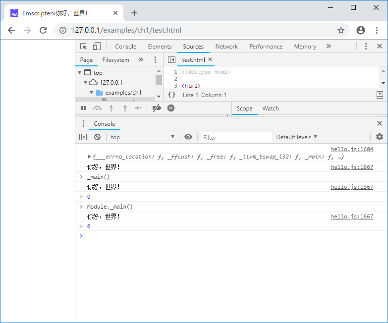

# 1.3 Taking a look at the Emscripten glue code

Open the glue code `hello.js` generated by Emscripten in the previous section (1.2), we can see that most of the code are around the global object `Module`, which is the core of the Emscripten program runtime.

> **tips** Skip 1.3.1 and 1.3.2 will not affect the reading of subsequent chapters. But if you are interested in the details of the Emscripten module loading, this section will help you understand the structure of the glue code. As the version of Emscripten is upgraded, the glue code may change. The code shown in this section is based on Emscripten 1.38.11.

## 1.3.1 Loading WebAssembly Module

The loading of the WebAssembly Module(`.wasm` file) is done in the `doNativeWasm()` function. The core parts are as follows:

```js
    function instantiateArrayBuffer(receiver) {
      getBinaryPromise().then(function(binary) {
        return WebAssembly.instantiate(binary, info);
      }).then(receiver).catch(function(reason) {
        err('failed to asynchronously prepare wasm: ' + reason);
        abort(reason);
      });
    }
    // Prefer streaming instantiation if available.
    if (!Module['wasmBinary'] &&
        typeof WebAssembly.instantiateStreaming === 'function' &&
        !isDataURI(wasmBinaryFile) &&
        typeof fetch === 'function') {
      WebAssembly.instantiateStreaming(fetch(wasmBinaryFile, { credentials: 'same-origin' }), info)
        .then(receiveInstantiatedSource)
        .catch(function(reason) {
          // We expect the most common failure cause to be a bad MIME type for the binary,
          // in which case falling back to ArrayBuffer instantiation should work.
          err('wasm streaming compile failed: ' + reason);
          err('falling back to ArrayBuffer instantiation');
          instantiateArrayBuffer(receiveInstantiatedSource);
        });
    } else {
      instantiateArrayBuffer(receiveInstantiatedSource);
    }
```

This dazzling array of code actually only does a few things:

1. Try to create an `WebAssembly.Instance` using the `WebAssembly.instantiateStreaming()` function;
1. If the streaming creation fails, use the `WebAssembly.instantiate()` function instead to create an `WebAssembly.Instance`;
1. The returned `WebAssembly.Instance` after successful instantiation is handled by the `receiveInstantiatedSource()` function.

`receiveInstantiatedSource()` related codes are as follows:

```js
    function receiveInstance(instance, module) {
      exports = instance.exports;
      if (exports.memory) mergeMemory(exports.memory);
      Module['asm'] = exports;
      Module["usingWasm"] = true;
      removeRunDependency('wasm-instantiate');
    }

    ......

    function receiveInstantiatedSource(output) {
      // 'output' is a WebAssemblyInstantiatedSource object which has both the module and instance.
      // receiveInstance() will swap in the exports (to Module.asm) so they can be called
      assert(Module === trueModule, 'the Module object should not be replaced during async compilation - perhaps the order of HTML elements is wrong?');
      trueModule = null;
      receiveInstance(output['instance'], output['module']);
    }

```

The `receiveInstantiatedSource()` function calls the `receiveInstance()` function. The exported object of the instance is passed to the `Module['asm']` by the following instruction:

```js
      Module['asm'] = exports;
```

If we manually add the code of printing the exported object of the instance in the above function:

```js
    function receiveInstance(instance, module) {
      ... ...
      Module['asm'] = exports;
      console.log(Module['asm']);  //print instance.exports
      ... ...
```

The console will output：


It can be seen that after the above series of code runs, `Module['asm']` saves the exported object of the WebAssembly instance - and the exported function is just the most important entry for the external call of the WebAssembly instance.

## 1.3.2 Wrapping exported fucntions

In order to facilitate the call, Emscripten provides wrappers for the functions exported from C/C++. In `hello.js`, we can find a lot of wrap code like these:

```js
... ...
var _main = Module["_main"] = function() {
  assert(runtimeInitialized, 'you need to wait for the runtime to be ready (e.g. wait for main() to be called)');
  assert(!runtimeExited, 'the runtime was exited (use NO_EXIT_RUNTIME to keep it alive after main() exits)');
  return Module["asm"]["_main"].apply(null, arguments) };
var _malloc = Module["_malloc"] = function() {
  assert(runtimeInitialized, 'you need to wait for the runtime to be ready (e.g. wait for main() to be called)');
  assert(!runtimeExited, 'the runtime was exited (use NO_EXIT_RUNTIME to keep it alive after main() exits)');
  return Module["asm"]["_malloc"].apply(null, arguments) };
... ...
```

In Emscripten, when the C function is exported, the underscore "_" is added before the function name. This shows that the above code provides the wrappers of `main()` and `malloc()` functions respectively. `var _main` and `Module._main` are the corresponding `main()` function in `hello.cc`. We can verify this by manually executing `_main()` and `Module._main()` in the browser's console:



Unsurprisingly, both executed the C function `main()` and output "你好，世界！".

## 1.3.3 Asynchronous loading

The WebAssembly instance is created by the `WebAssembly.instantiateStreaming()`/`WebAssembly.instantiate()` method, and both methods are asynchronous, which means that the Emscripten runtime is not ready when the .js file is loaded. If we modify `test.html`, execute `Module._main()` immediately after loading .js like this:

```html
  <body>
    <script src="hello.js"></script>
    <script>
      Module._main();
    </script>
  </body>
```

The console will output the following error message:

```
Assertion failed: you need to wait for the runtime to be ready (e.g. wait for main() to be called)
```

Solving this problem requires establishing a notification mechanism when the runtime is ready. For this, Emscripten provides a variety of solutions. The easiest way is to fire a notification in the `main()` function, but for many modules, the `main()` function is not required, so the method we often used is the `onRuntimeInitialized` callback which does not depend on the `main()`. An example of this method is shown as follow:

```html
  <body>
    <script>
      Module = {};
      Module.onRuntimeInitialized = function() {
        //do sth.
        Module._main();
      }
    </script>
    <script src="hello.js"></script>
  </body>
```

The basic idea is to inject a method called `onRuntimeInitialized` into `Module` before the `Module` is initialized. After the runtime of Emscripten is ready, the method will be called. In `hello.js`, we can observe the calling process of the callback:

```js
function run(args) {
  ... ...
    ensureInitRuntime();

    preMain();

    if (Module['onRuntimeInitialized']) Module['onRuntimeInitialized']();

    if (Module['_main'] && shouldRunNow) Module['callMain'](args);

    postRun();
  ... ...
}
```

> **tips** In the sample code of this book, the `onRuntimeInitialized` callback method is used extensively as the test function entry.