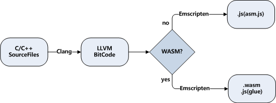

# 1.4 Selecting compilation target

## 1.4.1 asm.js and WebAssembly

In fact, Emscripten was born earlier than WebAssembly. For a long time before the WebAssembly appeared, Emscripten's compilation target was `asm.js`.

When the compilation target is `asm.js`, the C/C++ code is compiled into a .js file; When the compilation target is WebAssembly, the C/C++ code is compiled into a .wasm file and the corresponding .js glue code file. The two compilation targets are not much different from an application perspective: the memory models they use, the function export rules, and the way JavaScript and C call each other are all consistent. The main difference we encountered in actual use is the synchronous and asynchronous loading of the module: when the compilation target is `asm.js`, since the C/C++ code is completely converted to `asm.js`, the module can be considered to be loaded synchronously; when WebAssembly is used as the compilation target the module is loaded asynchronously. When projects targeting `asm.js` are switched to WebAssembly, a common problem is that the `Module` is used before the Emscritpen runtime is ready. This needs to be circumvented according to 1.3.3.

As of v1.38.1, the default compilation target for Emscripten is switched to WebAssembly. If you still need to use `asm.js` as compilation target, just add `-s WASM=0` parameter when calling `emcc`, for example:

```
> emcc hello.cc -s WASM=0 -o hello_asm.js
```

WebAssembly is a binary format, and its small size and high execution efficiency are its inherent advantages. For comparison, the `hello_asm.js` generated by the above command is about 300KB, and the `hello.js` of the WebAssembly version and `hello.wasm` are less than 150KB. When compatibility allows, you should try to use WebAssembly as the compilation target.

## 1.4.2 Compilation process

The process of `emcc` compiling C/C++ code is as follows:



The C/C++ code is first compiled into `LLVM BitCode` by `Clang` and then compiled to `asm.js` or `wasm` according to different targets.

Since `Clang` is called internally, `emcc` supports most of the `Clang` compile options, such as `-s OPTIONS=VALUE`/`-O`/`-g`/etc. In addition, in order to adapt to the Web environment, `emcc` has added some unique options, such as `--pre-js <file>`/`--post-js <file>` and so on.

Similar to `Clang`, all options for `emcc` can be viewed by the following command:

```
emcc --help
```