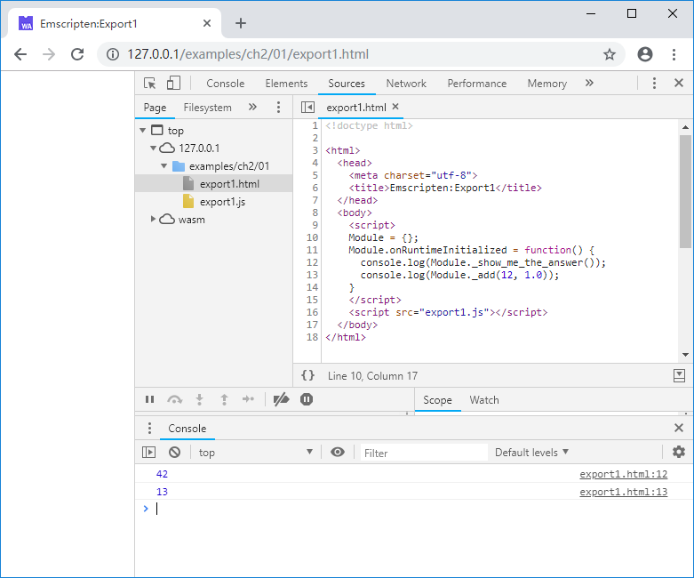
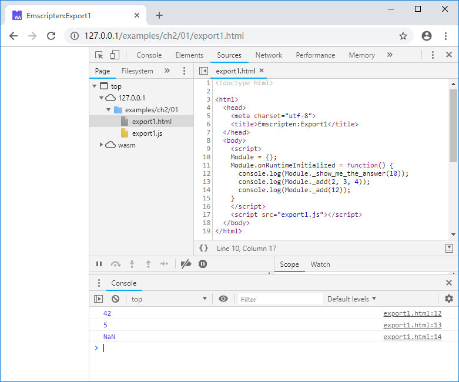

# 2.1 Calling compiled C functions from JavaScript

A functional WebAssembly module must provide a function interface for callers. In 1.3, we show the way to call the C/C++ entry function `main()` via `Module._main()` - if the `main()` function exists. This section describes the general method to call compiled C functions from JavaScript.

## 2.1.1 Define function export macro

In order to facilitate the function export, we need to define a function export macro, which needs to achieve the following goals:

1. Use C-style symbol declarations. We know that due to the introduction of function overloading, templates and other features, the name decoration rule of C++ is very complicated, and different C++ compilers have different rules. Without additional processing, when we create a function in C++, it is difficult to predict its name in the final compilation - this is completely different from C. So when we try to export global functions other than `main()` to JavaScript, we must enforce C-style symbol declarations to keep the function names readable in JavaScript.
2. Avoid functions being deleted by the optimizer at compile time due to lack of references. If a exported function is only called by JavaScript and is never used in C/C++, when some optimization options (such as `-O2`) are turned on, the function may be deleted by the compiler optimization, so the compile should be informed that these functions must be retained, cannot be deleted, and cannot be renamed.
3. In order to maintain sufficient compatibility, macros need to automatically switch the appropriate behavior according to different environments - native code and Emscripten, pure C and C++.

> **info** `main()` is the main entry point of C/C++ program, and its name decoration rule is special. Therefore, even if there is no special constraint in C++, the final symbol is still `_main()`

> **tips** As mentioned in the preface, we wish to write modules that insensitive to the compilation target. The third point above is the product of this concept.

To fullfill the above, we define the `EM_PORT_API` macro as follows:

```C
#ifndef EM_PORT_API
#	if defined(__EMSCRIPTEN__)
#		include <emscripten.h>
#		if defined(__cplusplus)
#			define EM_PORT_API(rettype) extern "C" rettype EMSCRIPTEN_KEEPALIVE
#		else
#			define EM_PORT_API(rettype) rettype EMSCRIPTEN_KEEPALIVE
#		endif
#	else
#		if defined(__cplusplus)
#			define EM_PORT_API(rettype) extern "C" rettype
#		else
#			define EM_PORT_API(rettype) rettype
#		endif
#	endif
#endif
```

- `__EMSCRIPTEN__` macro is used to detect if it's a Emscripten environment.
- `__cplusplus` is used to detect if it's a C++ environment.
- `EMSCRIPTEN_KEEPALIVE` is a unique Emscripten macro tells the compiler that subsequent functions must be preserved during optimization and the function should be exported.

In Emscripten, function declaration with `EM_PORT_API`:

```c
EM_PORT_API(int) Func(int param);
```

will eventually be expanded as follows:

```c
#include <emscripten.h>
Extern "C" int EMSCRIPTEN_KEEPALIVE Func(int param);
```

## 2.1.2 Calling C functions from JavaScript

According to the analysis of the glue code in 1.3, we know that the `Module` object in JavaScript has encapsulated the function exported from the C. The name of the wrap method is the underscore `_` plus the function name in C. For example, we create a C source code file `export1.cc` as follows:

```c
//export1.cc
#ifndef EM_PORT_API
#	if defined(__EMSCRIPTEN__)
#		include <emscripten.h>
#		if defined(__cplusplus)
#			define EM_PORT_API(rettype) extern "C" rettype EMSCRIPTEN_KEEPALIVE
#		else
#			define EM_PORT_API(rettype) rettype EMSCRIPTEN_KEEPALIVE
#		endif
#	else
#		if defined(__cplusplus)
#			define EM_PORT_API(rettype) extern "C" rettype
#		else
#			define EM_PORT_API(rettype) rettype
#		endif
#	endif
#endif

#include <stdio.h>

EM_PORT_API(int) show_me_the_answer() {
	return 42;
}

EM_PORT_API(float) add(float a, float b) {
	return a + b;
}
```

Compile it to WebAssembly binary code using the `emcc` command:

```
emcc export1.cc -o export1.js
```

Create `export1.html` as follows:

```html
<!doctype html>

<html>
  <head>
    <meta charset="utf-8">
    <title>Emscripten:Export1</title>
  </head>
  <body>
    <script>
    Module = {};
    Module.onRuntimeInitialized = function() {
      console.log(Module._show_me_the_answer());
      console.log(Module._add(12, 1.0));
    }
    </script>
    <script src="export1.js"></script>
  </body>
</html>
```

After browsing the page, the console will output:



It should be noted that JavaScript is a weakly typed language. When calling a function, it does not require the caller to be consistent with the callee's signature. This is fundamentally different from C/C++. For example, the following calls are illegal for C:

```c
int k = show_me_the_answer(10);
float f1 = add(12, 12, 12);
float f2 = add(12);
```

However in JavaScript, if the number of parameters given is more than the number of function parameters, the extra parameters are discarded - from left to right; if the number of parameters is less than the number of parameters, the insufficient parameters will be filled with `undefined` automatically. So the following JavaScript calls are legal:

```js
      console.log(Module._show_me_the_answer(10));
      console.log(Module._add(2, 3, 4));
      console.log(Module._add(12));
```

The output of above code will be:



Note that although the third call is syntactically legal, it returns a result of `NaN` because the missing argument is filled with `undefined` instead of 0.

> **tips** We injected the test code into the page using the `onRuntimeInitialized` callback described in 1.3. In order to omit irrelevant information for easy reading, the complete code of the callback injection and the definition of the `EM_PORT_API` macro will not be repeated in subsequent chapters.
