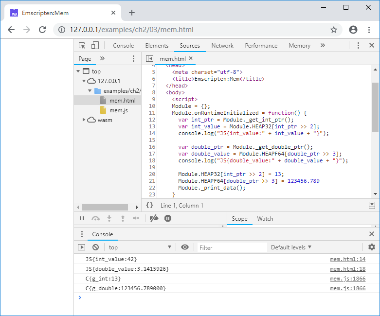

# 2.3 One-way transparent memory model

## 2.3.1 Module.buffer

Regardless of whether the compilation target is asm.js or wasm, the memory space in the C/C++ code actually corresponds to the ArrayBuffer object `Module.buffer` provided by Emscripten. C/C++ memory address is equivalent to the array index of `Module.buffer`.

> **info** ArrayBuffer is a one-dimensional array used to hold binary data in JavaScript. In the context of this book, "`Module.buffer`", "C/C++ memory", and "Emscripten heap" are equivalent.

The data that C/C++ code can access is in the C/C++ memory, it's in fact limited inside `Module.buffer`, other objects in the JavaScript cannot be accessed directly by C/C++ - so we call it a one-way transparent memory model.

In the current version of Emscripten, the pointer type is int32, so the maximum available memory range for a single module is `2GB-1`. In the undefined case, the default memory capacity is 16MB, and the stack capacity is 5MB.

## 2.3.2 Module.HEAPX

The ArrayBuffer in JavaScript cannot be accessed directly, and must be read and written by some type of TypedArray. For example, the following code creates an ArrayBuffer with a capacity of 12 bytes, and creates a TypedArray of type int32 on it, through which three int32 number of 1111111, 2222222, and 3333333 are stored in sequence:

```js
var buf = new ArrayBuffer(12);
var i32 = new Int32Array(buf);
i32[0] = 1111111;
i32[1] = 2222222;
i32[2] = 3333333;
```

> **tips** The relationship between ArrayBuffer and TypedArray can be simply understood like this: ArrayBuffer is the container that actually stores the data, and the TypedArray created on it uses the container as an array of some type.

Emscripten has created some TypedArray objects for `Module.buffer`, as shown in the following table:

Object | TypedArray | Corresponding C data type
---- | ------- | -------
Module.HEAP8 | Int8Array | int8
Module.HEAP16 | Int16Array | int16
Module.HEAP32 | Int32Array | int32
Module.HEAPU8 | Uint8Array | uint8
Module.HEAPU16 | Uint16Array | uint16
Module.HEAPU32 | Uint32Array | uint32
Module.HEAPF32 | Float32Array | float
Module.HEAPF64 | Float64Array | double

## 2.3.3 Accessing C/C++ memory in JavaScript

We'll show how to access C/C++ memory in JavaScript with a simple example. Create a C  file `mem.cc` as follows:

```c
//mem.cc
#include <stdio.h>

int g_int = 42;
double g_double = 3.1415926;

EM_PORT_API(int*) get_int_ptr() {
	return &g_int;
}

EM_PORT_API(double*) get_double_ptr() {
	return &g_double;
}

EM_PORT_API(void) print_data() {
	printf("C{g_int:%d}\n", g_int);
	printf("C{g_double:%lf}\n", g_double);
}
```

Compile it with the following command:

```
emcc mem.cc -o mem.js
```

The JavaScript code is as follows:

```js
//mem.html
      var int_ptr = Module._get_int_ptr();
      var int_value = Module.HEAP32[int_ptr >> 2];
      console.log("JS{int_value:" + int_value + "}");

      var double_ptr = Module._get_double_ptr();
      var double_value = Module.HEAPF64[double_ptr >> 3];
      console.log("JS{double_value:" + double_value + "}");
      
      Module.HEAP32[int_ptr >> 2] = 13;
      Module.HEAPF64[double_ptr >> 3] = 123456.789      
      Module._print_data();
```

In JavaScript side, we get the address of the global variable `g_int` by calling the C function `get_int_ptr()`, and then get the int32 value corresponding to the address by `Module.HEAP32[int_ptr >> 2]`. Since `Module.HEAP32` occupies 4 bytes per element, `int_ptr` needs to be divided by 4 for the correct index. The method of getting `g_double` is similar.

Next we modify the value of the memory corresponding to the `int_ptr` and `double_ptr` addresses, and then call the C function `print_data()`.

After browsing the page, the console will output:



It can be seen that the memory data is correctly read in JavaScript, the data written in JavaScript can be correctly read in C too.

> **info** According to the above example, when accessing C/C++ memory through `Module.HEAPX` in JavaScript, the address must be aligned - address of `int32`/`uint32`/`float` variable must be 4 bytes aligned, address of `double` variable must be 8 bytes alignment, other types are similar. The issue of address alignment will be discussed in detail in Section 4.2.