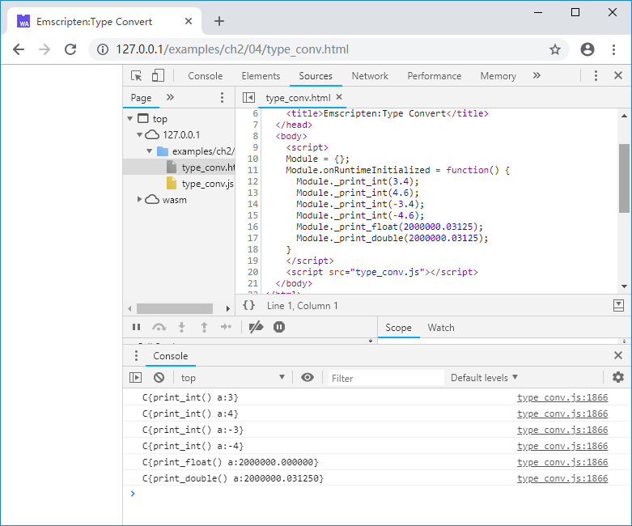
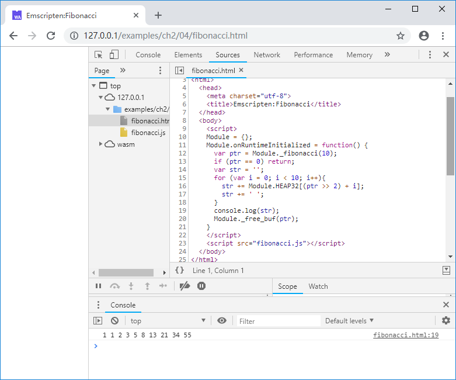
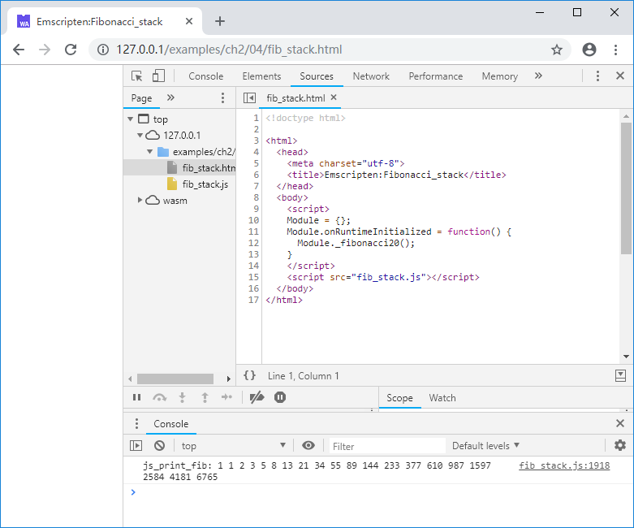
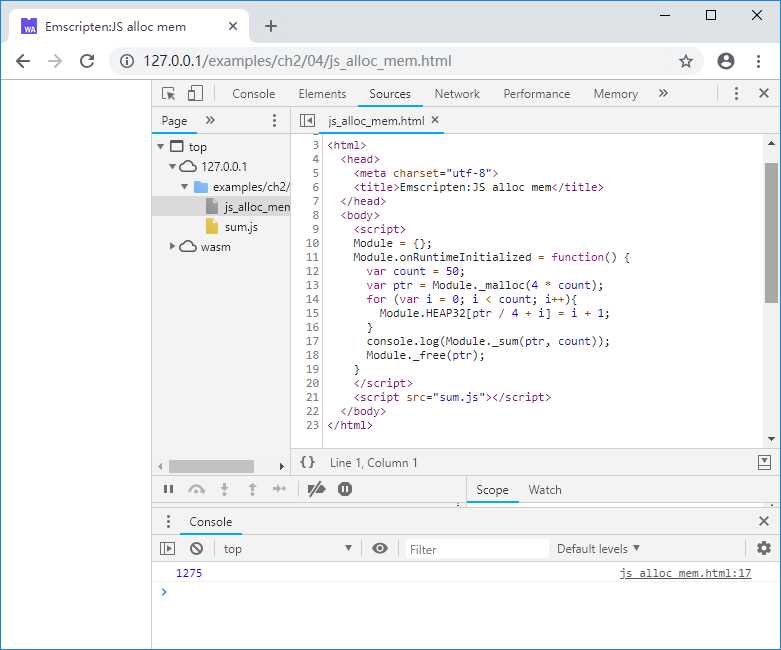

# 2.4 Exchange data between C and JavaScript

We introduced the memory model and the basic usage of `Module.HEAP` in 2.3. This section will delve into how to exchange data between JavaScript and C.

## 2.4.1 Parameters and return values

In the previous chapters, we deliberately ignored a fundamental question: How do parameters and return values are passed when JavaScript and C/C++ call each other?

The answer is: **Everything is `Number`**.

> **tips** The only numeric type in JavaScript is `Number`, which is a IEEE-754 64-bit floating point number.

From a linguistic point of view, JavaScript and C/C++ have completely different data structure. `Number` is the only intersection of the two, so essentially JavaScript and C/C++ are passing `Number` to each other when calling a function.

> **info** `Number` can accurately represent 32-bit integers and below, 32-bit floating-point numbers, 64-bit floating-point numbers, which covers most of the basic data types of C languages - except 64-bit integers, which means you can't use a 64-bit integer as a parameter or return value when interoperating between JavaScript and C, this will be discussed in detail in Section 4.2.

There are two ways to pass `Number` from JavaScript to C/C++:
1. JavaScript calls a exported C function with parameters, and `Number` is passed via parameters;
1. C calls a function implemented by JavaScript (see 2.2), and `Number` is passed via the return value of the injected function.

Since C/C++ is a strongly typed language, implicit type conversion occurs when recieving `Number` from JavaScript. For example, the C code as follows:

```c
//type_conv.cc
#include <stdio.h>

EM_PORT_API(void) print_int(int a) {
	printf("C{print_int() a:%d}\n", a);
}

EM_PORT_API(void) print_float(float a) {
	printf("C{print_float() a:%f}\n", a);
}

EM_PORT_API(void) print_double(double a) {
	printf("C{print_double() a:%lf}\n", a);
}
```

The JavaScript code as follows:

```js
//type_conv.html
      Module._print_int(3.4);
      Module._print_int(4.6);
      Module._print_int(-3.4);
      Module._print_int(-4.6);
      Module._print_float(2000000.03125);
      Module._print_double(2000000.03125);
```

The console will output:



It can be seen that when `Number` is passed, if the target type is `int`, the result will be `round to 0`, if the target type is `float`, the type conversion may lose precision.

There are also two ways to pass `Number` from C/C++ to JavaScript:
1. JavaScript calls a exported C function with return value,  and `Number` is passed via the return value;
1. C calls a function implemented by JavaScript (see 2.2), and `Number` is passed via the parameters of the injected function.

## 2.4.2 Exchange data via memory

Obviously, it is not feasible to exchange large chunks of data between JavaScript and C/C++ using parameters and return values. In this case, we can use memory instead.

In the following example, JavaScript calls the C function to generate a Fibonacci sequence in memory and then print it.

C code:

```c
//fibonacci.cc
#include <stdio.h>
#include <malloc.h>

EM_PORT_API(int*) fibonacci(int count) {
	if (count <= 0) return NULL;

	int* re = (int*)malloc(count * 4);
	if (NULL == re) {
		printf("Not enough memory.\n");
		return NULL;
	}

	re[0] = 1;
	int i0 = 0, i1 = 1;
	for (int i = 1; i < count; i++){
		re[i] = i0 + i1;
		i0 = i1;
		i1 = re[i];
	}
	
	return re;
}

EM_PORT_API(void) free_buf(void* buf) {
	free(buf);
}
```

JavaScript code:

```js
//fibonacci.html
      var ptr = Module._fibonacci(10);
      if (ptr == 0) return;
      var str = '';
      for (var i = 0; i < 10; i++){
        str += Module.HEAP32[(ptr >> 2) + i];
        str += ' ';
      }
      console.log(str);
      Module._free_buf(ptr);
```

After browsing the page, the console will output:



> **tips** In the example above, the C function `fibonacci()` allocates space on the heap. After calling in JavaScript, you need to call `free_buf()` to release it to avoid memory leaks.。

Note that the names of objects such as `Module.HEAP32` are "heap", but in fact they refer to the entire memory space of the C/C++ environment, so the data located on the C/C++ stack can also access via `Module.HEAP32`/`Module.HEAP16`/etc. For example:

```c
//fib_stack.cc
EM_PORT_API (void) js_print_fib(int* ptr, int count);

EM_PORT_API(void) fibonacci20() {
	static const int count = 20;
	int re[count];

	re[0] = 1;
	int i0 = 0, i1 = 1;
	for (int i = 1; i < count; i++){
		re[i] = i0 + i1;
		i0 = i1;
		i1 = re[i];
	}
	
	js_print_fib(re, count);
}
```

The C function `fibonacci20()` generates the first 20 items of the Fibonacci sequence on the stack, and then calls the injected function `js_print_fib()` in JavaScript side to print it out. Code of the injected function is as follows:

```js
//fib_stack_pkg.js
mergeInto(LibraryManager.library, {
    js_print_fib: function (ptr, count) {
        var str = 'js_print_fib: ';
        for (var i = 0; i < count; i++){
          str += Module.HEAP32[(ptr >> 2) + i];
          str += ' ';
        }
        console.log(str);
    }
})
```

Compile with the following command:

```
emcc fib_stack.cc --js-library fib_stack_pkg.js -o fib_stack.js
```

Call `fibonacci20()` in the web page:

```js
//fib_stack.html
    <script>
    Module = {};
    Module.onRuntimeInitialized = function() {
      Module._fibonacci20();
    }
    </script>
    <script src="fib_stack.js"></script>
```

The console will output:



## 2.4.3 Allocating C/C++ memory in JavaScript

The examples given in 2.4.2 are all allocated memory in C/C++, then read in JavaScript. Sometimes JavaScript needs to send large chunks of data into C/C++, and C/C++ cannot predict the size of the data block. In that case, you can allocate C/C++ memory in JavaScript and load the data, then pass in the data pointer and call C function for processing.

For example, the C function `sum()` calculate the sum of the input array:

```c
//sum.cc
EM_PORT_API(int) sum(int* ptr, int count) {
	int total = 0;
	for (int i = 0; i < count; i++){
		total += ptr[i];
	}
	return total;
}
```

We allocate memory in JavaScript side and stores it in the first 50 items of the natural sequence, then calls the C function `sum()`:

```js
//js_alloc_mem.html
      var count = 50;
      var ptr = Module._malloc(4 * count);
      for (var i = 0; i < count; i++){
        Module.HEAP32[ptr / 4 + i] = i + 1;
      }
      console.log(Module._sum(ptr, count));
      Module._free(ptr);
```

After browsing the page, the console will output:



> **tips** C/C++ doesn't have gc. After using the memory allocated by the `malloc()` function in JavaScript, don't forget to use `free()` to release it.

## 2.4.4 Strings

String are very common data type, but the string representation in C/C++ is completely incompatible with JavaScript. Fortunately, Emscripten provides us with a set of helper functions for the conversion. Here are two of the most common ones.

### `Pointer_stringify()`
This method converts C/C++ strings into JavaScript strings. For example:

The C function `get_string()` returns the address of a string:

```c
//strings.cc
EM_PORT_API(const char*) get_string() {
	static const char str[] = "Hello, wolrd! 你好，世界！"
	return str;
}
```

Get the string address in JavaScript and use `Pointer_stringify()` to convert it to a JavaScript string:

```js
//strings.html
      var ptr = Module._get_string();
      var str = Pointer_stringify(ptr);
      console.log(typeof(str));
      console.log(str);
```

After browsing the page, the console will output:

```
string
Hello, wolrd! 你好，世界！
```

### `allocateUTF8()`
This method will allocate enough space in C/C++ memory and copy the string into it with UTF8. For example, use `allocateUTF8()` in JavaScript to pass a string to C/C++ memory, then call the C function `print_string()` to print it:

JavaScript code:

```js
//strings.html
      ptr = allocateUTF8("你好，Emscripten！");
      Module._print_string(ptr);
      _free(ptr);
```

C code:

```c
//strings.cc
EM_PORT_API(void) print_string(char* str) {
	printf("%s\n", str);
}
```

After browsing the page, the console will output:

```
你好，Emscripten！
```

In addition, Emscripten also provides a series of helper functions such as `AsciiToString()`/`stringToAscii()`/`UTF8ArrayToString()`/`stringToUTF8Array()` for string conversion. Please refer to the glue code for details.

## 2.4.5 Summary

Basically, there are two ways to exchange data between JavaScript and C/C++:

1. Exchange data via parameters and return values;
1. Exchange data via C/C++ memory.

When transferring data using dynamically allocated memory addresses, don't forget to freeing up memory that is no longer in use to avoid leaks.