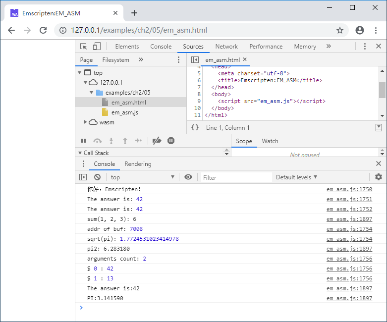

## 2.5 Using EM_ASM

Many compilers support embedding assembly code directly in C/C++ code. We can write "inline JavaScript" in Emscripten with a simular way by using `EM_ASM` and related macros.

## 2.5.1 `EM_ASM`

`EM_ASM` is very simple to use, look at the example bellow:

```c
#include <emscripten.h>

int main() {
	EM_ASM(console.log('你好，Emscripten！'));
	return 0;
}
```

The code above will call the JavaScript function `console.log()` to output "你好，Emscripten！".

We can write multiple JavaScript statements in one `EM_ASM()`, separated by ';', for example:

```c
    EM_ASM(var k = 42;console.log('The answer is:', k););
```

The code above will output:

```
The answer is:42
```

It is also feasible to write multiple lines of statements and end-of-line comments (the statements must be separated by semicolons when they are written, and cannot be omitted), for example:

```c
	EM_ASM(
		var k = 42;  //define k
		console.log('The answer is:', k);
	);
```


## 2.5.2 `EM_ASM_`/`EM_ASM_DOUBLE`

`EM_ASM_` macro can be used if parameters and return values are needed in the inline JavaScript code. The inline JavaScript code in the `EM_ASM_` macro must be placed in the code block enclosed by `{}` (to separate the code and parameters) and must contain at least one parameter. The inline JavaScript code accesses the n+1th parameter via `$n`. The following example calls JavaScript to calculate the sum of the three parameters and returns the result:

```c
	int sum = EM_ASM_({return $0 + $1 + $2;}, 1, 2, 3);
	printf("sum(1, 2, 3): %d\n", sum);
```

Variables can be used as parameters while using `EM_ASM_`, for example:

```c
	char buf[32];
	double pi = 3.14159;
	EM_ASM_(
		{
			console.log('addr of buf:', $0);
			console.log('sqrt(pi):', $1);
		},
		buf, sqrt(pi)
    );
```

The above code will output the address of `buf` and the square root of `pi`.

`EM_ASM_DOUBLE` usage is basically the same as `EM_ASM_`, the difference is that `EM_ASM_DOUBLE` returns a value of `double` instead of `int`. For example:

```c
	double pi2 = EM_ASM_DOUBLE(
		{
			return $0 * $1;
		},
		pi, 2.0
	);
	printf("pi2: %lf\n", pi2);
```

The inline JavaScript code in the `EM_ASM_`/`EM_ASM_DOUBLE` macro will be expanded into a JavaScript function, so in addition to `$n`, the built-in `arguments` object can be used to access parameters. For example:

```c
	EM_ASM_(
		{
            console.log('arguments count:', arguments.length);
			for(var i = 0; i < arguments.length; i++) {
				console.log('$', i, ':', arguments[i]);
			}
		},
		42, 13
	);
```

The code above will output:

```
arguments count: 2
$ 0 : 42
$ 1 : 13
```

## 2.5.3 `EM_ASM_INT_V`/`EM_ASM_DOUBLE_V`

If the inline JavaScript code doesn't have parameters, you can use the `EM_ASM_INT_V`/`EM_ASM_DOUBLE_V` macro. Since there are no parameters, the inline code doesn't need to be surrounded by `{}`, for example:

```c
	int answer = EM_ASM_INT_V(return 42);
	printf("The answer is:%d\n", answer);
	double pi_js = EM_ASM_DOUBLE_V(return 3.14159);
	printf("PI:%lf\n", pi_js);
```

The output of the examples in this section is as follows:

