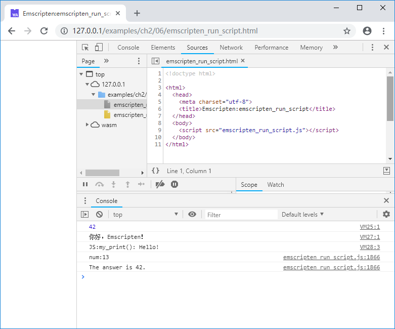

# 2.6 Using `emscripten_run_script`

The `EM_ASM` and related macros introduced in 2.5 can only accept hard-coded constant strings as inline JavaScript code. If the JavaScript code is created dynamically, we can use `emscripten_run_script()` and related functions instead. This series of helper functions can be analogized to `eval()' in JavaScript..

## 2.6.1 `emscripten_run_script()`

Declaration:

`void emscripten_run_script(const char *script)`

Parameters:

- `script`: The script to evaluate.

Return type：

- void

The function is very simple to use, for example:

```c
int main(){
	emscripten_run_script("console.log(42);");
	return 0;
}
```

`emscripten_run_script("console.log(42);");` in the code above is equivalent to `eval("console.log(42);")` in JavaScript.

Dynamically created script can be `eval()` too, for example:

```c
const char* get_js_code(){
	static char buf[1024];
	sprintf(buf, "console.log('你好，Emscripten！');");
	return buf;
}

int main(){
	emscripten_run_script(get_js_code());
	return 0;
}
```

Since the incoming script will eventually be executed via `eval()`, the passed script can be any JavaScript code, such as:

```c
	emscripten_run_script(R"(
		function my_print(s) {
			console.log("JS:my_print():", s);
		}
		my_print("Hello!");
	)");
```

The code above defines a fucntion `my_print()` first, then calls it to output "Hello!"

> **tips** The example above defines a string using the raw string definition of C++11 standard - `R` prefix. When compiling with the `emcc` command, you must add the `-std = c++11` parameter as shown below:

```
emcc emscripten_run_script.cc -std=c++11  -o emscripten_run_script.js
```

## 2.6.2 `emscripten_run_script_int()`

Declaration:

`int emscripten_run_script_int(const char *script)`

Parameters:

- `script`: The script to evaluate.

Return type:

- int

This function is similar to `emscripten_run_script()`, except that it returns the execution result of the input script as an integer, for example:

```c
	int num = emscripten_run_script_int(R"(
		function show_me_the_number() {
			return 13;
		}
		show_me_the_number();
	)");
	printf("num:%d\n", num);
```

The example above will output:

```
num:13
```

## 2.6.3 `emscripten_run_script_string()`

Declaration:

`char *emscripten_run_script_string(const char *script)`

Parameters:

- `script`: The script to evaluate.

Return type:
- char *

This function is similar to `emscripten_run_script_int()`, except that the return value is a string, for example:

```c
	const char* str = emscripten_run_script_string(R"(
		function show_me_the_answer() {
			return "The answer is 42.";
		}
		show_me_the_answer();
	)");
	printf("%s\n", str);
```

The example above will output:

```
The answer is 42.
```

In the glue code we can see that the implemention of `emscripten_run_script_string()` is as follows:

```js
  function _emscripten_run_script_string(ptr) {
      var s = eval(Pointer_stringify(ptr)) + '';
      var me = _emscripten_run_script_string;
      var len = lengthBytesUTF8(s);
      if (!me.bufferSize || me.bufferSize < len+1) {
        if (me.bufferSize) _free(me.buffer);
        me.bufferSize = len+1;
        me.buffer = _malloc(me.bufferSize);
      }
      stringToUTF8(s, me.buffer, me.bufferSize);
      return me.buffer;
    }
```

This function allocates space in C/C++ memory to hold the string returned by the incoming script. And it is not difficult to find from the code that when `emscripten_run_script_string()` is called multiple times, the result of the subsequent call may overwrite the result of the previous call - because `me.buffer` is reused.

The output of the examples in this section is as follows:

