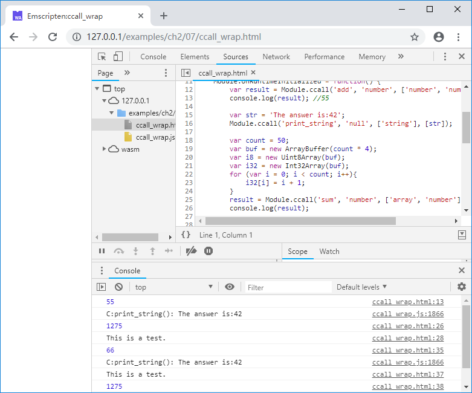

# 2.7 Using `ccall`/`cwrap`

In Section 2.4, we mentioned that JavaScript can only use `Number` as parameters when calling C/C++ functions. Therefore, if the parameter is a non-`Number` type such as a string or an array, it needs to be split into the following steps:

1. Use `Module._malloc()` to allocate memory in the Module heap to get the address `ptr`;
1. Copy data such as strings/arrays into `ptr`;
1. Using `ptr` as a parameter, call C/C++ function for processing;
1. Free `ptr` using `Module._free()`.

This shows that the calling process is quite cumbersome. Especially when there're a lot of non-`Number` parameters, the code in JavaScript side will expand dramatically. To simplify the calling process, Emscripten provides the `ccall`/`cwrap` wrapper function.

## 2.7.1 `ccall`

Syntax:

`var result = Module.ccall(ident, returnType, argTypes, args);`

Parameters:

- ident : The name of the C function to be called - without the `_` prefix.
- returnType : The return type of the function. Can be `'boolean'`, `'number'`, `'string'`, `'null'`, indicating that the function returns a boolean value, a numeric value, a string, and no return value.
- argTypes : An array of the types of arguments for the function. The parameter types can be `'number'`, `'string'`, `'array'`, representing values, strings, and arrays, respectively. If there are no arguments, this can be omitted.
- args : An array of the arguments to the function.

For example, a C function is as follows:

```c
//ccall_wrap.cc
EM_PORT_API(double) add(double a, int b) {
	return a + (double)b;
}
```

Compile with the following command:

```
emcc ccall_wrap.cc -s "EXTRA_EXPORTED_RUNTIME_METHODS=['ccall', 'cwrap']" -o ccall_wrap.js
```

> **tips** Starting from v1.38, Emscripten does not export the `ccall`/`cwrap` helper function by default. It needs to be explicitly exported by compiling with the `-s "EXTRA_EXPORTED_RUNTIME_METHODS=['ccall', 'cwrap']"` option.

Called in JavaScript side:

```js
//ccall_wrap.html
	var result = Module.ccall('add', 'number', ['number', 'number'], [13.0, 42]);
```

This is equivalent to calling `Module._add()` directly as follows:

```js
	var result = Module._add(13, 42);
```

The advantage of `ccall` is that you can use the string /`Uint8Array`/`Int8Array` as parameters. For example, a C function as follows:

```c
//ccall_wrap.cc
EM_PORT_API(void) print_string(const char* str) {
	printf("C:print_string(): %s\n", str);
}
```

The input parameter of `print_string()` is a string, which can be called in JavaScript using the following method:

```js
//ccall_wrap.html
	var str = 'The answer is:42';
	Module.ccall('print_string', 'null', ['string'], [str]);
```

An example of using `Uint8Array` as a parameter is as follows:

```c
//ccall_wrap.cc
EM_PORT_API(int) sum(uint8_t* ptr, int count) {
	int total = 0, temp;
	for (int i = 0; i < count; i++){
		memcpy(&temp, ptr + i * 4, 4);
		total += temp;
	}
	return total;
}
```

```js
//ccall_wrap.html
	var count = 50;
	var buf = new ArrayBuffer(count * 4);
	var i8 = new Uint8Array(buf);
	var i32 = new Int32Array(buf);
	for (var i = 0; i < count; i++){
		i32[i] = i + 1;
	}
	result = Module.ccall('sum', 'number', ['array', 'number'], [i8, count]);
```

If the C function returns a string that does not need to be freed (a static string, or a string stored in an address managed by the C code itself), using the `ccall` call in JavaScript, you can also get the returned string directly. For example:

```c
//ccall_wrap.cc
EM_PORT_API(const char*) get_string() {
	const static char str[] = "This is a test.";
	return str;
}
```

```js
//ccall_wrap.html
	console.log(Module.ccall('get_string', 'string'));
```

## 2.7.2 `cwrap`

Although `ccall` encapsulates data types such as strings, it still needs to fill in parameter type arrays, parameter lists, etc. when calling a C function. `cwrap` provides a further encapsulation, it returns a native JavaScript wrapper for a C function:

`var func = Module.cwrap(ident, returnType, argTypes);`

Parameters:
- ident : The name of the C function to be called - without the `_` prefix.
- returnType : The return type of the function. Can be `'boolean'`, `'number'`, `'string'`, `'null'`, indicating that the function returns a boolean value, a numeric value, a string, and no return value.
- argTypes : An array of the types of arguments for the function. The parameter types can be `'number'`, `'string'`, `'array'`, representing values, strings, and arrays, respectively.

Returns：
- A JavaScript function that can be used for calling the C function.

For example, the C export function in 2.7.1 can be wrapped as follows:

```js
//ccall_wrap.html
	var c_add = Module.cwrap('add', 'number', ['number', 'number']);
	var c_print_string = Module.cwrap('print_string', 'null', ['string']);
	var c_sum = Module.cwrap('sum', 'number', ['array', 'number']);
	var c_get_string = Module.cwrap('get_string', 'string');
```

The C function `add()`/`print_string()`/`sum()`/`get_string()` is wrapped as `c_add()`/`c_print_string()`/`c_sum()`/`c_get_string()` respectively. These functions can be used directly like native JavaScript functions:

```js
//ccall_wrap.html
	console.log(c_add(25.0, 41));
	c_print_string(str);
	console.log(c_get_string());
	console.log(c_sum(i8, count));
```

## 2.7.3 Potential risk of `ccall`/`cwrap`

Although `ccall`/`cwrap` can simplify the exchange of non-`Number` parameters, this convenience comes at a price: when the input parameter type is `'string'`/`'array'`, `ccall`/`cwrap` allocate the corresponding space on the stack of the C environment, and the data is copied into it, and then the function is called.

Stack is a scarce resource relative to the heap, so using `ccall`/`cwrap` requires special attention to the size of the incoming string/array to avoid stack overflow.

Listed below is the glue code generated by Emscripten for `ccall`/`cwrap`. Interested readers can try to analyze it. The general flow is:

1. `getCFunc()`, get the C function according to `ident`;
1. `stackSave()`, save the stack pointer;
1. `arrayToC()`/`stringToC()`, copy the array/string parameters to the stack;
1. `func.apply()`, call C function
1. `convertReturnValue()`, convert the return value  to the corresponding type;
1. `stackRestore()`, restore the stack pointer.

```js
// Returns the C function with a specified identifier (for C++, you need to do manual name mangling)
function getCFunc(ident) {
  var func = Module['_' + ident]; // closure exported function
  assert(func, 'Cannot call unknown function ' + ident + ', make sure it is exported');
  return func;
}

var JSfuncs = {
  // Helpers for cwrap -- it can't refer to Runtime directly because it might
  // be renamed by closure, instead it calls JSfuncs['stackSave'].body to find
  // out what the minified function name is.
  'stackSave': function() {
    stackSave()
  },
  'stackRestore': function() {
    stackRestore()
  },
  // type conversion from js to c
  'arrayToC' : function(arr) {
    var ret = stackAlloc(arr.length);
    writeArrayToMemory(arr, ret);
    return ret;
  },
  'stringToC' : function(str) {
    var ret = 0;
    if (str !== null && str !== undefined && str !== 0) { // null string
      // at most 4 bytes per UTF-8 code point, +1 for the trailing '\0'
      var len = (str.length << 2) + 1;
      ret = stackAlloc(len);
      stringToUTF8(str, ret, len);
    }
    return ret;
  }
};

// For fast lookup of conversion functions
var toC = {
  'string': JSfuncs['stringToC'], 'array': JSfuncs['arrayToC']
};

// C calling interface.
function ccall(ident, returnType, argTypes, args, opts) {
  function convertReturnValue(ret) {
    if (returnType === 'string') return Pointer_stringify(ret);
    if (returnType === 'boolean') return Boolean(ret);
    return ret;
  }

  var func = getCFunc(ident);
  var cArgs = [];
  var stack = 0;
  assert(returnType !== 'array', 'Return type should not be "array".');
  if (args) {
    for (var i = 0; i < args.length; i++) {
      var converter = toC[argTypes[i]];
      if (converter) {
        if (stack === 0) stack = stackSave();
        cArgs[i] = converter(args[i]);
      } else {
        cArgs[i] = args[i];
      }
    }
  }
  var ret = func.apply(null, cArgs);
  ret = convertReturnValue(ret);
  if (stack !== 0) stackRestore(stack);
  return ret;
}

function cwrap(ident, returnType, argTypes, opts) {
  return function() {
    return ccall(ident, returnType, argTypes, arguments, opts);
  }
}
```

The output of the examples in this section is as follows:

