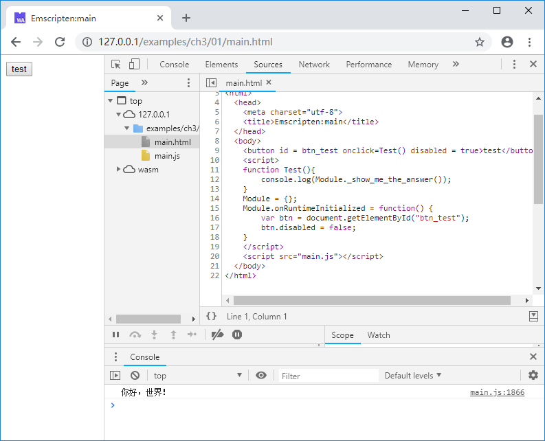
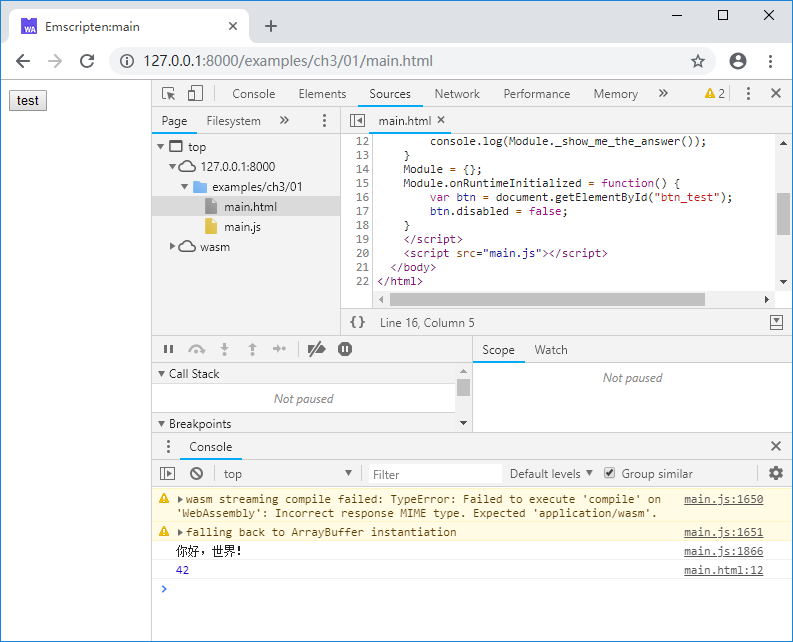
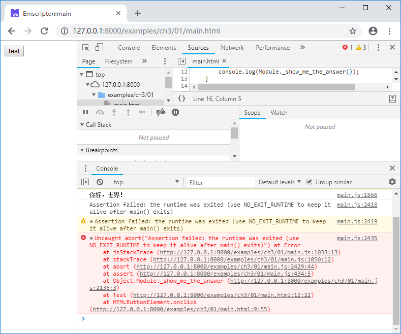

# 3.1 main function and lifecycle

When native code is generated, as the entry point function of a C/C++ program, `main()` usually stands for the lifecycle of the program, which terminates as `main()` returns. Under Emscripten, the situation is different, as the example shows:

```c
//main.cc
#include <stdio.h>

EM_PORT_API(int) show_me_the_answer() {
	return 42;
}

int main() {
	printf("你好，世界！\n");  //"你好，世界！" means "Hello, wolrd!" in chinese
	return 0;
}
```

HTML:

```html
//main.html
  <body>
	<button id = btn_test onclick=Test() disabled = true>test</button>
	<script>
	function Test(){
		console.log(Module._show_me_the_answer());
	}	
	Module = {};
	Module.onRuntimeInitialized = function() {
		var btn = document.getElementById("btn_test");
		btn.disabled = false;
	}
	</script>
	<script src="main.js"></script>
  </body>
```

Upon loading the page, `main()` is executed, as you can see the "你好，世界！"(which means "Hello, wolrd!" in chinese) output to the console:



At this time, if you click the "test" button, the console outputs:



After `main()` has returned, Emscripten runtime core(`Module`) is still usable! Also in previous chapters, some examples don't even have `main()` functions. It is evident that to Emscripten, `main()` function is neither indispensable nor controlling the lifecycle.

To destruct the Emscripten runtime after `main()` returns, use the `-s NO_EXIT_RUNTIME=0` option when compiling:

```
emcc main.cc -s NO_EXIT_RUNTIME=0 -o main.js
```

Compiled with the above command, the page outputs an error when the "test" button is clicked:



> **info** Starting from Emscripten v1.37.26, `NO_EXIT_RUNTIME` defaults to 1.

