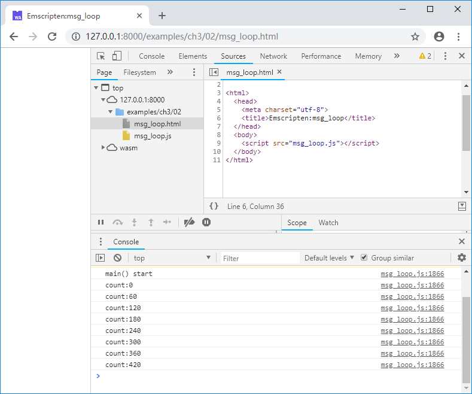
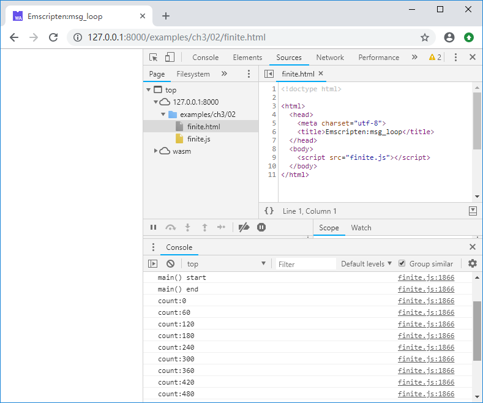

# 3.2 Message Loop

Except for the one-off types that do something and quit, most C/C++ contains a message loop like shown in the pseudo code below:

```c
int main() {
    while(1) {
        msg_loop();
    }
    return 0;
}
```

However in the browser JavaScript runs in a single thread, if the message loop of the C/C++ program is compiled and run as-is, it will block the page, preventing the DOM from updating, rendering the page unresponsive. For this reason Emscripten provides functions for emulating and scheduling of the message loop.

## 3.2.1 `emscripten_set_main_loop()`

Declaration:

`void emscripten_set_main_loop(em_callback_func func, int fps, int simulate_infinite_loop)`

Parameters:

- `func`: The message handling callback function.
- `fps`: The message loop frame rate. If this parameter is equal to less than 0,  the browser's `requestAnimationFrame` mechanism is used to call the message handling function, which aligns the page refresh rate to the monitor, smoothing rendering for graphic programs.
- `simulate_infinite_loop`: Whether "infinite loop" is simulated. This will be elaborated later.

Return value:

- None

Let's see a simple example:

```c
//msg_loop.cc
#include <emscripten.h>
#include <stdio.h>

void msg_loop() {
	static int count = 0;
	if (count % 60 == 0) {
		printf("count:%d\n", count);
	}
	count++;
}

int main() {
	printf("main() start\n");
	emscripten_set_main_loop(msg_loop, 0, 1);
	printf("main() end\n");
	return 0;
}
```

Compile and load into browser. The console outputs:



Notice that "main() start" is output but "main() end" isn't! This is because that `emscripten_set_main_loop` is called with `simulate_infinite_loop` set to 1.

If `emscripten_set_main_loop` is called with `simulate_infinite_loop` set to 0, the console outputs:



No matter whether `simulate_infinite_loop` is set to 1, the message handling function will execute infinitely at the designated frame rate. The difference is that when it is set to 1:

- The code after `emscripten_set_main_loop` is never executed.
- The call stack of `main()` won't be unwound.

Intuitively this behavior is the closest to the pseudo code at the beginning.

> **info** When `simulate_infinite_loop` is 1, `emscripten_set_main_loop()` will throw a `SimulateInfiniteLoop` exception in the JavaScript glue code. Then the exception is caught and the execution flow breaks.

## 3.2.2 Pause, continuation and termination of the message loop

Declarations:

`void emscripten_pause_main_loop(void)`

`void emscripten_resume_main_loop(void)`

`void emscripten_cancel_main_loop(void)`

The three functions pause, resume and terminate the message loop respectively. For example:

```c
//pause_resume_cancel.cc
#include <emscripten.h>
#include <stdio.h>

void msg_loop() {
	static int count = 0;
	if (count % 60 == 0) {
		printf("count:%d\n", count);
	}
	count++;
}

EM_PORT_API(void) pause_main_loop() {
	emscripten_pause_main_loop();
	printf("pause_main_loop()\n");
}

EM_PORT_API(void) resume_main_loop() {
	emscripten_resume_main_loop();
	printf("resume_main_loop()\n");
}

EM_PORT_API(void) cancel_main_loop() {
	emscripten_cancel_main_loop();
	printf("cancel_main_loop()\n");
}

int main() {
	printf("main() start\n");
	emscripten_set_main_loop(msg_loop, 0, 1);
	printf("main() end\n");
	return 0;
}
```

HTML:

```html
	<button id = pause onclick=Pause() disabled = true>Pause</button>
	<button id = resume onclick=Resume() disabled = true>Resume</button>
	<button id = cancel onclick=Cancel() disabled = true>Cancel</button>
	<script>
	function Pause() {
		Module._pause_main_loop();
	}
	function Resume() {
		Module._resume_main_loop();
	}
	function Cancel() {
		Module._cancel_main_loop();
	}
	
	Module = {};
	Module.onRuntimeInitialized = function() {
		document.getElementById("pause").disabled = false;
		document.getElementById("resume").disabled = false;
		document.getElementById("cancel").disabled = false;
	}
	</script>
	<script src="pause_resume_cancel.js"></script>
```

After loading the page, click the "Pause", "Resume" and "Cancel" buttons, the console outputs:


> **tips** As a matter of fact, using message loop functions provided by Emscripten is intrusive to C/C++ code. The author suggests avoiding them. More details can be found in section 4.1.

