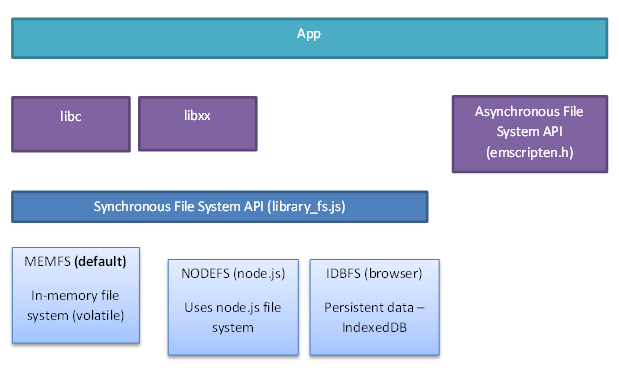
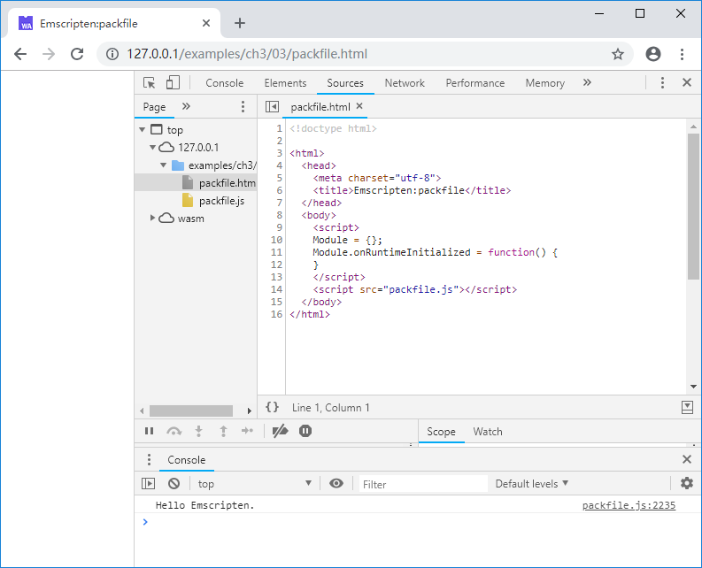
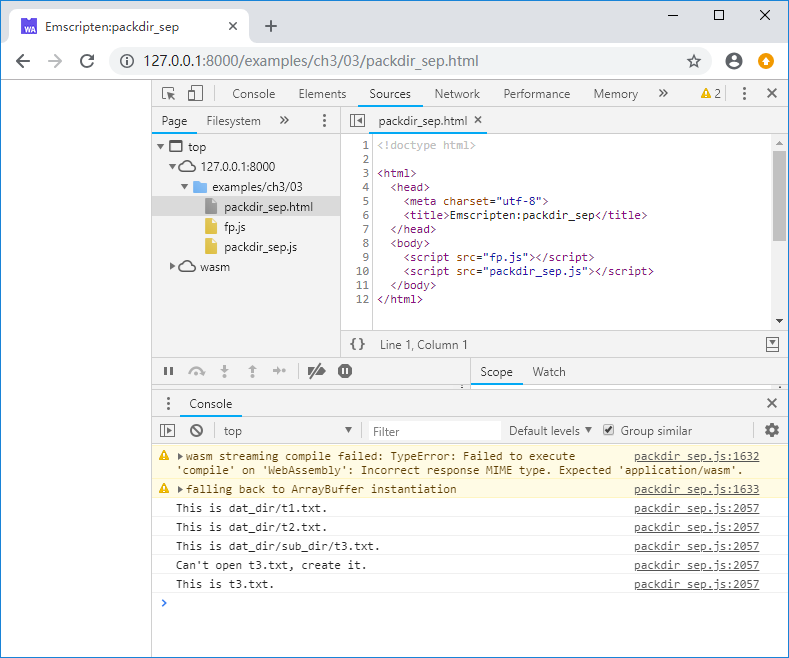
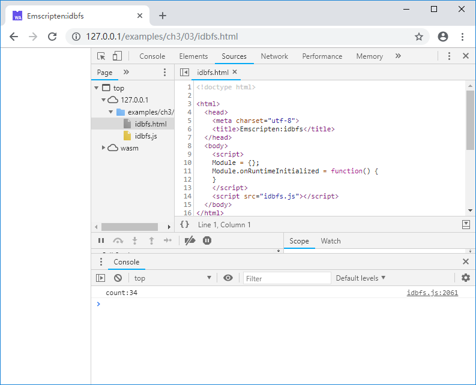

# 3.3 File systems

Portable C/C++ programs often use libc/libcxx synchronous file access functions such as`fopen()`/`fread()`/`fwrite()` etc. In terms of file system access, JavaScript is tremendously different from native C/C++ programs in that:

1. JavaScript programs running in the browser can't access local file systems;
2. In JavaScript, both AJAX and `fetch()` are asynchronous.

Emscripten provides a suite of virtual systems to supports the synchronous file access functions in libc/libcxx.

## 3.3.1 The architecture of Emscripten virtual file systems

This picture depicts the architecture of Emscripten virtual file systems:



> **tips** The asynchronous file system API is a suite of functions declared in emscripten.h and is only available in Emscripten environment. It doesn't align with the "compilation target-insensitive" goal of this book so we won't introduce it here.

At the bottom layer, Emscripten provides 3 file systems:
1. `MEMFS`: the memory file system. Data in this file system is stored in memory. Data written by programs is lost when the page is refreshed.
1. `NODEFS`: the Node.js file system. This file system can access local file system and can persist data, but is available only in Node.js environment.
1. `IDBFS`: the IndexedDB file system. This file system is built on the IndexedDB object of the browser and can persist data. It is available only in the browser.

Emscripten's synchronous file system API abstract those three file systems into the `FS` object. Furthermore it provides libc/libcxx file access functions such as `fopen()`/`fread()`/`fwrite()`.

Grammatically, from the caller point of view, the C/C++ code is no different from that targeting native platforms, but attention should be paid to the characteristics of the underlying file system and the semantic differences they bring. Emscripten virtual file system is a vast topic which whole books can be dedicated to. Constraint by the size of the book, this section will focus mainly on the packaging file system based on `MEMFS`, only giving examples of `NODEFS` and `IDBFS` without elaborating.

## 3.3.2 `MEMFS`/Packaging file system

Before files are imported into `MEMFS`, they must be packaged. File packaging can be done with `emcc` command or the standalone `file_packager.py` tool.

There are 2 packaging modes: `embed` and `preload`. In `embed` mode, data files are converted to JavaScript code; In `preload` mode, besides .js files, .data files containing binary encoded code are generated, which are fetched and loaded by the glue code in the .js file.

> **tips** Because `embed` mode has to encode data files into text, the generated package is larger than `preload` mode, so unless the total size of packaged files is tiny, `preload` mode should be used.

When running `emcc`, use `--preload-file` option to package files or folders in `preload` mode and `--embed-file` for `embed` mode.

For example, there is a text file `hello.txt` in the same directory as the C source code file `package.cc`, in this directory run the command:

```
emcc packfile.cc -o packfile.js --preload-file hello.txt
```

A `package.js` and `package.data` are generated. `package.data` contains contents of `hello.txt`. The C code can read `hello.txt` and print it out:

```c
//packfile.cc
int main() {
	FILE* fp = fopen("hello.txt", "rt");
	if (fp) {
		while (!feof(fp)) {
			char c = fgetc(fp);
			if (c != EOF) {
				putchar(c);
			}
		}
		fclose(fp);
	}
	return 0;
}
```

The console outputs:



`--preload-file` can not only package individual files, but also directories. For example, in the directory containing C source code file `packdir.cc` there is a directory `dat_dir`, shown below:

```
|--packdir.cc
|--dat_dir
   |--t1.txt
   |--t2.txt
   |--sub_dir
      |--t3.txt
```

Under the directory where `packdir.cc` resides run this command:

```
emcc packdir.cc -o packdir.js --preload-file dat_dir
```

A `packdir.data` package file is generated, which contains all contents of `dat_dir`. The C source code is:

```c
//packdir.cc
void read_fs(const char* fname) {
	FILE* fp = fopen(fname, "rt");
	if (fp) {
		while (!feof(fp)) {
			char c = fgetc(fp);
			if (c != EOF) {
				putchar(c);
			}
		}
		fclose(fp);
	}
}

void write_fs() {
    
	FILE* fp = fopen("t3.txt", "wt");
	if (fp) {
		fprintf(fp, "This is t3.txt.\n");
		fclose(fp);
	}
}

int main() {
	read_fs("dat_dir/t1.txt");
	read_fs("dat_dir/t2.txt");
	read_fs("dat_dir/sub_dir/t3.txt");

	write_fs();
	read_fs("t3.txt");
	return 0;
}
```

The console outputs:


Emscripten uses UNIX styled path separator "/". From the point of view the C/C++ code, packaging files are located in the current directory. When packaging files are loaded, files and directories can be created and written into. However the data are actually written into memory managed by JavaScript, and is lost when the page is refreshed.

The Python script `file_packager.py` located in `<emsdk>/<sdk_ver>/tools/` can package file separately. For example the below command packages `dat_dir` directory into `fp.data` and `fp.js` in `preload` mode:

```
python emsdk/1.38.11/tools/file_packager.py fp.data --preload dat_dir --js-output=fp.js
```

To use the separately packaged files, the main program must be compiled with `-s FORCE_FILESYSTEM=1` to include the file system support, for example:

```
emcc packdir.cc -o packdir_sep.js -s FORCE_FILESYSTEM=1
```

In the page, the separately packaged js must be loaded before main js:

```js
//packdir_sep.html
	<script src="fp.js"></script>
	<script src="packdir_sep.js"></script>
```

The console output of the above example remains the same:



> **info** Although package downloading is asynchronous, Emscripten ensures that when the runtime is ready, the file system has been initialized, thus it is safe to the file system in `Module.onRuntimeInitialized` callback.

## 3.3.3 `NODEFS`

Below is an example using `NODEFS`:

```c
//nodefs.cc
void setup_nodefs() {
	EM_ASM(
		FS.mkdir('/data');
		FS.mount(NODEFS, {root:'.'}, '/data');
	);
}

int main() {
	setup_nodefs();
	
	FILE* fp = fopen("/data/nodefs_data.txt", "r+t");
	if (fp == NULL) fp = fopen("/data/nodefs_data.txt", "w+t");
	int count = 0;
	if (fp) {
		fscanf(fp, "%d", &count);
		count++;
		fseek(fp, 0, SEEK_SET);
		fprintf(fp, "%d", count);
		fclose(fp);
		printf("count:%d\n", count);
	}
	else {
		printf("fopen failed.\n");
	}

	return 0;
}
```

Notice that `setup_nodefs()` uses the `EM_ASM` macro to execute JavaScript to mount `NODEFS`: `FS.mkdir('/data')` makes a "/data" directory in the virtual file system, `FS.mount(NODEFS, {root:'.'}, '/data')` mounts the local current directory to it. When `main()` runs, it opens `/data/nodefs_data.txt`, which maps to `nodefs_data.txt` in local current directory, reads an integer from it, adds 1 and writes back. Compile the above code with `emcc`:

```
emcc nodefs.cc -o nodefs.js
```

Run `nodefs.js` multiple time with Node, the output is:

```
> node nodefs.js
count:2
> node nodefs.js
count:3
> node nodefs.js
count:4
```

## 3.3.4 `IDBFS`

Below is an example using `IDBFS`:

```c
void sync_idbfs() {
	EM_ASM(
		FS.syncfs(function (err) {});
	);
}

EM_PORT_API(void) test() {
	FILE* fp = fopen("/data/nodefs_data.txt", "r+t");
	if (fp == NULL) fp = fopen("/data/nodefs_data.txt", "w+t");
	int count = 0;
	if (fp) {
		fscanf(fp, "%d", &count);
		count++;
		fseek(fp, 0, SEEK_SET);
		fprintf(fp, "%d", count);
		fclose(fp);
		printf("count:%d\n", count);
		
		sync_idbfs();
	}
	else {
		printf("fopen failed.\n");
	}
}

int main() {
	EM_ASM(
		FS.mkdir('/data');
		FS.mount(IDBFS, {}, '/data');
		FS.syncfs(true, function (err) {
			assert(!err);
			ccall('test', 'v');
		});
	);
	
	return 0;
}
```

Similar to `NODEFS`, `IDBFS` is mounted with `FS.mount()` method. `IDBFS` also uses memory to storage the virtual file system, but it supports two-way synchronization between memory and IndexedDB with the `FS.syncfs()` method, achieving data persistence. `FS.syncfs()` is an asynchronous operation, thus in the above example, the file accessing `test()` function must be invoked in the callback of `FS.syncfs()`. Every time the page is refreshed, the count output to console increments by 1:


 