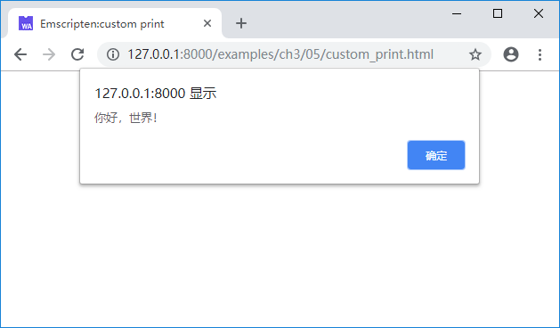
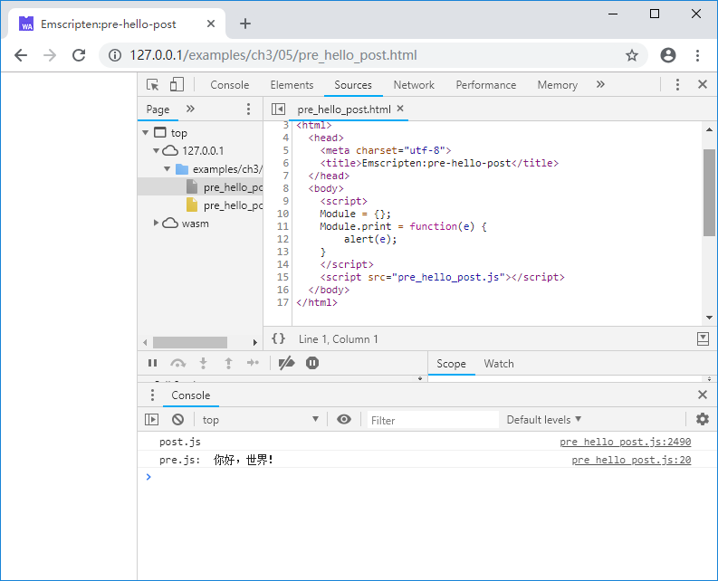

# 3.5 Customize Module object

The JavaScript `Module` object controls numerous runtime behaviors. Previously we have tried to:

- Use `Module.onRuntimeInitialized` callback to execute test code after the runtime is ready.
- Set `Module.TOTAL_MEMORY` to modify memory size.

We can also change the standard output behavior using `Module`. For example:

```html
<!--custom_print.html-->
	<script>
	Module = {};
	Module.print = function(e) {
		alert(e);
	}
	</script>
	<script src="hello.js"></script>
```

The above code changes `Module.print` to popping up dialog box with `alert()` function. When loaded along with the helloworld example .js file in section 1.2, the output is:



Additionally, the `Module` object provides a series of customizable objects/methods such as `Module.arguments`, `Module.onAbort` and `Module.noInitialRun`. Refer to the official document [https://kripken.github.io/emscripten-site/docs/api_reference/module.html](https://kripken.github.io/emscripten-site/docs/api_reference/module.html) for details.

Sometimes we hope to insert custom code before and after the .js glue code generated by Emscripten (for example installing JavaScript methods called by C/C++ code and setting customization parameters on `Module`). Two special compiling options `--pre-js <file>` and `--post-js <file>` can help. For example:

```c
//hello.cc
#include <stdio.h>

int main() {
	printf("你好，世界！\n");
	return 0;
}
```

```js
//pre.js
Module = {};
Module.print = function(e) {
	console.log('pre.js: ', e);
}
```

```js
//post.js
console.log('post.js');
```

Use this command to compile:

```
emcc hello.cc --pre-js pre.js --post-js post.js -o pre_hello_post.js
```

An excerpt of the generated `pre_hello_post.js` is shown below:

```js
...
// --pre-jses are emitted after the Module integration code, so that they can
// refer to Module (if they choose; they can also define Module)
Module = {};
Module.print = function(e) {
	console.log('pre.js: ', e);
}
// Sometimes an existing Module object exists with properties
// meant to overwrite the default module functionality. Here
// we collect those properties and reapply _after_ we configure
// the current environment's defaults to avoid having to be so
// defensive during initialization.
var moduleOverrides = {};

...

run();
// {{POST_RUN_ADDITIONS}}
// {{MODULE_ADDITIONS}}
console.log('post.js');
```

As we can it contains three parts:

1. The contents of `pre.js`;
1. The compiled .js output from `hello.cc`;
1. The contents of `post.js`.

When run the page outputs:



> **tips** Notice that the 'post.js' is output to the console first because wasm module is loaded asynchronously.
