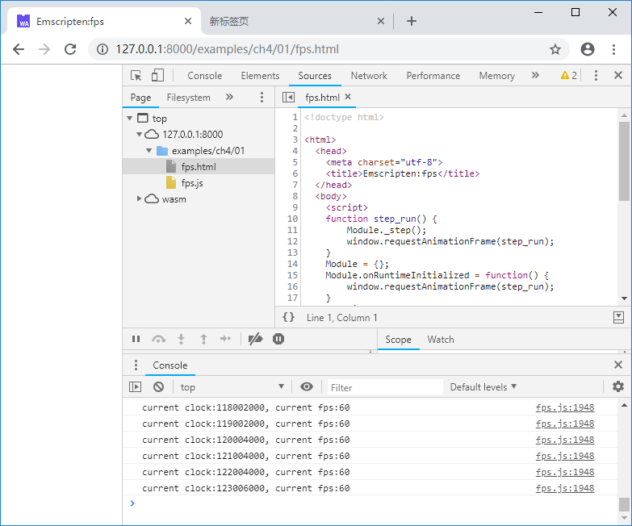

# 4.1 Message loop detaching

In Section 3.2 we introduced the use of `emscripten_set_main_loop()` to maintain the message loop. This section discusses the reasons why we don't recommend it, as well as alternative solutions.

# 4.1.1 Limitations of `emscripten_set_main_loop()`

In general, the role of the message loop can be summarized as:

1. Keep the program alive;
1. Parse and process messages (input events, timed events, etc.).

As we discussed in Section 3.1, in the new version of Emscripten (v1.37.26 and later), the runtime does not exit with the `main()` function by default. `Module` is always available before the page is closed, so there is no need to use `emscripten_set_main_loop()` to keep the program alive.

Refer to the definition of `em_callback_func`:

```c
typedef void (*em_callback_func)(void);
```

Obviously, the message callback function has no parameters, which in fact causes **the message loop can not carry message information**. It does not have event distribution and processing functions. In most cases, it can only be used as a loop timer. If you need a complete event-driven module, you still need to provide additional event entries.

Most operating system-level message loops are built around specific `messages` (such as the `MSG` structure of Windows). When cross-platform programming (WebAssembly is actually a platform), it is common to separate code that is closely related to the operating system from the core logic. In actual work, we tend to encapsulate the C/C++ code into a stateful C library - the message loop is detached from the core - to achieve the purpose of compatibility with both WebAssembly and native code.

# 4.1.2 Timed loop in JavaScript

JavaScript itself is an event-driven language, so for C/C++ modules that are only driven by events without timing, just call the corresponding event handler provided by the module when a specific event occurs in JavaScript - Some examples of GUI events will be introduced in chapter 7.

For applications that require regular execution, there are many ways to do this in JavaScript, including: `setTimeout()`, `setInterval()`, `window.requestAnimationFrame()`, and so on. Many applications that need to be executed regularly are web-based dynamic graphics rendering applications. Such applications often require stable execution interval and smooth frame rate. In this case, using `window.requestAnimationFrame()` is the best choice. Syntax:

```js
requestId = window.requestAnimationFrame(cb_func);
```

The parameter `cb_func` is a callback function that is called before the browser renders the next frame. In the actual application, `window.requestAnimationFrame()` will be called again inside the callback function, like this:

```js
    function step_func() {
        //do sth.
        window.requestAnimationFrame(step_func);
    }
```

The code above will cause the `step_func()` function to be executed each time the browser redraws.

The frame rate of the browser is synchronized with the frame rate of the display device. In the following example, the C function `step()` counts and outputs the frame rate:

```c
//loop.cc
#include <emscripten.h>
#include <stdio.h>
#include <time.h>

EM_PORT_API(void) step() {
	static int count = 0;
	static long cb = clock();	

	long t = clock();
	if (t - cb >= CLOCKS_PER_SEC) {
		cb = t;
		printf("current clock:%ld, current fps:%d\n", t, count);
		count = 0;
	}
	count++;
}
```

The JavaScript code is as follows:

```html
<!--loop.html-->
	<script>
	function step_run() {
		Module._step();
		window.requestAnimationFrame(step_run);
	}
	Module = {};
	Module.onRuntimeInitialized = function() {
		window.requestAnimationFrame(step_run);
	}
	</script>
	<script src="fps.js"></script>
```

After browsing the page, the console will output:



> **tips** In fact, Emscripten's built-in message loop uses a similar mechanism.