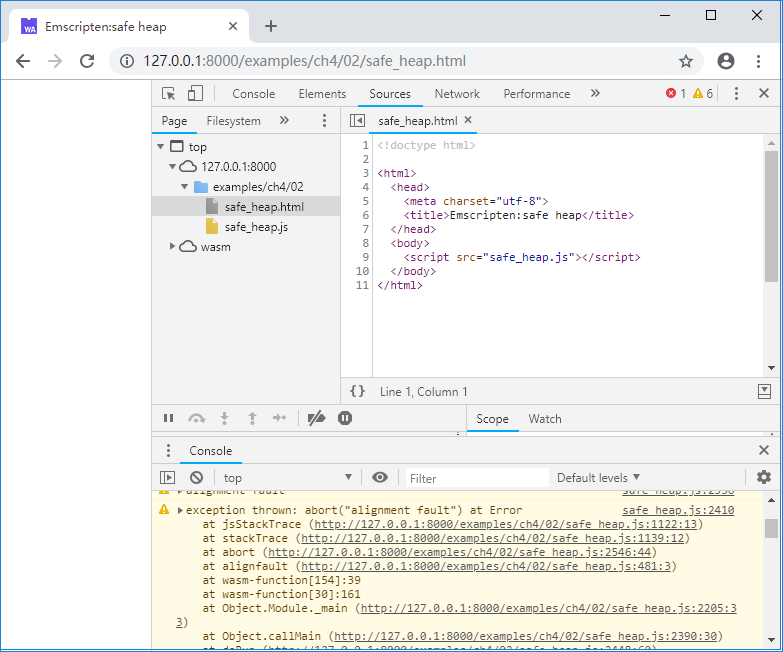

# 4.2 Memory alignment

When the target instruction set is x86/x64, unaligned memory reads and writes will not lead to error. In the Emscripten environment, when the compilation target is `asm.js` and WebAssembly, the behavior is different.

> **info** The meaning of "unaligned" here is that the memory address to be accessed is not an integer multiple of the size of the data type to be accessed.

## 4.2.1 `asm.js`

C code as follows:

```c
//unaligned.cc
struct ST {
	uint8_t	c[4];
	float	f;
};

int main() {
	char *buf = (char*)malloc(100);
	ST *pst = (ST*)(buf + 2);

	pst->c[0] = pst->c[1] = pst->c[2] = pst->c[3] = 123;
	pst->f = 3.14f;

	printf("c[0]:%d,c[1]:%d,c[2]:%d,c[3]:%d,f:%f\n",
		pst->c[0], pst->c[1], pst->c[2], pst->c[3], pst->f);

	free(buf);
	return 0;
}
```

Compile with the following command with `asm.js`:

```
emcc unaligned.cc -s WASM=0 -o unaligned_asmjs.js
```

After browsing the page, the console will output:


What happened? Why did the value of `pst->c[2]`, `pst->c[3]` change? Let's take a look at the generated JavaScript code:


Note the line 1980, corresponding to the C code `pst->f = 3.14f;`:

```js
 HEAPF32[$14>>2] = 3.1400001049041748;
```

When targeting `asm.js`, reading and writing data in memory is done by the `HEAP` view (`TypedArray`) corresponding to the data type. In the example above, when accessing the `float` variable, the `HEAPF32` of type `Float32Array` is used. While `TypedArray` is naturally aligned, the data can't be read and written correctly by the unaligned address:


## 4.2.2 WebAssembly

If we compile the above example to WebAssembly with the following command:

```
emcc unaligned.cc -o unaligned_wasm.js
```

After browsing the page, the console will output:


Very dramatic, why the data is correct when compiling to WebAssembly?

Because the memory read and write instructions of WebAssembly can be executed correctly even if the address is unaligned. For example, the wasm instruction `f32.store` in this example:


Does this mean that memory alignment can be ignored while compile to WebAssembly? No, the reason is:

1. When the address is unaligned, the performance will decrease.
1. When you need to transfer a lot of data between C/C++ and JavaScript through memory, you still can't get around the `TypedArray` view of memory - such as WebGL calls.

## 4.2.3 Detecting and avoiding unaligned memory operations

Most unaligned memory operations are derived from forcing changes to pointer types. For example, in example above, `char *` is changed to `ST *`, but this usage is difficult to avoid completely, such as serialization/deserialization, use buffer pools to store multiple types of data, etc. You should carefully design the storage structure so that each type of data is aligned to the maximum length of the data type - such as a buffer needs to store both the string and `double`, then the string length should be align up to 8 bytes to ensure that all data accesses in it are aligned.

Errors caused by unaligned memory operations are silent and difficult to troubleshoot by default. Compiling with the `SAFE_HEAP=1` option will force the runtime to check for unaligned memory operations. When this option is used, an exception is thrown when an unaligned memory read or write occurs during the run. For example, if we compile with the following command:

```
emcc unaligned.cc -s SAFE_HEAP=1 -o safe_heap.js
```

After browsing the page, the console will output:



From the exception information output from the console we can know the function that caused the unaligned memory operation and the approximate location of the operation in the function.

The `SAFE_HEAP` mode can detect unaligned memory operations regardless of whether the compilation target is `asm.js` or WebAssembly. Of course, in this mode, the performance of the program will be greatly affected and should only be used during testing.