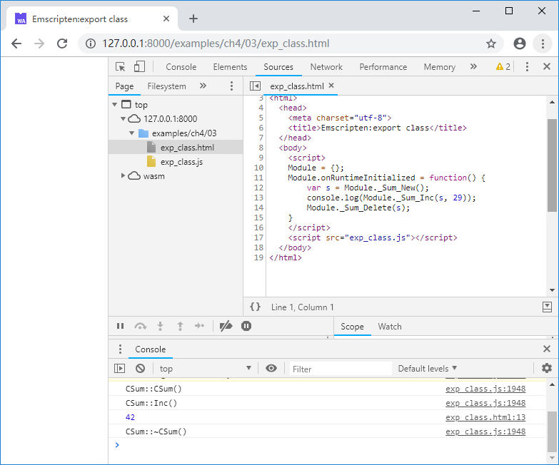

# 4.3 Exporting C++ objects using the C interface

Using `Embind` and `WebIDL Binder` in Emscripten can export C++ objects to JavaScript, but we don't use these two methods in actual work, because these methods are intrusive, more importantly, we have reservations about that "C++ classes should be used as library interfaces" - the possibility of designing a bad C++ interface is much higher than designing a bad C interface - of course this does not mean against the use of C++, in fact, C++ is our primary language, but from the perspective of interface design, we believes that the complexity of C++ classes should not overflow library boundaries, so using C interface to export C++ objects becomes a natural choice.

First we define a simple class `CSum`, which has a public function `Inc()` for accumulation operation, and a private member `m_nSum` for storing the accumulated value:

```cpp
//exp_class.cpp
class CSum {
public:
	CSum() {
		printf("CSum::CSum()\n");
		m_nSum = 13;
	}
	virtual ~CSum() {
		printf("CSum::~CSum()\n");
	}

	int Inc(int i){
		printf("CSum::Inc()\n");
		m_nSum += i;
		return m_nSum;
	}
private:
	int m_nSum;	
};
```

Next we define two export functions for the `new` and `delete` operations of the `CSum` class:

```cpp
//exp_class.cpp
struct Sum;

EM_PORT_API(struct Sum*) Sum_New() {
	CSum *obj = new CSum();
	return (struct Sum*)obj;
}

EM_PORT_API(void) Sum_Delete(struct Sum* sum) {
	CSum *obj = (CSum*)sum;
	delete obj;
}
```

The return value of `Sum_New()` and the argument of `Sum_Delete()` are the addresses of the `CSum` object in the heap. The empty structure `Sum` is additionally defined here, and `Sum*` is used as the pointer type of the `CSum` object, which avoids the type ambiguity caused by using `void*` and can provide mandatory type check during the compilation.

Next we define the export function `Sum_Inc()` whose first argument is a pointer to the `Sum*` type - the address of the `CSum` object:

```cpp
//exp_class.cpp
EM_PORT_API(int) Sum_Inc(struct Sum* sum, int i) {
	CSum *obj = (CSum*)sum;
	return obj->Inc(i);
}
```

This completes the export of the `CSum` class. Calling `Sum_New()` in JavaScript to create the `CSum` object and calling its public member function:

```js
//exp_class.html
	Module.onRuntimeInitialized = function() {
		var s = Module._Sum_New();
		console.log(Module._Sum_Inc(s, 29));
		Module._Sum_Delete(s);
    }
```

After browsing the page, the console will output:



> **tips** Due to differences in memory models, the `object` in C++ and the `object` in JavaScript are completely different. `Module._Sum_New()` returns the address of the newly created `CSum` object in the Module heap, **it's not a JavaScript object**. This approach essentially uses the address of a C++ object as a bridge between JavaScript and C++.

Obviously subclass objects with inheritance can also be exported in the same way, for example:

```cpp
//exp_child_class.cpp
class CShape {
public:
	CShape() {};
	virtual ~CShape() {};

	virtual void WhatAreYou() = 0;
};

class CTriangle : public CShape {
public:
	CTriangle() {}
	virtual ~CTriangle() {}
	
	void WhatAreYou(){ printf("I'm a triangle.\n") ;}
};

class CCircle : public CShape {
public:
	CCircle() {}
	virtual ~CCircle() {}
	
	void WhatAreYou(){ printf("I'm a circle.\n") ;}
};

//-----------------------------------

struct Shape;

EM_PORT_API(struct Shape*) Shape_New_Triangle() {
	CTriangle *obj = new CTriangle();
	return (struct Shape*)obj;
}

EM_PORT_API(struct Shape*) Shape_New_Circle() {
	CCircle *obj = new CCircle();
	return (struct Shape*)obj;
}

EM_PORT_API(void) Shape_Delete(struct Shape* shape) {
	CShape *obj = (CShape*)shape;
	delete obj;
}

EM_PORT_API(void) Shape_WhatAreYou(struct Shape* shape) {
	CShape *obj = (CShape*)shape;
	obj->WhatAreYou();
}
```

Create two subclass objects in JavaScript:

```js
//exp_child_class.html
	Module.onRuntimeInitialized = function() {
		var t = Module._Shape_New_Triangle();
		Module._Shape_WhatAreYou(t);
		
		var c = Module._Shape_New_Circle();
		Module._Shape_WhatAreYou(c);
		
		Module._Shape_Delete(t);
		Module._Shape_Delete(c);
	}
```

After browsing the page, the console will output:

