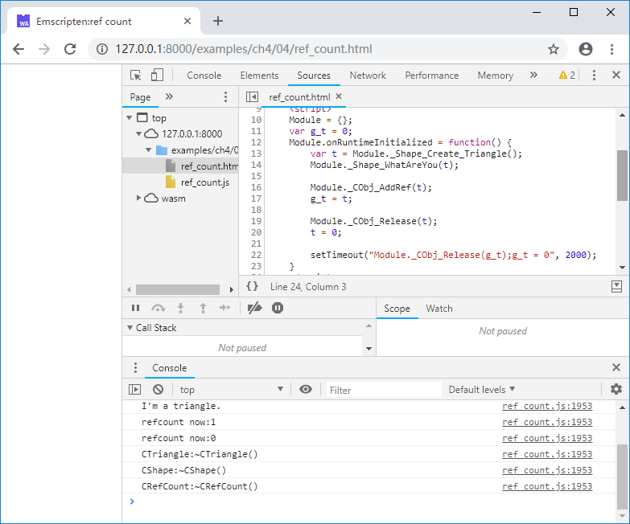

# 4.4 Lifecycle control for C++ object

C++ does not have a GC mechanism. When a C++ object is exported to JavaScript, it must use some method for object lifecycle management to avoid wild pointers or memory leaks. Reference counting is undoubtedly the most common way.

## 4.4.1 Base class for reference counting

The problem that object lifecycle management needs to solve is how to decide when to destroy an object when it is referenced in multiple places. Reference counting solves this problem in a simple way:

- Each object comes with a reference count with an initial value of 0;
- Every time when the reference of a object is obtained, increments its reference count by one;
- After the object's user finishes using the object, it does not directly destroy it. Instead, it decrements its reference count by one. When the reference count drops to 0, it means that the object is no longer used and can be safely destroyed.

In C++, we generally implement reference counting by adding the `AddRef()` and `Release()` member functions to the base class, for example:

```cpp
#include <atomic>

#ifndef SAFE_RELEASE
	#define SAFE_RELEASE(p) { if(p) { (p)->Release(); (p)=NULL; } }
#endif

class CRefCount {
public:
	CRefCount() : m_ref_count(1) {}
	virtual ~CRefCount() {}

	void AddRef() {
		m_ref_count++;
	}
	
	int Release() {
		int t = --m_ref_count;
		if (t == 0) delete this;
		return t;
	}

protected:
	std::atomic<int> m_ref_count;
};
```

The `CRefCount` constructor set its reference count member `m_ref_count` to 1, because when we create an instance of `CRefCount` we immediately get a reference (pointer) to the object, and the reference count should be 1. The member `m_ref_count` is of type `std::atomic<int>`, which guarantees atomic operations under multithreaded conditions and avoids concurrent read and write errors.

## 4.4.2 `AddRef()`/`Release()` usage rules

The use of `AddRef()`/`Release()` generally follows the following rules:

1. When an object's reference is copied from one memory location to another, `AddRef()` should be called. When a reference pointed to by a memory location is no longer used, `Release()` should be called and The memory location should set to `null`;
1. If a memory location has previously stored a reference to a non-null object A, when writing another non-null object B into it, the `Release()` of A should be called first to notify A that it is no longer used, then call B's `AddRef()`;
1. When there is a special convention for the relationship of object references between multiple memory locations, the extra `AddRef()`/`Release()` can be omitted.

The first and the second are relatively easy to understand, and the more troublesome is the third one, for example:

```cpp
	CRefCount* obj = new CRefCount();

	obj->AddRef();
	//do sth. with obj:
	Func(obj);
	obj->Release();
	
	SAFE_RELEASE(obj);
```

The `AddRef()` and `Release()` around `Func(obj)` are actually unnecessary, because `obj` is always valid during the execution of `Func(obj)`. Another example:

```cpp
void Func(CRefCount* obj) {
	if (!obj) return;

	obj->AddRef();
	CRefCount* temp = obj;
	//do sth. with temp:
	//...
	SAFE_RELEASE(temp);
}
```

`obj->AddRef()` and `temp->Release()` are also unnecessary, because the lifetime of the local variable `temp` is consistent with the `Func()`.

<!--
The reference count increase and decrease rule can be simplified to:
1. For `[in]` objects, if you save it to another location, call `AddRef()`;
1. For `[out]` objects, call `AddRef()`;
1. For `[in out]` objects, first `Release()`, then `AddRef()` after modifying it;
1. If you are not sure, always add `AddRef()`/`Release()`.

The first through the third correspond to the following examples:

1：

```cpp
void Func(CRefCount* obj) {
	//do sth. with obj:
	//...
}
```

2：

```cpp
CRefCount* g_obj = new CRefCount();
CRefCount* GetGlobalObj() {
	g_obj->AddRef();
	return g_obj;
}
```

3：

```cpp
CRefCount* g_obj = new CRefCount();
void UpdateObj(CRefCount*& obj) {
	SAFE_RELEASE(obj);
	g_obj->AddRef();
	obj = g_obj;
}
```-->

## 4.4.3 Exporting `AddRef()`/`Release()`

According to the introduction in Section 4.3, if all C++ objects inherit from the same `CRefCount` base class, then you only need to export the `AddRef()`/`Release()` of `CRefCount`. For example:

```cpp
//ref_count.cpp
#include <stdio.h>
#include <atomic>

#ifndef SAFE_RELEASE
	#define SAFE_RELEASE(p) { if(p) { (p)->Release(); (p)=NULL; } }
#endif

class CRefCount {
public:
	CRefCount() : m_ref_count(1) {}
	virtual ~CRefCount() { printf("CRefCount:~CRefCount()\n"); }

	void AddRef() {
		m_ref_count++;
	}
	
	int Release() {
		int t = --m_ref_count;
		printf("refcount now:%d\n", t);
		if (t == 0) delete this;
		return t;
	}

protected:
	std::atomic<int> m_ref_count;
};

struct RefCount;

EM_PORT_API(void) CObj_AddRef(struct RefCount* obj) {
	CRefCount *ro = (CRefCount*)obj;
	ro->AddRef();
}

EM_PORT_API(int) CObj_Release(struct RefCount* obj) {
	CRefCount *ro = (CRefCount*)obj;
	if (ro) {
		return ro->Release();
	}
	else return 0;
}

//-----------------------------------

class CShape : public CRefCount{
public:
	CShape() {}
	virtual ~CShape() { printf("CShape:~CShape()\n"); }

	virtual void WhatAreYou() = 0;
};

struct Shape;

EM_PORT_API(void) Shape_WhatAreYou(struct Shape* shape) {
	CShape *obj = (CShape*)shape;
	obj->WhatAreYou();
}

//-----------------------------------

class CTriangle : public CShape {
public:
	CTriangle() {}
	virtual ~CTriangle() { printf("CTriangle:~CTriangle()\n"); }
	
	void WhatAreYou(){ printf("I'm a triangle.\n"); }
};

EM_PORT_API(struct Shape*) Shape_Create_Triangle() {
	CTriangle *obj = new CTriangle();
	return (struct Shape*)obj;
}
```

JavaScript code as follows:

```js
//ref_count.html
	Module = {};
	var g_t = 0;
	Module.onRuntimeInitialized = function() {
		var t = Module._Shape_Create_Triangle();
		Module._Shape_WhatAreYou(t);

		Module._CObj_AddRef(t);
		g_t = t;

		Module._CObj_Release(t);
		t = 0;
		
		setTimeout("Module._CObj_Release(g_t);g_t = 0", 2000);
	}
```

2 seconds after browsing the page, the console will output:



So far, we have completed the export and life cycle control of C++ objects.