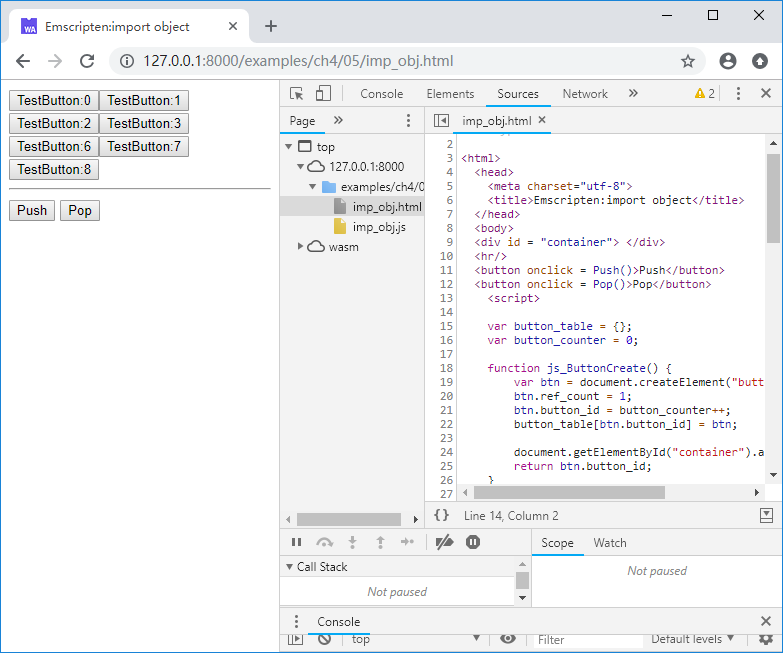
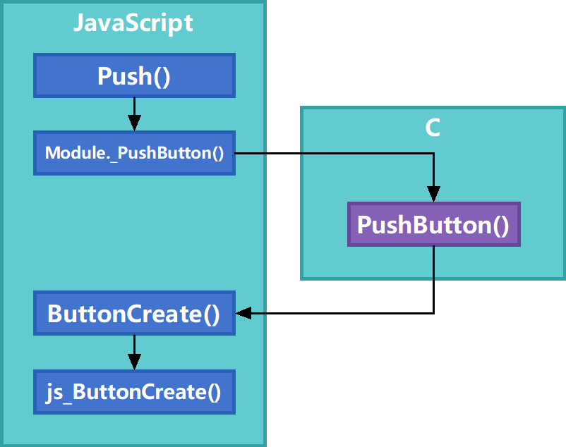

# 4.5 Importing JavaScript object using C interface

Sections 4.3 and 4.4 describe how to export C++ objects to JavaScript. This section describes the inverses of it: importing JavaScript objects into C.

## 4.5.1 Creating a JavaScript-object/ID table

As introduced in Section 2.3, C code cannot access objects in JavaScript directly. To do this, we need to provide a way for C code to recognize different JavaScript objects. The easiest way is to use the object/ID table. The core idea of this method is:

- assign a non-repeating integer ID to each JavaScript object that will be imported into C, and store the object/ID relationship in a table;
- Pass the object's ID into C, which uses the ID to refer to the actual JavaScript object;
- When the C code manipulates an object through the injected function, the injected function looks up the actual JavaScript object by ID in the object/ID table and manipulates it.

> **tips** In fact, this method uses the same idea as the C++ object export method described in Section 4.3. The only difference is that the address of the C++ object is used in Section 4.3 to refer to the C++ object itself.

The following JavaScript code is a simple example of using an object/ID table:

```js
var obj_table = {};
var obj_counter = 0;

function MyObj_Create() {
	this.name = "MyObj";
	this.obj_id = obj_counter++;
	obj_table[this.obj_id] = this;
}

function MyObj_Func(obj_id) {
	if (!obj_table[obj_id]) return;
	//do sth. with obj_table[obj_id]
}
```

`obj_table` is the object/ID table; when the constructor function `MyObj_Create()` creates a new object, it will be assigned an ID for the object and the corresponding relationship will be saved in `obj_table`. The function `MyObj_Func()` looks up the corresponding object by `obj_id` and then uses it.

## 4.5.2 Lifecycle control of imported JavaScript objects

After the JavaScript object is imported into the C environment, it still needs lifecycle control. The `AddRef()`/`Release()` method in Section 4.4 can still be used here.

For example, we define a set of JavaScript methods as follows:

```js
//imp_obj.html
	var button_table = {};
	var button_counter = 0;

	function js_ButtonCreate() {
		var btn = document.createElement("button");
		btn.ref_count = 1;
		btn.button_id = button_counter++;
		button_table[btn.button_id] = btn;
	
		document.getElementById("container").appendChild(btn);
		return btn.button_id;
	}
	
	function js_ButtonAddRef(button_id) {
		if (!button_table[button_id]) return;
		
		button_table[button_id].ref_count++;
	}
	
	function js_ButtonRelease(button_id) {
		if (!button_table[button_id]) return -1;
	
		var btn = button_table[button_id];
		btn.ref_count--;
		var rc = btn.ref_count;
		if (rc == 0) {
			document.getElementById("container").removeChild(btn);
			delete button_table[button_id];
		}
		return rc;
	}
	
	function js_ButtonSetInnerHtml(button_id, name) {
		if (!button_table[button_id]) return;
		button_table[button_id].innerHTML = name;	
	}
```

`js_ButtonCreate()` creates a button in the DOM, `js_ButtonAddRef()`/`js_ButtonRelease()` increases and decreases the reference count of the button, and `js_ButtonSetInnerHtml()` sets the internal html content of the specified button. Referring to Section 4.5.1, these four functions work around the button/ID table `button_table`.

Then use the methods described in Section 2.2 to inject these methods into C. The import library code is as follows:

```js
//pkg.js
mergeInto(LibraryManager.library, {
	ButtonCreate: function () {
		return js_ButtonCreate();
    },
	
	ButtonAddRef: function (button_id) {
		js_ButtonAddRef(button_id);
    },
	
	ButtonRelease: function (button_id) {
		return js_ButtonRelease(button_id);
	},

	ButtonSetInnerHtml: function(button_id, str) {
		js_ButtonSetInnerHtml(button_id, Pointer_stringify(str));
	}
})
```

The C API and exported functions are as follows:

```c
//imp_obj.cpp
struct JS_BUTTON;
EM_PORT_API(struct JS_BUTTON*) ButtonCreate();
EM_PORT_API(void) ButtonAddRef(struct JS_BUTTON* btn);
EM_PORT_API(int) ButtonRelease(struct JS_BUTTON* btn);
EM_PORT_API(void) ButtonSetInnerHtml(struct JS_BUTTON* btn, const char* str);

//-----------------------------------

std::vector<struct JS_BUTTON*> g_buttons;

EM_PORT_API(void) PushButton() {
	JS_BUTTON* btn = ButtonCreate();
	char name[256];
	sprintf(name, "TestButton:%d", (int)btn);
	ButtonSetInnerHtml(btn, name);
	g_buttons.push_back(btn);
}

EM_PORT_API(void) PopButton() {
	if (g_buttons.size() <= 0) return;
	JS_BUTTON* btn = g_buttons.back();
	ButtonRelease(btn);
	g_buttons.pop_back();
}
```

Compile with the following command:

```
emcc imp_obj.cpp --js-library pkg.js -o imp_obj.js
```

Then we create two buttons in the page and call `PushButton()`/`PopButton()` in their `onclick` event:

```html
  <button onclick = Push()>Push</button>
  <button onclick = Pop()>Pop</button>
	<script>
	......
	
	function Push(){
		Module._PushButton();
	}
	
	function Pop(){
		Module._PopButton();
	}
```

After browsing the page, click on `Push`/`Pop` and you can see that multiple buttons have been created/deleted in the DOM:



The calling sequence is as shown below:


