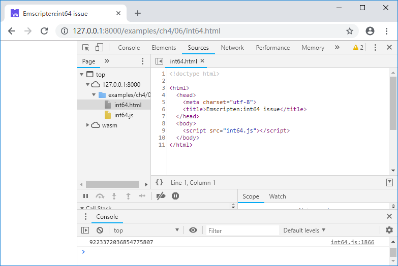
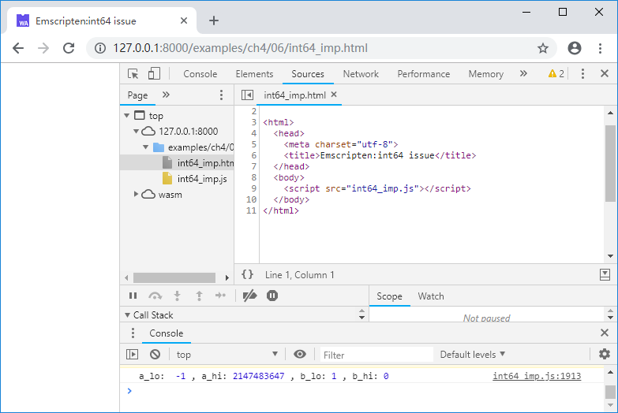

# 4.6 Be careful with `int64`

This section describes some of the issues with Emscripten about 64-bit integers.

## 4.6.1 WebAssembly natively supports `int64`

First of all, WebAssembly does supports 64-bit integer operations. For example, C code as follows:

```c
//int64.cc
int main() {
	int64_t a = 9223372036854775806; //0x7FFFFFFFFFFFFFFE
	a += 1;
	printf("%lld\n", a);
}
```

The console outputs:



It can be seen that the result of the addition of `int64` is correct, and `printf()` can also output the result correctly. However, if C/C++ tries to exchange 64-bit integers with JavaScript, it will be in trouble.

## 4.6.2 The export function contains `int64`

JavaScript has only one numeric type: `number` - equivalent to `double` in C, JavaScript essentially cannot express 64-bit integers, so there is an embarrassing limitation in the current WebAssembly specification:

> **info** WebAssembly export functions cannot use 64-bit integers as parameters or return values. Once a function whose parameter or return value is `int64` is called in JavaScript, `TypeError` will be thrown. See section 3.7 of "WebAssembly Primer" for details.

Due to this limitation, Emscripten made the following compromises:

- When a parameter of the exported function is a 64-bit integer, split it into two parts, the lower part and the higher part (both are 32-bit integers).
- When the return value of the exported function is a 64-bit integer, only the lower 32-bits can be received in JavaScript.

For example, the following C function:

```c
int64_t func(int64_t a, int64_t b)
```

After exporting to JavaScript it will become:

```c
int32_t func(int32_t a_lo, int32_t a_hi, int32_t b_lo, int32_t b_hi)
```

Where `a_lo`/`a_hi` is the lower 32 bits/higher 32 bits of `a`, `b_lo`/`b_hi` is the lower 32 bits/higher 32 bits of `b`.

For example C code as follows:

```c
//int64_exp.cc
EM_PORT_API(int64_t) i64_add(int64_t a, int64_t b) {
	int64_t c = a + b;
	printf("a:%lld, b:%lld:, a+b: %lld\n", a, b, c);
	return c;
}

int main() {
	printf("main():");
	printf("%lld\n", i64_add(9223372036854775806, 1));
}
```

The following method should be used when calling the export function `i64_add()` in JavaScript:

```js
//int64_exp.html
	Module = {};
	Module.onRuntimeInitialized = function() {
		console.log(Module._i64_add(0xFFFFFFFE,0x7FFFFFFF, 1, 0));
	}
```

After browsing the page, the console outputs:


Note that the first two lines of output correspond to `console.log(Module._i64_add(0xFFFFFFFE, 0x7FFFFFFF, 1, 0))` in JavaScript. You can see that each `int64` is split into two `int32` and passed to C. The addition is performed correctly in the code, but the return value only retains the lower 32 bits (0xFFFFFFFF) to -1.

The output of the next two lines corresponds to `printf("%lld\n", i64_add(9223372036854775806, 1))` in C; the result and output of the arithmetic operation are correct.

## 4.6.2 The injected function contains `int64`

Using the method in Section 2.2, when implementing the C function interface in JavaScript, if the parameters of the function interface contain 64-bit integers, the lower 32 bits/higher 32 bits will be split in the same way, such as:

```c
//int64_imp.cc
EM_PORT_API(void) i64_func(int64_t a, int64_t b);

int main() {
	i64_func(0x7FFFFFFFFFFFFFFF, 1);
}
```

The injected function will receive 4 parameters, which are `a_lo`, `a_hi`, `b_lo`, `b_hi`:

```js
//pkg.js
mergeInto(LibraryManager.library, {
	i64_func: function (a_lo, a_hi, b_lo, b_hi) {
		console.log('a_lo: ', a_lo, ', a_hi:', a_hi, ', b_lo:', b_lo, ', b_hi:', b_hi);
    }
})
```

Compile with the following command:

```
emcc int64_imp.cc --js-library pkg.js  -o int64_imp.js
```

After browsing the page, the console outpus:



## 4.6.3 Summary

As can be seen from the above example, due to the defect of JavaScript itself, C functions that containe `int64` parameter/return value will be deformed when imported and exported in Emscripten. We hope that JavaScript will natively support 64-bit integers one day. Before that, our advice is: Try not to exchange `int64` between JavaScript and C/C++.