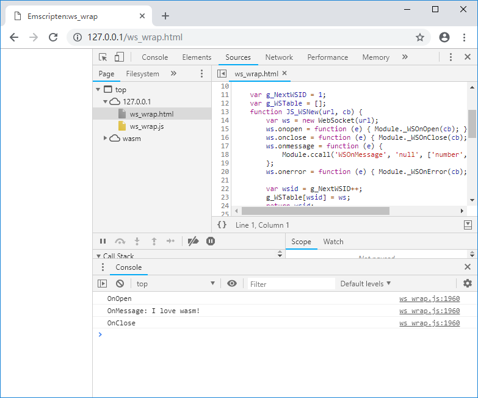

# 5.2 WebSocket

This section describes how to use WebSocket in Emscripten.

## 5.2.1 Introduction to WebSocket

WebSocket has become an international standard in 2011 and is currently supported by most browsers. Compared with HTTP, WebSocket has the following characteristics:

1. WebSocket is a long-lived-connection protocol. After successful connection, it can send data multiple times.
1. Different from HTTP which only one-way request can be initiated by the client, WebSocket is a two-way protocol. After the connection is established, both the client and the server can send data to the each other actively.
1. WebSocket can send both text data and binary data;
1. WebSocket has no homologous restrictions;
1. Unencrypted WebSocket uses `ws` as the protocol identifier and uses TCP protocol encapsulation; encrypted WebSocket uses `wss` as the protocol identifier and is encapsulated using TLS protocol.

To facilitate testing, we first create a simple WebSocket echo service. We choose Golang to create the service, the code is as follows:

```go
//ws_echo.go
package main

import (
	"fmt"
	"log"
	"net/http"
	"syscall"

	"golang.org/x/net/websocket"

	"os"
	"os/signal"
)

func main() {
	log.Println("ws_echo start...")

	wsPort := 40001
	go func() {
		log.Println(fmt.Sprint("WebSocket:", wsPort, " Listening ..."))
		http.Handle("/ws_echo", websocket.Handler(webSocketHandler))
		err := http.ListenAndServe(fmt.Sprint(":", wsPort), nil)
		if err != nil {
			panic("ListenAndServe: " + err.Error())
		}
	}()

	httpPort := 80
	go func() {
		log.Println(fmt.Sprint("http:", httpPort, " Listening ..."))
		err := http.ListenAndServe(fmt.Sprint(":", httpPort),
			http.FileServer(http.Dir("./")))
		if err != nil {
			panic("ListenAndServe: " + err.Error())
		}
	}()

	ch := make(chan os.Signal, 1)
	signal.Notify(ch, syscall.SIGINT, syscall.SIGTERM)
	log.Printf("ws_echo quit (%v)\n", <-ch)
}

func webSocketHandler(ws *websocket.Conn) {
	ws.PayloadType = websocket.TextFrame
	defer ws.Close()

	rtemp := make([]byte, 32768)
	for {
		n, err := ws.Read(rtemp)
		if err != nil {
			log.Println("Error:Read:", err)
			return
		}

		n, err = ws.Write(rtemp[:n])
	}
}
```

The code above serves up current folder on port 80, and starts the WebSocket echo service on the `/ws_echo` path of port 40001, the service recieves data from client and then sends it back. After installing the Golang environment, start the program with the following command:

```
go run ws_echo.go
```

## 5.2.2 Using WebSocket in JavaScript

Create a WebSocket object in JavaScript using the `WebSocket()` constructor, the `WebSocket.send()` method is used to send data, and the `WebSocket.onmessage()` property is used to specify a callback function that handles the received data, for example:

```js
//websocket_js.html
	var ws = new WebSocket("ws://localhost:40001/ws_echo");
	ws.onopen = function(e) {
	  console.log("ws.onopen");
	  ws.send("Hello world!");
	}

	ws.onmessage = function(e) {
	  console.log("ws.onmessage: " + e.data);
	  ws.close();
	}

	ws.onclose = function(e) {
	  console.log("ws.onclose");
	}

	ws.onerror = function(e) {
	  console.log("ws.onerror");
	}
```

The code above creates a WebSocket connection to `ws://localhost:40001/ws_echo`. After the connection is established, it sends "Hello world!". After the WebSocket echo service sends the received data back, `ws.onmessage()` print the received data to console:


## 5.2.3 Wrapping WebSocket object using C API

Similar to the wrapping method of `XMLHttpRequest` described in Section 5.1, the C interface of a WebSocket object is divided into two parts:

1. Functions that called by C, implemented by JavaScript. Including the creation of WebSocket objects, sending data etc.
1. Functions that called by JavaScript, implemented by C. Includes callbacks for various events

C code:

```cpp
//ws_wrap.cpp

struct WS_WRAPPER;
struct WS_CB;

//imp by JavaScript, call by C:
EM_PORT_API(struct WS_WRAPPER*) WSNew(const char *url, struct WS_CB *cb);
EM_PORT_API(int) WSSend(struct WS_WRAPPER *ws, const char *data);
EM_PORT_API(void) WSDelete(struct WS_WRAPPER *ws);

//WebSocket callback:
class CWSCallback{
public:
	CWSCallback(const char *url){
		m_ws = WSNew(url, (struct WS_CB*)this);
	}
	virtual ~CWSCallback(){}

	void OnOpen(){
		printf("OnOpen\n");
		WSSend(m_ws, "I love wasm!");
	}

	void OnClose(){
		printf("OnClose\n");
	}

	void OnMessage(const char* data){
		printf("OnMessage: %s\n", data);
		WSDelete(m_ws);
		m_ws = NULL;
	}

	void OnError(){
		printf("OnError\n");
	}

	struct WS_WRAPPER *m_ws;
};

//imp by C, call by JavaScript:
EM_PORT_API(void) WSOnOpen(struct WS_CB *cb){
	if (cb == NULL) return;
	CWSCallback *pc = (CWSCallback*)cb;
	pc->OnOpen();
}

EM_PORT_API(void) WSOnClose(struct WS_CB *cb){
	if (cb == NULL) return;
	CWSCallback *pc = (CWSCallback*)cb;
	pc->OnClose();
}

EM_PORT_API(void) WSOnMessage(struct WS_CB *cb, const char* data){
	if (cb == NULL) return;
	CWSCallback *pc = (CWSCallback*)cb;
	pc->OnMessage(data);
}

EM_PORT_API(void) WSOnError(struct WS_CB *cb){
	if (cb == NULL) return;
	CWSCallback *pc = (CWSCallback*)cb;
	pc->OnError();
}

CWSCallback wscb("ws://localhost:40001/ws_echo");
```

Similar to the method described in Section 5, when we create a WebSocket connection, we bind a callback object `cb` to handle the callback events for it. By this way, when the program starts multiple WebSocket connections at the same time, we can assign different callback processing objects to each WebSocket connection.

The import library is as follows:

```js
//pkg.js
mergeInto(LibraryManager.library, {
	WSNew: function (url, cb) {
		return JS_WSNew(Pointer_stringify(url), cb);
	},

	WSSend: function (ws, data) {
		return JS_WSSend(ws, Pointer_stringify(data));
	},

	WSDelete: function (ws) {
		return JS_WSDelete(ws);
	}
})
```

JavaScript code:

```js
//ws_wrap.html
	var g_NextWSID = 1;
	var g_WSTable = [];
	function JS_WSNew(url, cb) {
		var ws = new WebSocket(url);
		ws.onopen = function (e) { Module._WSOnOpen(cb); };
		ws.onclose = function (e) { Module._WSOnClose(cb); };
		ws.onmessage = function (e) {
			Module.ccall('WSOnMessage', 'null', ['number', 'string'], [cb, e.data]);
		};
		ws.onerror = function (e) { Module._WSOnError(cb); };

		var wsid = g_NextWSID++;
		g_WSTable[wsid] = ws;
		return wsid;
	}

	function JS_WSSend(ws, data) {
		var ws = g_WSTable[ws];
		ws.send(data);
	}

	function JS_WSDelete(ws) {
		var ws = g_WSTable[ws];
		ws.close();
	}
```

The entire program integrates techniques such as **exporting C++ objects** (Section 4.3), **importing JavaScript objects** (Section 4.5), and **ccall** (Section 2.7). Compile with the following command:

```
emcc  ws_wrap.cpp --js-library pkg.js -s "EXTRA_EXPORTED_RUNTIME_METHODS=['ccall']" -o ws_wrap.js
```

Start the WebSocket echo service then browse the page, the console outputs:


