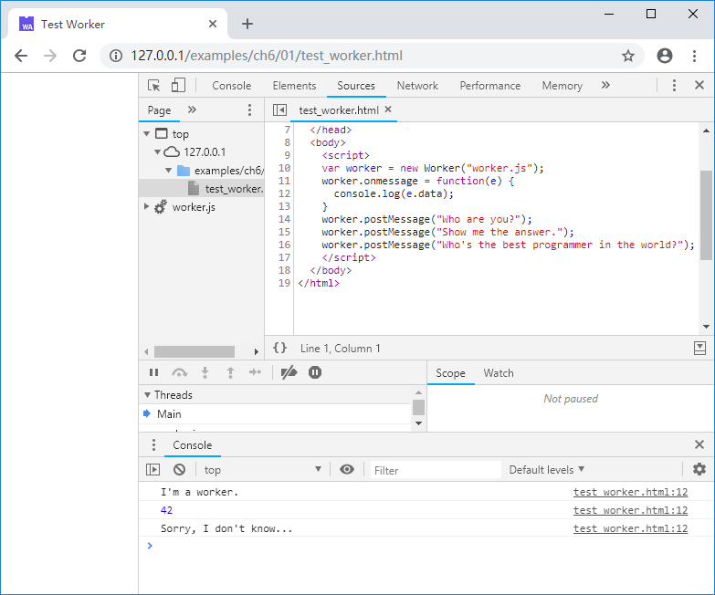

# 6.1 Multithreading in JavaScript

This section introduces multithreading in JavaScript with examples.

## 6.1.1 Fundamentals of multithreading in JavaScript

Developers who have dealt with multithreaded native applications in C are no stranger to the relationships between threads and processes, the most important point being:

> All threads of a process share the same memory space.

Thus the majority of multithreaded C programs are **shared-memory** concurrency, in that threads could exchange data via memory freely. In the mean time, management of contended resources accesses become the most common problems in multithreading programming and many of us have struggled with write-synchronization and deadlocks.

In contrast, although JavaScript can start concurrent execution of multiple threads via the `Worker` object, but between `Worker`s and the main thread or between two `Worker`s, there is no shared memory. From this perspective, the behavior of `Worker` is more similar to process than to thread.

> **info** Some newest browsers support the `SharedArrayBuffer` object between `Worker`s. But this object-specific sharing is at a different level to inter-thread memory sharing of C. Currently `SharedArrayBuffer` may have compatibility issues and is out of topic.

Although it may not be familiar to C developers, concurrency model that doesn't rely on memory-sharing is not uncommon, Go's CSP modeling being an instance. In the same spirit, JavaScript parent and child `Worker`s can dispatch and concurrently execute tasks by sending messages to each other.

## 6.1.2 An example of `Worker` usage

The URL of the JavaScript file corresponding to a `Worker` must be specified when the `Worker` is created. For example:

```js
//test_worker.html
    var worker = new Worker("worker.js");
    worker.onmessage = function(e) {
      console.log(e.data);
    }
    worker.postMessage("Who are you?");
    worker.postMessage("Show me the answer.");
    worker.postMessage("Who's the best programmer in the world?");
```

`new Worker("worker.js");` creates a `Worker` object and designates it to use `worker.js`. The `worker.onmessage` callback handles message sent by the `Worker`. `worker.postMessage()` sends messages to the `Worker`.

An excerpt of the `Worker`'s code is shown below:

```js
//worker.js
onmessage = function(e){
  if (e.data == "Who are you?") {
    postMessage("I'm a worker.");
  }
  else if (e.data == "Show me the answer.") {
    postMessage(42);
  }
  else {
    postMessage("Sorry, I don't know...")
  }
}
```

In the `Worker`, the `onmessage` callback handles messages from the parent thread. `postMessage()` sends messages to the parent thread. In the above example, different actions are taken according to the message from the parent. When the page is loaded, the console outputs:


