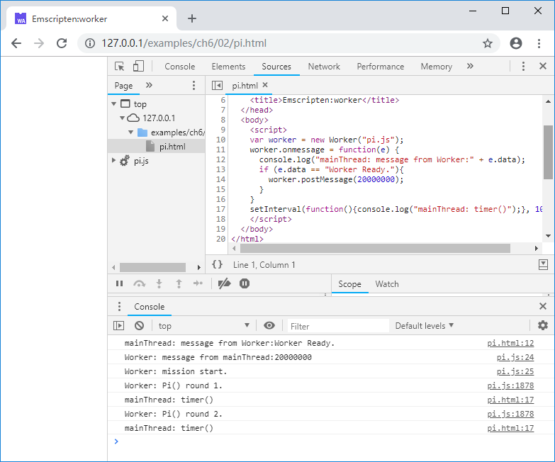
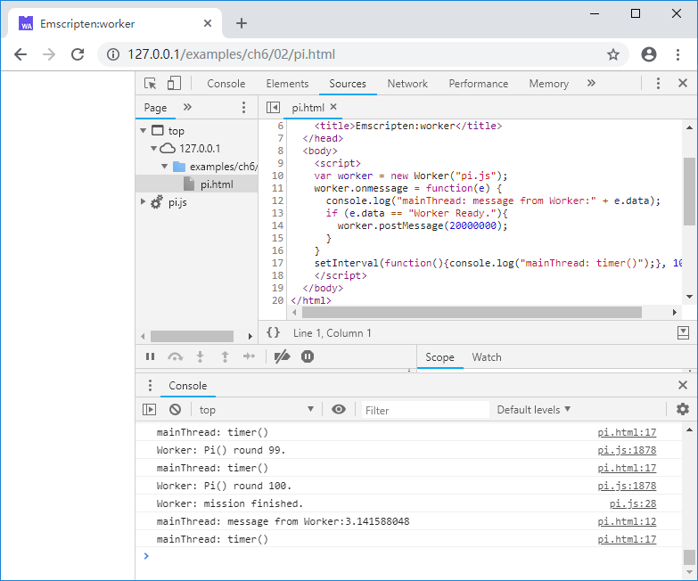

# 6.2 Using Emscripten in Web Worker

The section dissects an example of concurrent execution using Emscripten and `Worker`.

Let's see the C code first:

```c
//pi.cc
double Random()
{
	static int seed = 1;
	static int const a = 16807, m = 2147483647, q = 127773, r = 2836;

	seed = a * (seed % q) - r * (seed / q);
	if (seed < 0) seed += m;
	return (double)seed / (double)m;
}

EM_PORT_API(double) Pi(int trials)
{
	double sum = 0.0;
	for (int j = 0; j < 100; j++)
	{
		int hits = 0;
		for (int i = 0; i < trials; i++)
		{
			double x = Random();
			double y = Random();
			if (x * x + y * y < 1.0)
				hits++;
		}
		sum += 4.0 * hits / trials;
		printf("Worker: Pi() round %d.\n", j + 1);
	}
	return sum / 100.0f;
}
```

A 'Pi()' function is exported from the C code, which computes Pi using probabilistic method. It takes as input the number of trials of each round, and repeats for 100 rounds, outputting a counter at the end of each one.

Before compiling, we need a `pre'js` (that will be inserted before the js file generated by emcc) shown below:

```js
//pre.js
Module = {};
Module.onRuntimeInitialized = function() {
  postMessage("Worker Ready.");
}

onmessage = function(e){
  console.log("Worker: message from mainThread:" + e.data);
  console.log("Worker: mission start.");
  var p = Module._Pi(e.data);
  postMessage(p);
  console.log("Worker: mission finished.");
}
```

The `onmessage()` callback function defined in `pre.js` handles messages from the main thread. It computes Pi according to the parameter passed by the main thread and sends the result back by `postMessage()`. Even in `Worker`, the compiling and initialization of `Module` is also asynchronous. That `Worker` has finished loading the js file doesn't mean the `Module` runtime is usable so some notification mechanism must be leveraged to ensure that `Module` is initialized before `Worker` starts calling it. In this example, we again sets the `Module.onRuntimeInitialized` callback to signal the main thread that `Module` is ready.

Compile with the command:

```
emcc pi.cc --pre-js pre.js -o pi.js
```

The code for the main thread (i.e. the page) is shown below:

```js
//pi.html
    var worker = new Worker("pi.js");
    worker.onmessage = function(e) {
      console.log("mainThread: message from Worker:" + e.data);
      if (e.data == "Worker Ready."){
        worker.postMessage(20000000);
      }
    }
    setInterval(function(){console.log("mainThread: timer()");}, 1000);
```

This part is simple: after ensuring the `Module` in `Worker` is ready by receiving "Worker Ready.", send the task parameter `2000000` to `Worker` to compute Pi.

When the page is loaded, the console shows:



If you open the CPU monitor, you can see a core fully loaded by the computation of a `Worker`. The main thread is not blocked and outputs timer log periodically. After 1-2 minutes the `Worker` finishes and sends back the result:

