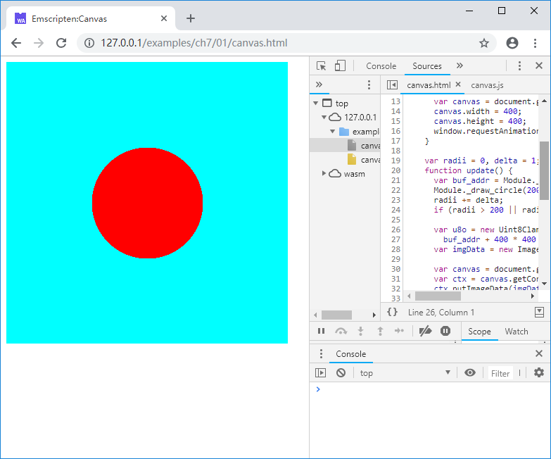

# 7.1 Canvas

The `Canvas` object is similar to the `DC` object in the Windows system. It is a rectangular area on the screen that provides a series of operations such as as line drawing, polygon filling, character output, etc. Most importantly, it can read and write the RGBA value of pixels in the area directly, which allows us to draw arbitrary images on the `Canvas`.

The example in this section create a page that contains a `Canvas`, and a red circle that is rounded up and down will be drawn on the `Canvas`. among them:

- C code manages image data and drawing of circles;
- JavaScript code updates Canvas data and animation.

C code:

```c
//canvas.html
uint8_t *img_buf = NULL;
int img_width = 0, img_height = 0;

EM_PORT_API(uint8_t*) get_img_buf(int w, int h) {
	if (img_buf == NULL || w != img_width || h != img_height) {
		if (img_buf) {
			free(img_buf);
		}
		img_buf = (uint8_t*)malloc(w * h * 4);
		img_width = w;
		img_height = h;
	}

	return img_buf;
}

EM_PORT_API(void) draw_circle(int cx, int cy, int radii) {
	int sq = radii * radii;
	for (int y = 0; y < img_height; y++) {
		for (int x = 0; x < img_width; x++) {
			int d = (y - cy) * (y - cy) + (x - cx) * (x - cx);
			if (d < sq) {
				img_buf[(y * img_width + x) * 4] = 255;		//r
				img_buf[(y * img_width + x) * 4 + 1] = 0;	//g
				img_buf[(y * img_width + x) * 4 + 2] = 0;	//b
				img_buf[(y * img_width + x) * 4 + 3] = 255;	//a
			}
			else {
				img_buf[(y * img_width + x) * 4] = 0;		//r
				img_buf[(y * img_width + x) * 4 + 1] = 255;	//g
				img_buf[(y * img_width + x) * 4 + 2] = 255;	//b
				img_buf[(y * img_width + x) * 4 + 3] = 255;	//a
			}
		}
	}
}
```

`img_buf` points to the buffer used to hold the bitmap. The `get_img_buf()` function will determine if the buffer needs to be recreated based on the parameters passed in. The `draw_circle()` function will fill the drawn circle with the specified radius at the specified position.

html:

```html
//canvas.html
    <canvas id="myCanvas"></canvas>
    <script>
    Module = {};
    Module.onRuntimeInitialized = function() {
      var canvas = document.getElementById('myCanvas');
      canvas.width = 400;
      canvas.height = 400;
      window.requestAnimationFrame(update);
    }

    var radii = 0, delta = 1;
    function update() {
      var buf_addr = Module._get_img_buf(400, 400);
      Module._draw_circle(200, 200, radii);
      radii += delta;
      if (radii > 200 || radii < 0) delta = -delta;

      var u8o = new Uint8ClampedArray(Module.HEAPU8.subarray(buf_addr,
        buf_addr + 400 * 400 * 4));
      var imgData = new ImageData(u8o, 400, 400);

      var canvas = document.getElementById('myCanvas');
      var ctx = canvas.getContext('2d');
      ctx.putImageData(imgData, 0, 0);

      window.requestAnimationFrame(update);
    }
    </script>
    <script src="canvas.js"></script>
```

The `Canvas` element with id `myCanvas` is declared in html. When each frame is updated, the image data is extracted from the Emscripten runtime `Module`, the `ImageData` object `imgData` is created, and the `CanvasRenderingContext2D` object `ctx` is updated by `imgData`. The overall data flow is shown below:


Compile with the following command:

```
emcc canvas.cc -o canvas.js
```

Browsing the page, a red circle that grows bigger and smaller will appear on the cyan background:



In fact, the `Canvas` object has built-in drawing methods for various geometries including circles, rectangles, and sectors. The code above uses the custom `draw_circle()` function to demonstrate how to manipulate bitmaps in C, and how to extract the image and update to `Canvas`. For details on related objects such as `Canvas`, `ImageData`, `CanvasRenderingContext2D`, refer to MDN.
