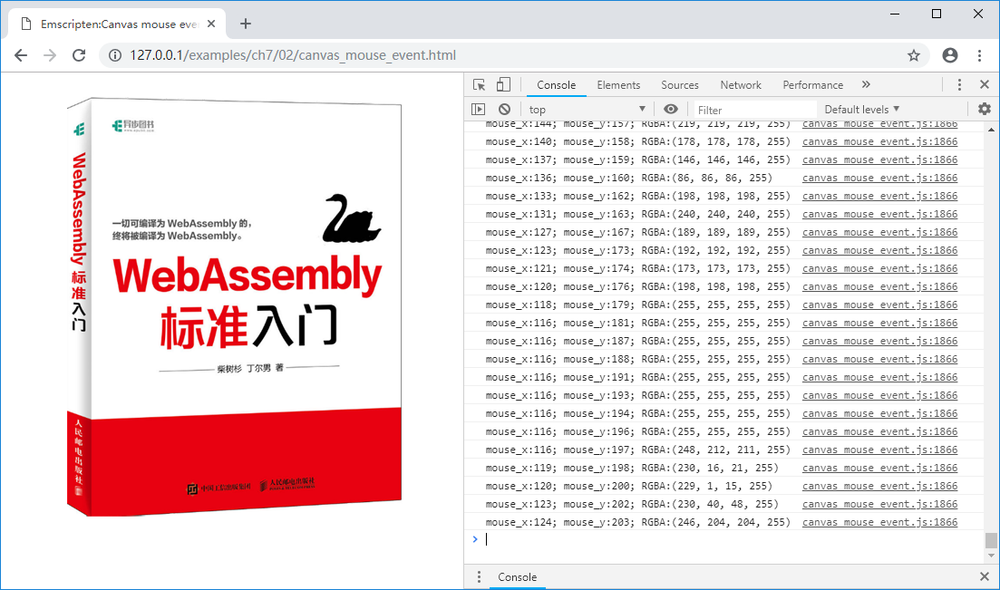

# 7.2 Mouse events

In JavaScript, it's very easy to attach events to DOM elements. This section uses `Canvas` as an example to introduce mouse events.

The example in this section create a page that contains a `Canvas` that will call the C function when the mouse moves over the `Canvas`, outputting the coordinates of the cursor in the Canvas and the color (RGBA) of the pixel at that coordinate.

html:

```html
//canvas_mouse_event.html
    <canvas id="myCanvas"></canvas>
    <script>
    Module = {};
    Module.onRuntimeInitialized = function() {
      var image=new Image();
      image.src="cover.png";
      image.onload=function() {
        var canvas = document.getElementById('myCanvas');
        var ctx = canvas.getContext("2d");
        canvas.width = image.width;
        canvas.height = image.height;
        ctx.drawImage(image, 0, 0);
        var img_data = ctx.getImageData(0, 0, image.width, image.height).data;

        var buf_addr = Module._get_img_buf(image.width, image.height);
        Module.HEAPU8.set(img_data, buf_addr);  //copy img_data to Emscripten

        canvas.addEventListener("mousemove", onMouseMove, true);
	  }
    }

    function getPointOnCanvas(canvas, x, y) {
      var bbox = canvas.getBoundingClientRect();
      return {
        x: x - bbox.left * (canvas.width / bbox.width),
        y: y - bbox.top * (canvas.height / bbox.height)
      };
    }

    function onMouseMove(event) {
      var canvas = document.getElementById('myCanvas');
      var loc = getPointOnCanvas(canvas, event.clientX, event.clientY);
      Module._on_mouse_move(loc.x, loc.y);
    }
    </script>
    <script src="canvas_mouse_event.js"></script>
```

In the `onRuntimeInitialized()` callback of `Module`, an `Image` object is created, and the `cover.png` is loaded. After the image is loaded, it is updated to `Canvas`, and the bitmap data is copied to the C side. `canvas.addEventListener()` adds an event handler for mouse movement. When the mouse moves, the `onMouseMove()` function will be executed. The `onMouseMove()` function converts the cursor from the window coordinates to the `Canvas` coordinates and calls the C export function `Module._on_mouse_move()` to perform the color picking operation.

C code:

```c
uint8_t *img_buf = NULL;
int img_width = 0, img_height = 0;

EM_PORT_API(uint8_t*) get_img_buf(int w, int h) {
	if (img_buf == NULL || w != img_width || h != img_height) {
		if (img_buf) {
			free(img_buf);
		}
		img_buf = (uint8_t*)malloc(w * h * 4);
		img_width = w;
		img_height = h;
	}

	return img_buf;
}

EM_PORT_API(void) on_mouse_move(int x, int y) {
	if (img_buf == NULL) {
		printf("img_buf not ready!\n");
		return;
	}
	if (x >= img_width || x < 0 || y >= img_height || y <0) {
		printf("out of range!\n");
		return;
	}

	printf("mouse_x:%d; mouse_y:%d; RGBA:(%d, %d, %d, %d)\n", x, y,
		img_buf[(y * img_width + x) * 4],
		img_buf[(y * img_width + x) * 4 + 1],
		img_buf[(y * img_width + x) * 4 + 2],
		img_buf[(y * img_width + x) * 4 + 3]);
}
```

The `get_img_buf()` function is identical to the one in the previous example for allocating buffers that hold bitmap data; the `on_mouse_move()` function performs color picking and log output based on incoming parameters.

Compile with the following command:

```
emcc canvas_mouse_event.cc -o canvas_mouse_event.js
```

Browse the page and move the mouse over the Canvas, the console outputs:


