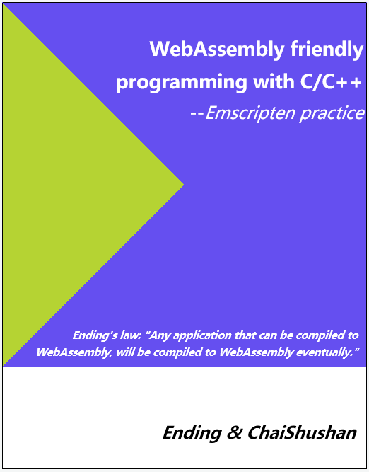

#  WebAssembly friendly programming with C/C++

This book introduces the use of C/C++ for WebAssembly development. For the basics of WebAssembly, please refer to the "WebAssembly Primer"(Simplified Chinese), the sale address:

- EPUB：[https://www.epubit.com/book/detail/40619](https://www.epubit.com/book/detail/40619)
- JD：[https://item.jd.com/12499372.html](https://item.jd.com/12499372.html)

----

- Author: Ending，Github [@3dgen](https://github.com/3dgen)
- Author: ChaiShushan，Github [@chai2010](https://github.com/chai2010), Twitter [@chaishushan](https://twitter.com/chaishushan)
- Translator: Ending，Github [@3dgen](https://github.com/3dgen)
- Translator: yushih, Github [@yushih](https://github.com/yushih)
- Project: https://github.com/3dgen/cppwasm-book

----

## Read online

- https://3dgen.cn/cppwasm-book/en

## Reference

- ["WebAssembly Primer"](https://www.epubit.com/book/detail/40619)
- [https://github.com/chai2010/awesome-wasm-zh](https://github.com/chai2010/awesome-wasm-zh)

## Copyright

----

## Preface

> *Ending's law: "Any application that can be compiled to WebAssembly, will be compiled to WebAssembly eventually."*

WebAssembly is the newest virtual machine standard for the web. C/C++ source code can be compiled into the WebAssembly binary format(.wasm) through the Emscripten toolchain, and then imported into web pages for JavaScript calls - this means that programs written in C/C++ can run in the web page.

This book introduces how to develope WebAssembly modules by C/C++ from the basic use of Emscripten; some general design principles and technical frameworks are proposed based on the first-hand experience gained by the author in the actual project.

We believe that an ideal Web-oriented C/C++ project should be insensitive to the compilation target - can be compiled to native code, or can be compiled to WebAssembly and run in the web page, the switch between each other only need to change the target configuration. So, we can make full use of the powerful development, debugging, analysis, testing and other functions of the existing IDE environment to improve project quality and reduce development costs.

However, the operating environment of WebAssembly is very different from the native code. Therefore, in order to achieve the above ideal goal, the characteristics (or limitations) of the Web environment must be fully considered, from the overall framework to the interface design and even to the data exchange between functions. This is the connotation of "WebAssembly friendly" implemented in this book.

