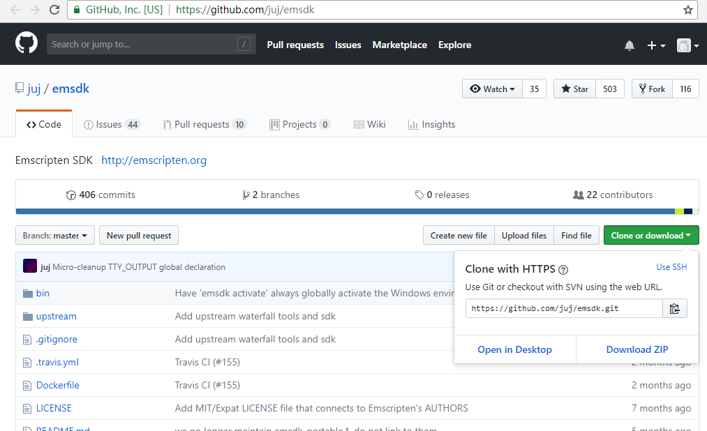

# 1.1 安装Emscripten

Emscripten包含了将C/C++代码编译为WebAssembly所需的完整工具集（LLVM、Node.js、Python、Java等），它不依赖于任何其他的编译器环境。

## 1.1.1 使用emsdk命令行工具安装Emscripten

emsdk是一组基于Python 2的脚本，因此首先需要安装Python 2.7.12或更新版。Python下载地址：[https://www.python.org/downloads/](https://www.python.org/downloads/)

### `下载emsdk`

Python准备就绪后，下载emsdk工具包，熟悉git的读者可以直接使用下列命令行在本地克隆emsdk库：

```
git clone https://github.com/juj/emsdk.git
```

不熟悉git的读者可以访问[https://github.com/juj/emsdk](https://github.com/juj/emsdk)，然后通过页面右上方的“Clone or download”下载emsdk库并解压到本地。如图：



### `安装并激活Emscripten`

对MacOS或Linux用户，在控制台切换至emsdk所在目录，执行以下命令：

```
./emsdk update
./emsdk install latest
```

emsdk将联网下载并安装Emscripten最新版的各个组件。安装完毕后，执行以下命令配置并激活已安装的Emscripten：

```
./emsdk activate latest
```

在新建的控制台中，切换至emsdk所在的目录，执行以下命令：

```
source ./emsdk_env.sh
```

将为当前控制台配置Emscripten各个组件的PATH等环境变量。


在Windows环境下的安装方法基本一致，区别是使用`emsdk.bat`代替`emsdk`，使用`emsdk_env.bat`代替`source ./emsdk_env.sh`。安装及激活执行：

```
emsdk.bat update
emsdk.bat install latest
emsdk.bat activate latest
```

设置环境变量执行：

```
emsdk_env.bat
```

> **tips** 安装及激活只需要执行一次；以后在新建的控制台中设置一次环境变量后，即可使用Emscripten核心命令emcc。在Windows环境下，如果想把Emscripten的环境变量注册为全局变量，可以以管理员身份运行`emsdk.bat activate latest --global`，该命令将更改系统的环境变量，使得以后无需再运行`emsdk_env.bat`，该方法有潜在的副作用：它将环境变量指向了Emscripten内置的Node.js、Python、Java，若系统中安装了这些组件的其他版本，可能引发冲突。


## 1.1.2 Docker环境安装Emscripten

如果读者熟悉Docker工具，那么也可以在Docker环境安装Emscripten。Docker环境的Emscripten是完全隔离的，对宿主机环境不会造成任何的影响。Docker仓库的`apiaryio/emcc`镜像提供了完整的Emscripten打包。

比如通过本地的emcc编译hello.c文件：

```
$ emcc hello.c
```

采用Docker环境后，对应以下的命令：

```
$ docker run --rm -it -v `pwd`:/src apiaryio/emcc emcc
```

其中参数`--rm`表示运行结束后删除容器资源，参数`-it`表示定向容器的标准输入和输出到命令行环境，参数`-v 'pwd':/src`表示将当前目录映射到容器的/src目录。之后的`apiaryio/emcc`为容器对应镜像的名字，里面包含了Emscripten开发环境。最后的emcc参数表示容器中运行的命令，和本地的emcc命令是一致的。

以上命令默认获取的是latest版本，也就是最新的Emscripten版本。对于正式开发环境，我们推荐安装确定版本的Emscripten。容器镜像的全部版本可以从这里查看：[https://hub.docker.com/r/apiaryio/emcc/tags/](https://hub.docker.com/r/apiaryio/emcc/tags/)。如果将`apiaryio/emcc`替换为`apiaryio/emcc:1.38.11`，则表示采用的是v1.38.11版本的镜像。

对于国内用户，可以采用Docker官方提供的国内仓库镜像加速下载。仓库镜像代理配置的细节可以参考：[https://www.docker-cn.com/registry-mirror](https://www.docker-cn.com/registry-mirror) 。

## 1.1.3 校验安装

emcc是Emscripten的核心命令，正确安装激活并设置环境变量后，执行`emcc -v`可以查看版本信息：

```
>emcc -v
emcc (Emscripten gcc/clang-like replacement + linker emulating GNU ld) 1.38.11
clang version 6.0.1  (emscripten 1.38.11 : 1.38.11)
Target: x86_64-pc-windows-msvc
Thread model: posix
InstalledDir: E:\Tool\emsdk\clang\e1.38.11_64bit
INFO:root:(Emscripten: Running sanity checks)
```

关于Emscripten安装的更多详细信息，可以访问：[http://kripken.github.io/emscripten-site/docs/getting_started/downloads.html](http://kripken.github.io/emscripten-site/docs/getting_started/downloads.html)

由于Emscripten 1.37.3才开始正式支持WebAssembly，因此已经安装过Emscripten旧版本的用户最好升级至最新版。本书内容均以Emscripten 1.38.11为准。