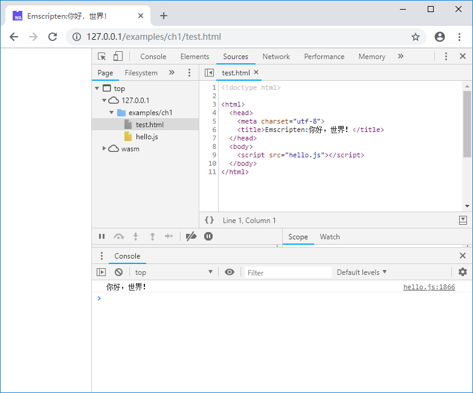
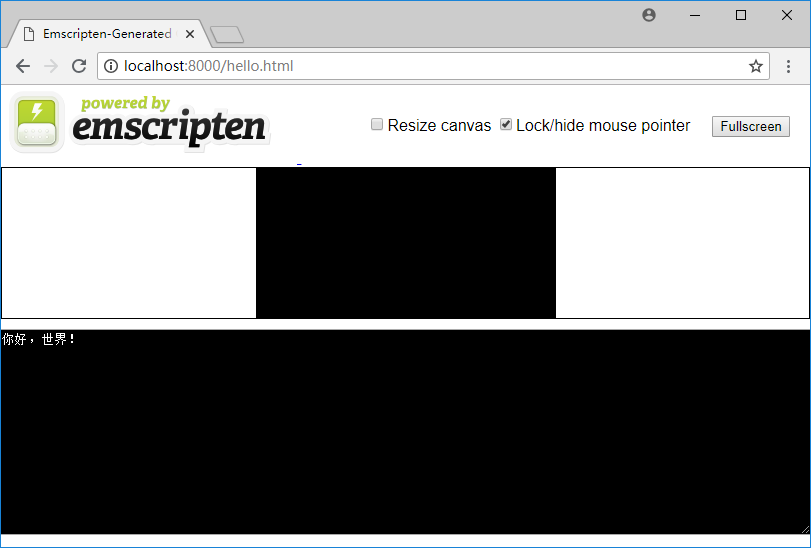

# 1.2 你好，世界！

本节将从经典的"Hello, wolrd!"例程入手，介绍如何使用Emscripten编译C/C++代码并运行测试。

## 1.2.1 生成wasm

新建一个名为`hello.cc`的C源文件，为了正确标识中文字符串，将其保存为UTF8编码：

```c
//hello.cc
#include <stdio.h>

int main() {
    printf("你好，世界！\n");
    return 0;
}
```

进入控制台，使用1.1节中介绍的`emsdk_env`命令设置Emscripten环境变量后，切换至`hello.cc`所在的目录，执行以下命令：

```
emcc hello.cc
```

目录下将得到两个文件：`a.out.wasm`以及`a.out.js`。其中`a.out.wasm`为C源文件编译后形成的WebAssembly汇编文件；`a.out.js`是Emscripten生成的胶水代码，其中包含了Emscripten的运行环境和wasm的封装，导入`a.out.js`即可自动完成.wasm载入/编译/实例化、运行时初始化等繁杂的工作。

使用`-o`选项可以指定`emcc`的输出文件，执行下列命令：

```
emcc hello.cc -o hello.js
```

编译后的成果文件分别为`hello.wasm`以及`hello.js`。

## 1.2.2 在网页中测试

不同于NativeCode，C/C++被编译为WebAssembly以后是无法直接运行的，我们需要将它导入网页发布后，通过浏览器来执行。

在刚才的目录下，新建一个名为`test.html`的网页文件：

```html
<!doctype html>

<html>
  <head>
    <meta charset="utf-8">
    <title>Emscripten:你好，世界！</title>
  </head>

  <body>
    <script src="hello.js"></script>
  </body>
</html>
```

将该目录通过http协议发布后，使用浏览器打开`test.html`，打开开发者面板（Chrome浏览器下使用F12快捷键），我们将在控制台看到如下输出：



> **tips** WebAssembly例程需通过http网页发布后方可运行。本书的例程目录中有一个名为"py_simple_server.bat"的批处理文件，该批处理用于在Windows操作系统下使用python将当前目录发布为http服务，端口为8000；当然您也可以使用nginx/IIS/apatch或任意一种惯用的工具来完成该操作。

## 1.2.3 在Node.js中测试

WebAssembly程序不仅可以在网页中运行，也可以在Node.js 8.0及以上的版本中运行。Emscripten自带了Node.js环境，因此我们可以直接使用`node`来测试刚才的程序：

```
> node hello.js
你好，世界！
```

## 1.2.4 使用Emscripten生成测试页面

使用`emcc`命令时，若指定输出文件后缀为`.html`，那么Emscripten不仅会生成WebAssembly汇编文件.wasm、JavaScript环境胶水代码.js，还会额外生成一个Emscripten测试页面，例如下列命令：

```
emcc hello.cc -o hello.html
```

执行后，将获得`hello.wasm`、`hello.js`以及`hello.html`。其中`hello.wasm`、`hello.js`与使用`-o hello.js`时获得的文件内容是一致的。将目录发布后使用浏览器访问`hello.html`，页面显示如下：



页面下方是一个模拟了标准控制台的输入输出区域；其上方较小的黑色区域是一个canvas画布，可用于模拟图形界面。页面自动载入了hello.js，并在控制台正确输出了“你好，世界！”

Emscripten自动生成的测试页面使用很方便，但是其页面代码量很大，不利于讲解，因此本书除特殊说明外，均使用手动编写的网页进行测试。