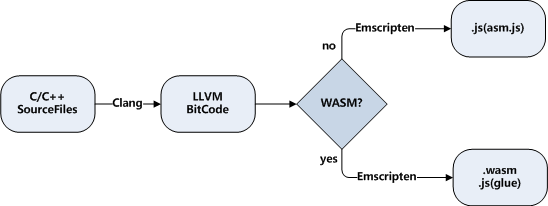

# 1.4 编译目标及编译流程

## 1.4.1 编译目标选择

事实上Emscripten的诞生早于WebAssembly，在WebAssembly标准出现前的很长一段时间内，Emscripten的编译目标是`asm.js`。自1.37.3起，Emscirpten才开始正式支持WebAssembly。

以`asm.js`为编译目标时，C/C++代码被编译为.js文件；以WebAssembly为编译目标时，C/C++代码被编译为.wasm文件及对应的.js胶水代码文件。两种编译目标从应用角度来说差别不大——它们使用的内存模型、函数导出规则、JavaScript与C相互调用的方法等都是一致的。我们在实际使用中遇到的主要区别在于模块加载的同步和异步：当编译目标为`asm.js`时，由于C/C++代码被完全转换成了`asm.js`（JavaScript子集），因此可以认为模块是同步加载的；而以WebAssembly为编译目标时，由于WebAssembly的实例化方法本身是异步指令，因此模块加载为异步加载。以`asm.js`为目标的工程切换至WebAssembly时，容易发生Emscritpen运行时未就绪时调用了Module功能的问题，需要按照1.3.3的方法予以规避。

自1.38.1起，Emscripten默认的编译目标切换为WebAssembly。如果仍然需要以`asm.js`为编译目标，只需要在调用`emcc`时添加`-s WASM=0`参数，例如：

```
> emcc hello.cc -s WASM=0 -o hello_asm.js
```

WebAssembly是二进制格式，体积小、执行效率高是其先天优势。作为比较，上述命令生成的`hello_asm.js`约300KB，而WebAssembly版本的`hello.js`与`hello.wasm`加在一起还不到150KB。在兼容性允许的情况下，应尽量使用WebAssembly作为编译目标。

## 1.4.2 编译流程

`emcc`编译C/C++代码的流程如下：



C/C++代码首先通过`Clang`编译为`LLVM字节码`，然后根据不同的目标编译为`asm.js`或`wasm`。

由于内部调用`Clang`，因此`emcc`支持绝大多数的`Clang`编译选项，比如`-s OPTIONS=VALUE`、`-O`、`-g`等。除此之外，为了适应Web环境，`emcc`增加了一些特有的选项，如`--pre-js <file>`、`--post-js <file>`等。

与`Clang`类似，`emcc`所有的选项列表可以通过：

```
emcc --help
```

命令查看。