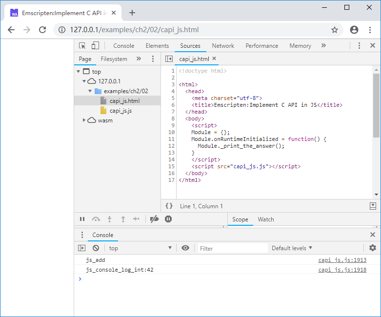

# 2.2 JavaScript函数注入C

Emscripten提供了多种在C环境调用JavaScript的方法，包括：
- `EM_JS`/`EM_ASM`宏内联JavaScript代码
- `emscripten_run_script`函数
- JavaScript函数注入（更准确的描述为：“Implement C API in JavaScript”，既`在JavaScript中实现C函数API`）

本节将重点介绍其中的最后一种。

## 2.2.1 C函数声明

在C环境中，我们经常碰到这种情况：模块A调用了由模块B实现的函数——既在模块A中创建函数声明，在模块B中实现函数体。在Emscripten中，C代码部分是模块A，JavaScript代码部分是模块B。例如创建`capi_js.cc`如下：

```c
//capi_js.cc
EM_PORT_API(int) js_add(int a, int b);
EM_PORT_API(void) js_console_log_int(int param);

EM_PORT_API(void) print_the_answer() {
    int i = js_add(21, 21);
    js_console_log_int(i);
}
```

`print_the_answer()`调用了函数`js_add`计算21+21，然后调用`js_console_log_int()`来打印结果，后二者仅仅给出了声明，函数实现将在JavaScript中完成。

基于2.1.1相同的理由，C函数API声明时应该使用C风格的符号修饰。出于简便，我们在声明`js_add()`与`js_console_log_int()`时沿用了`EM_PORT_API`宏（该宏展开后会增加`EMSCRIPTEN_KEEPALIVE`定义，由于函数并没有在C代码中实现，此时`EMSCRIPTEN_KEEPALIVE`并没有实际作用）。

## 2.2.2 JavaScript实现C函数

创建一个JavaScript源文件`pkg.js`如下：

```js
//pkg.js
mergeInto(LibraryManager.library, {
    js_add: function (a, b) {
        console.log("js_add");
        return a + b;
    },

    js_console_log_int: function (param) {
        console.log("js_console_log_int:" + param);
    }
})
```

代码按照两个C函数各自的声明定义了两个对象`js_add`以及`js_console_log_int`，并将其合并到`LibraryManager.library`中——在JavaScript中，方法（或者说函数）也是对象。

> **tips** `LibraryManager.library`可以简单的理解为JavaScript注入C环境的库，既2.2.1中所说的“模块B”。虽然事实上它远比这要复杂，但这种简单的类比足以应对大部分常规应用。

执行下列命令：

```
emcc capi_js.cc --js-library pkg.js -o capi_js.js
```

`--js-library pkg.js`意为将`pkg.js`作为附加库参与链接。命令执行后得到`capi_js.js`以及`capi_js.wasm`。按照之前章节的例子在网页中将其载入，并调用C导出的`print_the_answer()`函数：

```html
//capi_js.html
  <body>
    <script>
    Module = {};
    Module.onRuntimeInitialized = function() {
      Module._print_the_answer();
    }
    </script>
    <script src="capi_js.js"></script>
  </body>
```

浏览页面，控制台将输出：



自此，我们实现了在C环境调用JavaScript方法。

## 2.2.3 闭包限制及解决办法

使用“mergeInto(LibraryManager.library……”注入的方法不能直接使用闭包。当然这可以通过在注入方法中调用其他JavaScript方法来间接实现。比如我们创建`closure.cc`如下：

```c
//closure.cc
#include <stdio.h>

EM_PORT_API(int) show_me_the_answer();

EM_PORT_API(void) func() {
    printf("%d\n", show_me_the_answer());
}
```

`show_me_the_answer()`函数在`closure_pkg.js`中实现

```js
//closure_pkg.js
mergeInto(LibraryManager.library, {
    show_me_the_answer: function () {
        return jsShowMeTheAnswer();
    }
})
```

`show_me_the_answer()`调用了`jsShowMeTheAnswer()`，后者将在网页`closure.html`中实现：

```html
//closure.html
  <body>
    <script>
    function f1(){
      var answer = 42;
      function f2() {
        return answer;
      }
      return f2;
    }
    var jsShowMeTheAnswer = f1();

    Module = {};
    Module.onRuntimeInitialized = function() {
      Module._func();
    }
    </script>
    <script src="closure.js"></script>
  </body>
```

熟悉JavaScript的读者一定已经发现了：`jsShowMeTheAnswer()`使用了闭包。

使用这种方法，不仅可以绕过“mergeInto(LibraryManager.library……”注入的方法不仅能直接使用闭包的限制，还可以动态调整注入函数的行为——比如上例中我们可以在JavaScript环境中动态调整`jsShowMeTheAnswer()`对象，从而改变C环境中的`show_me_the_answer()`函数的返回值。

## 2.2.4 JavaScript函数注入的优缺点

- 优点：使用JavaScript函数注入可以保持C代码的纯净——既C代码中不包含任何JavaScript的成分；
- 缺点：该方法需要额外创建一个.js库文件，维护略为麻烦。