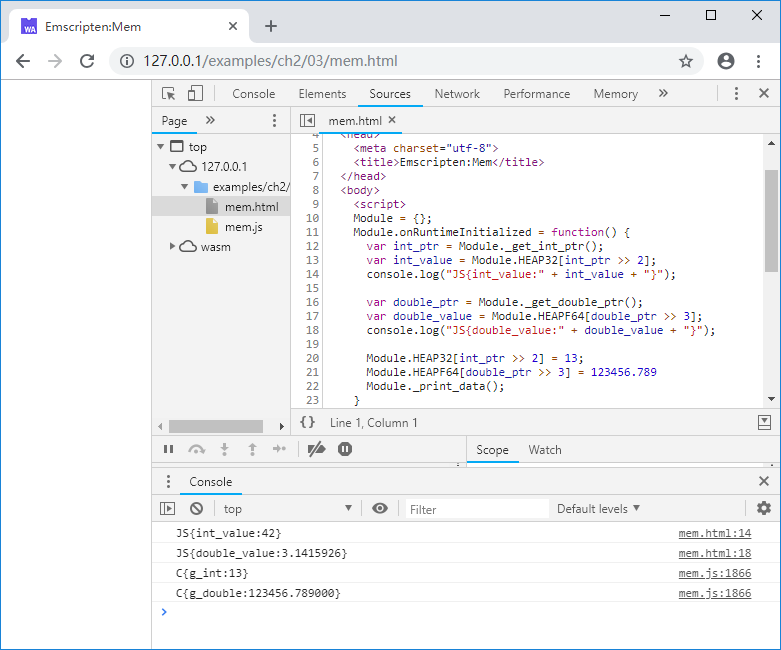

# 2.3 单向透明的内存模型

## 2.3.1 Module.buffer

无论编译目标是asm.js还是wasm，C/C++代码眼中的内存空间实际上对应的都是Emscripten提供的ArrayBuffer对象：`Module.buffer`，C/C++内存地址与`Module.buffer`数组下标一一对应。

> **info** ArrayBuffer是JavaScript中用于保存二进制数据的一维数组。在本书的语境中，“`Module.buffer`”、“C/C++内存”、“Emscripten堆”三者是等价的。

C/C++代码能直接通过地址访问的数据全部在内存中（包括运行时堆、运行时栈），而内存对应`Module.buffer`对象，C/C++代码能直接访问的数据事实上被限制在`Module.buffer`内部，JavaScript环境中的其他对象无法被C/C++直接访问——因此我们称其为单向透明的内存模型。

在当前版本的Emscripten中，指针（既地址）类型为int32，因此单一模块的最大可用内存范围为`2GB-1`。未定义的情况下，内存默认容量为16MB，其中栈容量为5MB。

## 2.3.2 Module.HEAPX

JavaScript中的ArrayBuffer无法直接访问，必须通过某种类型的TypedArray方可对其进行读写。例如下列JavaScript代码创建了一个容量为12字节的ArrayBuffer，并在其上创建了类型为int32的TypedArray，通过该View依次向其中存入了1111111、2222222、3333333三个int32型的数：

```js
var buf = new ArrayBuffer(12);
var i32 = new Int32Array(buf);
i32[0] = 1111111;
i32[1] = 2222222;
i32[2] = 3333333;
```

> **tips** ArrayBuffer与TypedArray的关系可以简单理解为：ArrayBuffer是实际存储数据的容器，在其上创建的TypedArray则是把该容器当作某种类型的数组来使用。

Emscripten已经为`Module.buffer`创建了常用类型的TypedArray，见下表：

对象 | TypedArray | 对应C数据类型
---- | ------- | -------
Module.HEAP8 | Int8Array | int8
Module.HEAP16 | Int16Array | int16
Module.HEAP32 | Int32Array | int32
Module.HEAPU8 | Uint8Array | uint8
Module.HEAPU16 | Uint16Array | uint16
Module.HEAPU32 | Uint32Array | uint32
Module.HEAPF32 | Float32Array | float
Module.HEAPF64 | Float64Array | double

## 2.3.3 在JavaScript中访问C/C++内存

我们通过一个简单的例子展示如何在JavaScript中访问C/C++内存。创建C源代码`mem.cc`如下：

```c
//mem.cc
#include <stdio.h>

int g_int = 42;
double g_double = 3.1415926;

EM_PORT_API(int*) get_int_ptr() {
	return &g_int;
}

EM_PORT_API(double*) get_double_ptr() {
	return &g_double;
}

EM_PORT_API(void) print_data() {
	printf("C{g_int:%d}\n", g_int);
	printf("C{g_double:%lf}\n", g_double);
}
```

将其编译为`mem.js`及`mem.wasm`。

JavaScript部分代码如下：

```js
      var int_ptr = Module._get_int_ptr();
      var int_value = Module.HEAP32[int_ptr >> 2];
      console.log("JS{int_value:" + int_value + "}");

      var double_ptr = Module._get_double_ptr();
      var double_value = Module.HEAPF64[double_ptr >> 3];
      console.log("JS{double_value:" + double_value + "}");
      
      Module.HEAP32[int_ptr >> 2] = 13;
      Module.HEAPF64[double_ptr >> 3] = 123456.789      
      Module._print_data();
```

我们在JavaScript中调用了C函数`get_int_ptr()`，获取了全局变量`g_int`的地址，然后通过`Module.HEAP32[int_ptr >> 2]`获取了该地址对应的int32值。由于`Module.HEAP32`每个元素占用4字节，因此`int_ptr`需除以4（既右移2位）方为正确的索引。获取`g_double`的方法类似不赘述。

接下来我们修改了`int_ptr`及`double_ptr`地址对应内存的值，然后调用C函数`print_data()`。页面发布通过浏览器访问后，开发者面板控制台输出：



由此可见，在JavaScript中正确读取了C的内存数据；JavaScript中写入的数据，在C中亦能正确获取。

> **info** 通过上述例子可知，在JavaScript中通过各种类型的`HEAP`访问C/C++的内存数据时，地址必须对齐，既：int32/uint32/float型变量地址必须4字节对齐、double型变量地址必须8字节对齐，其他类型类似。关于地址对齐的问题，将在4.2节详细讨论。

本书的后续章节中，在不会引起歧义的情况下，我们将使用“内存”指代“Emscripten为C/C++提供的运行时内存”，以简化描述。