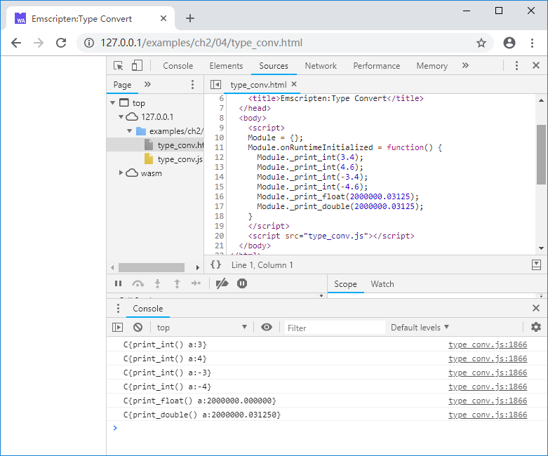

# 2.4 JavaScript与C交换数据

在2.3中我们介绍了内存模型和`Module.HEAP`的基本用法。本节将深入讨论JavaScript与C如何交换数据。

## 2.4.1 参数及返回值

在之前章节的例程中，我们有意忽略了一个基础性的问题：JavaScript与C/C++相互调用的时候，参数与返回值究竟是如何传递的？

答案是：**一切皆为`Number`**。

> **tips** JavaScript只有一种数值类型：`Number`，既64位浮点数（IEEE 754标准）。

从语言角度来说，JavaScript与C/C++有完全不同的数据体系，`Number`是二者唯一的交集，因此本质上二者相互调用时，都是在交换`Number`。

> **info** `Number`可以精确表达32位及以下整型数、32位浮点数、64位浮点数，这涵盖了大多数C语言的基础数据类型——64位整型数除外，这意味着JavaScript与C相互操作时，不能使用64位整型数作为参数或返回值，4.6节将对此进行详细讨论。

`Number`从JavaScript传入C/C++有两种途径：
1. JavaScript调用了带参数的C导出函数，`Number`通过参数传入；
1. C调用了由JavaScript实现的函数（见2.2），`Number`通过注入函数的返回值传入。

由于C/C++是强类型语言，因此来自JavaScript的`Number`传入时，会发生隐式类型转换。例如C代码如下：

```c
//type_conv.cc
#include <stdio.h>

EM_PORT_API(void) print_int(int a) {
	printf("C{print_int() a:%d}\n", a);
}

EM_PORT_API(void) print_float(float a) {
	printf("C{print_float() a:%f}\n", a);
}

EM_PORT_API(void) print_double(double a) {
	printf("C{print_double() a:%lf}\n", a);
}
```

JavaScript代码如下：

```js
//type_conv.html
      Module._print_int(3.4);
      Module._print_int(4.6);
      Module._print_int(-3.4);
      Module._print_int(-4.6);
      Module._print_float(2000000.03125);
      Module._print_double(2000000.03125);
```

浏览页面，控制台输出：



可见`Number`传入时，若目标类型为`int`，将执行`向0取整`；若目标类型为`float`，类型转换时有可能损失精度。

数值从C/C++传出至JavaScript也有两种途径：
1. JavaScript调用了带返回值的C导出函数，通过返回值传出；
1. C调用了由JavaScript实现的函数（见2.2），通过注入函数的参数传出。

C/C++中除64位整型数外的简单数值类型转为`Number`是无损的，此处不再示例。

## 2.4.2 通过内存交换数据

需要在JavaScript与C/C++之间交换大块的数据时，直接使用参数传递数据显然不可行，此时可以通过内存来交换数据。如下例，JavaScript调用C函数在内存中生成斐波拉契数列后输出，C代码：

```c
//fibonacci.cc
#include <stdio.h>
#include <malloc.h>

EM_PORT_API(int*) fibonacci(int count) {
	if (count <= 0) return NULL;

	int* re = (int*)malloc(count * 4);
	if (NULL == re) {
		printf("Not enough memory.\n");
		return NULL;
	}

	re[0] = 1;
	int i0 = 0, i1 = 1;
	for (int i = 1; i < count; i++){
		re[i] = i0 + i1;
		i0 = i1;
		i1 = re[i];
	}
	
	return re;
}

EM_PORT_API(void) free_buf(void* buf) {
	free(buf);
}
```

JavaScript代码：

```js
//fibonacci.html
      var ptr = Module._fibonacci(10);
      if (ptr == 0) return;
      var str = '';
      for (var i = 0; i < 10; i++){
        str += Module.HEAP32[(ptr >> 2) + i];
        str += ' ';
      }
      console.log(str);
      Module._free_buf(ptr);
```

浏览页面，控制台输出：


> **tips** 在上述例子中，C函数`fibonacci()`在堆上分配了空间，在JavaScript中调用后需要调用`free_buf()`将其释放以免内存泄漏。

注意`Module.HEAP32`等对象的名称虽然为“堆”（HEAP），但事实上它们指的是C/C++环境的整个内存空间，因此位于C/C++栈上的数据也可以通过`Module.HEAP32`等对象来访问。如下例，C代码：

```c
//fib_stack.cc
EM_PORT_API (void) js_print_fib(int* ptr, int count);

EM_PORT_API(void) fibonacci20() {
	static const int count = 20;
	int re[count];

	re[0] = 1;
	int i0 = 0, i1 = 1;
	for (int i = 1; i < count; i++){
		re[i] = i0 + i1;
		i0 = i1;
		i1 = re[i];
	}
	
	js_print_fib(re, count);
}
```

C函数`fibonacci10()`在栈上生成了斐波拉契数列前20项，然后调用了JavaScript注入函数`js_print_fib()`将其打印输出。JavaScript注入函数代码：

```js
//fib_stack_pkg.js
mergeInto(LibraryManager.library, {
    js_print_fib: function (ptr, count) {
        var str = 'js_print_fib: ';
        for (var i = 0; i < count; i++){
          str += Module.HEAP32[(ptr >> 2) + i];
          str += ' ';
        }
        console.log(str);
    }
})
```

使用以下命令编译得到`fib_stack.js`/`fib_stack.wasm`：

```
emcc fib_stack.cc --js-library fib_stack_pkg.js -o fib_stack.js
```

网页中调用`fibonacci20()`：

```js
//fib_stack.html
    <script>
    Module = {};
    Module.onRuntimeInitialized = function() {
      Module._fibonacci20();
    }
    </script>
    <script src="fib_stack.js"></script>
```

浏览页面，控制台输出：


## 2.4.3 在JavaScript中分配内存

2.4.2给出的例子都是在C/C++环境中分配内存，在JavaScript中读取；有时候JavaScript需要将大块的数据送入C/C++环境，而C/C++无法预知数据块的大小，此时可以在JavaScript中分配内存并装入数据，然后将数据指针传入，调用C函数进行处理。

这种用法之所以可行，核心原因在于：Emscripten导出了C的`malloc()`/`free()`函数。例如：

C函数`sum()`求传入的int数组的各项之和：
```c
//sum.cc
EM_PORT_API(int) sum(int* ptr, int count) {
	int total = 0;
	for (int i = 0; i < count; i++){
		total += ptr[i];
	}
	return total;
}
```

JavaScript分配了内存，并存入自然数列前50项，然后调用C函数`sum()`求数列的和：

```js
//js_alloc_mem.html
      var count = 50;
      var ptr = Module._malloc(4 * count);
      for (var i = 0; i < count; i++){
        Module.HEAP32[ptr / 4 + i] = i + 1;
      }
      console.log(Module._sum(ptr, count));
      Module._free(ptr);
```

控制台将输出：

```
1275
```

> **tips** C/C++的内存没有gc机制，在JavaScript中使用`malloc()`函数分配的内存使用结束后，别忘了使用`free()`将其释放。

## 2.4.4 字符串

字符串是极为常用的数据类型，然而C/C++中的字符串表达方式（0值标志结尾）与JavaScript完全不兼容；幸运的是，Emscripten为我们提供了一组辅助函数用于二者的转换，下面介绍其中较为常用的两个。

### `Pointer_stringify()`
该方法可以将C/C++的字符串转换为JavaScript字符串。例如：

C函数`get_string()`返回了一个字符串的地址：

```c
//strings.cc
EM_PORT_API(const char*) get_string() {
	static const char str[] = "Hello, wolrd! 你好，世界！"
	return str;
}
```

在JavaScript中获取该字符串地址，并通过`Pointer_stringify()`将其转换为JavaScript字符串：

```js
//strings.html
      var ptr = Module._get_string();
      var str = Pointer_stringify(ptr);
      console.log(typeof(str));
      console.log(str);
```

控制台将输出：

```
string
Hello, wolrd! 你好，世界！
```

### `allocateUTF8()`
该方法将在C/C++内存中分配足够大的空间，并将字符串按UTF8格式拷入其中。例如，在JavaScript中使用`allocateUTF8()`将字符串传入C/C++内存，然后调用C函数`print_string()`打印它：

```js
//strings.html
      ptr = allocateUTF8("你好，Emscripten！");
      Module._print_string(ptr);
      _free(ptr);
```

C代码部分：

```c
//strings.cc
EM_PORT_API(void) print_string(char* str) {
	printf("%s\n", str);
}
```

网页浏览后，控制台将输出：

```
你好，Emscripten！
```

此外，Emscripten还提供了`AsciiToString()`/`stringToAscii()`/`UTF8ArrayToString()`/`stringToUTF8Array()`等一系列辅助函数用于处理各种格式的字符串在各种存储对象中的转换，欲知详情请自行参考胶水代码。

## 2.4.5 小结

归根到底，JavaScript代码与C/C++之间交换数据主要有2条途径：

1. 通过数值类型的参数直接传递；
1. 通过C/C++内存间接传递。

使用动态分配的内存地址传递数据的时候，要特别注意释放已不再使用的内存避免泄漏。内存的分配和释放应遵循“谁分配谁释放”的原则——既在JavaScript中分配的内存应由JavaScript代码释放，在C/C++中分配的内存应由C/C++代码释放。