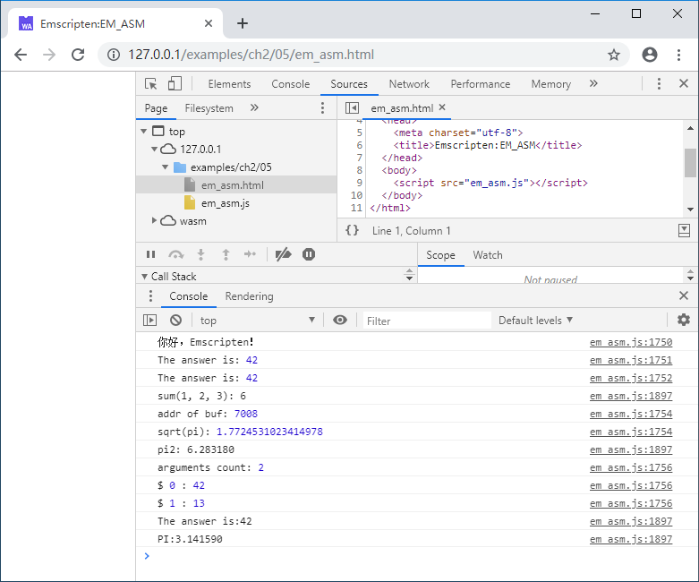

## 2.5 EM_ASM系列宏

很多编译器支持在C/C++代码直接嵌入汇编代码，Emscripten采用类似的方式，提供了一组以“EM_ASM”为前缀的宏，用于以内联的方式在C/C++代码中直接嵌入JavaScript代码。

## 2.5.1 `EM_ASM`

`EM_ASM`使用很简单，只需要将欲执行的JavaScript代码置于参数中，例如：

```c
#include <emscripten.h>

int main() {
	EM_ASM(console.log('你好，Emscripten！'));
	return 0;
}
```

上述代码将调用JavaScript方法`console.log()`输出“你好，Emscripten！”。

`EM_ASM`宏可以一次嵌入多条JavaScript语句，语句之间用分号分隔，例如：

```c
    EM_ASM(var k = 42;console.log('The answer is:', k););
```

将输出：

```
The answer is:42
```

嵌入的多条语句分行书写以及行尾注释也是可行的（分行书写时语句之间必须以分号分隔，不能省略），例如：

```c
	EM_ASM(
		var k = 42;  //define k
		console.log('The answer is:', k);
	);
```

`EM_ASM`宏只能执行嵌入的JavaScript代码, 无法传入参数或获取返回结果。

## 2.5.2 `EM_ASM_`/`EM_ASM_DOUBLE`

`EM_ASM_`支持输入数值类型的可变参数, 同时返回整数类型的结果。`EM_ASM_`宏嵌入的JavaScript代码必须放到`{}`包围的代码块中（以区隔代码与参数），且至少必须含有一个输入参数。嵌入的JavaScript代码通过`$n`访问第n+1个参数。下面的例子调用JavaScript计算了三个数值的和，并将结果返回：

```c
	int sum = EM_ASM_({return $0 + $1 + $2;}, 1, 2, 3);
	printf("sum(1, 2, 3): %d\n", sum);
```

使用`EM_ASM_`宏嵌入JavaScript时，参数不仅可以是常数，也可以是变量，例如：

```c
	char buf[32];
	double pi = 3.14159;
	EM_ASM_(
		{
			console.log('addr of buf:', $0);
			console.log('sqrt(pi):', $1);
		},
		buf, sqrt(pi)
	);
```

上述代码将依次输出buf的地址以及pi的平方根。

`EM_ASM_DOUBLE`用法与`EM_ASM_`基本一致，区别是`EM_ASM_DOUBLE`返回值为`double`。例如：

```c
	double pi2 = EM_ASM_DOUBLE(
		{
			return $0 * $1;
		},
		pi, 2.0
	);
	printf("pi2: %lf\n", pi2);
```

`EM_ASM_`/`EM_ASM_DOUBLE`宏中嵌入的JavaScript代码会被展开为一个独立的JavaScript方法，因此在嵌入的JavaScript中除了用`$n`之外，也可以用内置的`arguments`对象来访问参数，例如：

```c
	EM_ASM_(
		{
			console.log('arguments count:', arguments.length);
			for(var i = 0; i < arguments.length; i++) {
				console.log('$', i, ':', arguments[i]);
			}
		},
		42, 13
	);
```

上述代码将输出：

```
arguments count: 2
$ 0 : 42
$ 1 : 13
```

## 2.5.3 `EM_ASM_INT_V`/`EM_ASM_DOUBLE_V`

如果嵌入的JavaScript代码不需要参数，可以使用`EM_ASM_INT_V`/`EM_ASM_DOUBLE_V`宏。由于没有参数，嵌入的代码无需用`{}`包围，例如：

```c
	int answer = EM_ASM_INT_V(return 42);
	printf("The answer is:%d\n", answer);
	double pi_js = EM_ASM_DOUBLE_V(return 3.14159);
	printf("PI:%lf\n", pi_js);
```

本节例子的输出如下：


