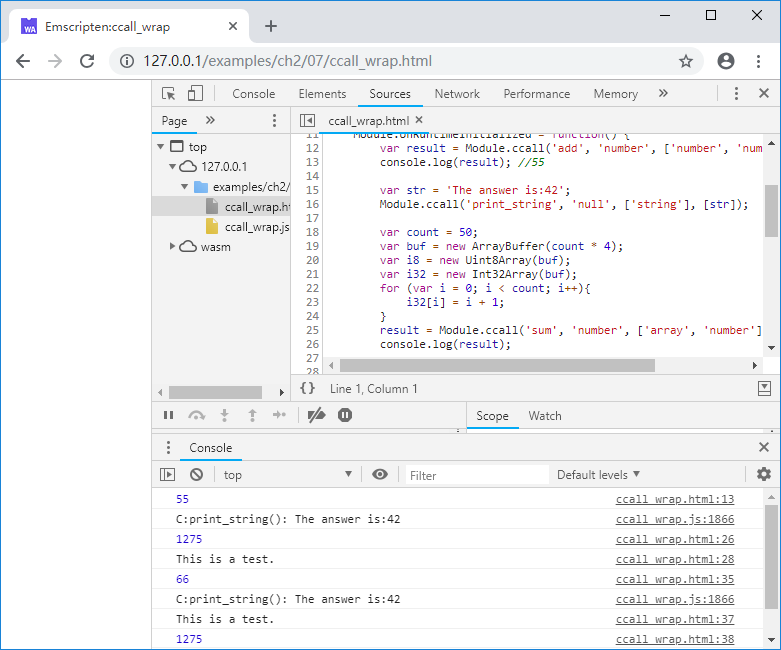

# 2.7 `ccall`/`cwrap`

2.4节我们提到，JavaScript调用C/C++时只能使用`Number`作为参数，因此如果参数是字符串、数组等非`Number`类型，则需要拆分为以下步骤：

1. 使用`Module._malloc()`在Module堆中分配内存，获取地址ptr；
1. 将字符串/数组等数据拷入内存的ptr处；
1. 将ptr作为参数，调用C/C++函数进行处理；
1. 使用`Module._free()`释放ptr。

由此可见调用过程相当繁琐，尤其当非`Number`参数个数较多时，JavaScript侧的调用代码会急剧膨胀。为了简化调用过程，Emscripten提供了`ccall`/`cwrap`封装函数。

## 2.7.1 `ccall`

语法：

`var result = Module.ccall(ident, returnType, argTypes, args);`

参数：

- ident ：C导出函数的函数名（不含“_”下划线前缀）；
- returnType ：C导出函数的返回值类型，可以为`'boolean'`、`'number'`、`'string'`、`'null'`，分别表示函数返回值为布尔值、数值、字符串、无返回值；
- argTypes ：C导出函数的参数类型的数组。参数类型可以为`'number'`、`'string'`、`'array'`，分别代表数值、字符串、数组；
- args ：参数数组。

例如C导出函数如下：

```c
//ccall_wrap.cc
EM_PORT_API(double) add(double a, int b) {
	return a + (double)b;
}
```

使用下列命令编译：

```
emcc ccall_wrap.cc -s "EXTRA_EXPORTED_RUNTIME_METHODS=['ccall', 'cwrap']" -o ccall_wrap.js
```

> **tips** Emscripten从v1.38开始，`ccall`/`cwrap`辅助函数默认没有导出，在编译时需要通过`-s "EXTRA_EXPORTED_RUNTIME_METHODS=['ccall', 'cwrap']"`选项显式导出。

在JavaScript中可以使用以下方法调用：

```js
//ccall_wrap.html
	var result = Module.ccall('add', 'number', ['number', 'number'], [13.0, 42]);
```

这与直接调用`Module._add()`：

```js
	var result = Module._add(13, 42);
```

是等价的。

`ccall`的优势在于可以直接使用字符串/`Uint8Array`/`Int8Array`作为参数。

例如C导出函数如下：

```c
//ccall_wrap.cc
EM_PORT_API(void) print_string(const char* str) {
	printf("C:print_string(): %s\n", str);
}
```

`print_string()`的输入参数为字符串，在JavaScript中使用以下方法调用：

```js
//ccall_wrap.html
	var str = 'The answer is:42';
	Module.ccall('print_string', 'null', ['string'], [str]);
```

使用`Uint8Array`作为参数的例子如下：

```c
//ccall_wrap.cc
EM_PORT_API(int) sum(uint8_t* ptr, int count) {
	int total = 0, temp;
	for (int i = 0; i < count; i++){
		memcpy(&temp, ptr + i * 4, 4);
		total += temp;
	}
	return total;
}
```

```js
//ccall_wrap.html
	var count = 50;
	var buf = new ArrayBuffer(count * 4);
	var i8 = new Uint8Array(buf);
	var i32 = new Int32Array(buf);
	for (var i = 0; i < count; i++){
		i32[i] = i + 1;
	}
	result = Module.ccall('sum', 'number', ['array', 'number'], [i8, count]);
```

> **tips** 上述例子的C代码中，我们使用`memcpy(&temp, ptr + i * 4, 4);`获取自然数列的第i个元素的值，使用该方法的原因是：输入地址`ptr`有可能未对齐，关于对齐的更多信息，详见4.2

如果C导出函数返回了无需释放的字符串（静态字符串，或存放在由C代码自行管理的地址中的字符串），在JavaScript中使用`ccall`调用，亦可直接获取返回的字符串，例如：

```c
//ccall_wrap.cc
EM_PORT_API(const char*) get_string() {
	const static char str[] = "This is a test.";
	return str;
}
```

```js
//ccall_wrap.html
	console.log(Module.ccall('get_string', 'string'));
```

## 2.7.2 `cwrap`

`ccall`虽然封装了字符串等数据类型，但调用时仍然需要填入参数类型数组、参数列表等，为此`cwrap`进行了进一步封装：

`var func = Module.cwrap(ident, returnType, argTypes);`

参数：
- ident ：C导出函数的函数名（不含“_”下划线前缀）；
- returnType ：C导出函数的返回值类型，可以为`'boolean'`、`'number'`、`'string'`、`'null'`，分别表示函数返回值为布尔值、数值、字符串、无返回值；
- argTypes ：C导出函数的参数类型的数组。参数类型可以为`'number'`、`'string'`、`'array'`，分别代表数值、字符串、数组；

返回值：
- 封装方法

例如2.7.1中的C导出函数可以按下列方式进行封装：

```js
//ccall_wrap.html
	var c_add = Module.cwrap('add', 'number', ['number', 'number']);
	var c_print_string = Module.cwrap('print_string', 'null', ['string']);
	var c_sum = Module.cwrap('sum', 'number', ['array', 'number']);
	var c_get_string = Module.cwrap('get_string', 'string');
```

C导出函数`add()`/`print_string()`/`sum()`/`get_string()`分别被封装为`c_add()`/`c_print_string()`/`c_sum()`/`c_get_string()`，这些封装方法与普通的JavaScript方法一样可以被直接使用：

```js
//ccall_wrap.html
	console.log(c_add(25.0, 41));
	c_print_string(str);
	console.log(c_get_string());
	console.log(c_sum(i8, count));
```

## 2.7.3 `ccall`/`cwrap`潜在风险

虽然`ccall`/`cwrap`可以简化字符串参数的交换，但这种便利性是有代价的：当输入参数类型为`'string'`/`'array'`时，`ccall`/`cwrap`在C环境的栈上分配了相应的空间，并将数据拷入了其中，然后调用相应的导出函数。

相对于堆来说，栈空间是很稀缺的资源，因此使用`ccall`/`cwrap`时需要格外注意传入的字符串/数组的大小，避免爆栈。

下面列出的是Emscripten为`ccall`/`cwrap`生成的相关胶水代码，有兴趣的读者可以尝试分析，其概略流程为：

1. `getCFunc()`，根据`ident`获取C导出函数；
1. `stackSave()`，保存栈指针；
1. `arrayToC()`/`stringToC()`，将array/string参数拷贝到栈空间中；
1. `func.apply()`，调用C导出函数
1. `convertReturnValue()`，根据returnType将返回值转为对应类型；
1. `stackRestore()`，恢复栈指针。


```js
// Returns the C function with a specified identifier (for C++, you need to do manual name mangling)
function getCFunc(ident) {
  var func = Module['_' + ident]; // closure exported function
  assert(func, 'Cannot call unknown function ' + ident + ', make sure it is exported');
  return func;
}

var JSfuncs = {
  // Helpers for cwrap -- it can't refer to Runtime directly because it might
  // be renamed by closure, instead it calls JSfuncs['stackSave'].body to find
  // out what the minified function name is.
  'stackSave': function() {
    stackSave()
  },
  'stackRestore': function() {
    stackRestore()
  },
  // type conversion from js to c
  'arrayToC' : function(arr) {
    var ret = stackAlloc(arr.length);
    writeArrayToMemory(arr, ret);
    return ret;
  },
  'stringToC' : function(str) {
    var ret = 0;
    if (str !== null && str !== undefined && str !== 0) { // null string
      // at most 4 bytes per UTF-8 code point, +1 for the trailing '\0'
      var len = (str.length << 2) + 1;
      ret = stackAlloc(len);
      stringToUTF8(str, ret, len);
    }
    return ret;
  }
};

// For fast lookup of conversion functions
var toC = {
  'string': JSfuncs['stringToC'], 'array': JSfuncs['arrayToC']
};

// C calling interface.
function ccall(ident, returnType, argTypes, args, opts) {
  function convertReturnValue(ret) {
    if (returnType === 'string') return Pointer_stringify(ret);
    if (returnType === 'boolean') return Boolean(ret);
    return ret;
  }

  var func = getCFunc(ident);
  var cArgs = [];
  var stack = 0;
  assert(returnType !== 'array', 'Return type should not be "array".');
  if (args) {
    for (var i = 0; i < args.length; i++) {
      var converter = toC[argTypes[i]];
      if (converter) {
        if (stack === 0) stack = stackSave();
        cArgs[i] = converter(args[i]);
      } else {
        cArgs[i] = args[i];
      }
    }
  }
  var ret = func.apply(null, cArgs);
  ret = convertReturnValue(ret);
  if (stack !== 0) stackRestore(stack);
  return ret;
}

function cwrap(ident, returnType, argTypes, opts) {
  return function() {
    return ccall(ident, returnType, argTypes, arguments, opts);
  }
}
```

本节例子的输出如下：

