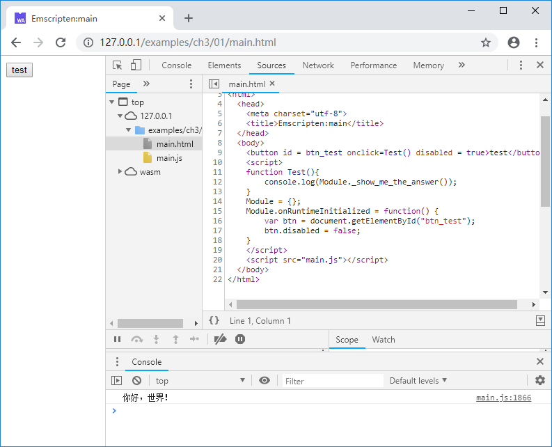
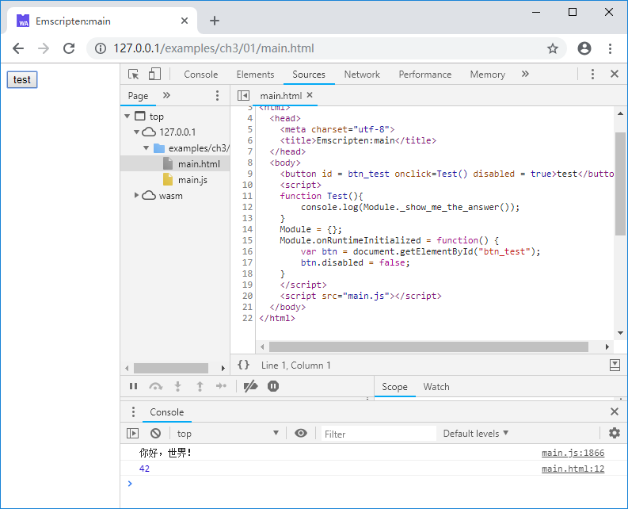
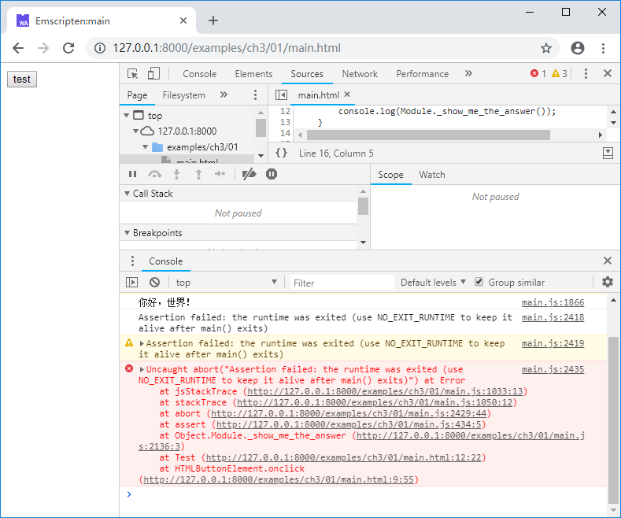

# 3.1 main函数与生命周期

生成本地代码时，作为C/C++程序的入口函数，通常`main()`函数意味着程序的整个生命周期，程序随`main()`函数返回的返回而退出；而在Emscripten下，情况有所不同，来看下面的例子：

```c
//main.cc
#include <stdio.h>

EM_PORT_API(int) show_me_the_answer() {
	return 42;
}

int main() {
	printf("你好，世界！\n");
	return 0;
}
```

网页部分：

```html
//main.html
  <body>
	<button id = btn_test onclick=Test() disabled = true>test</button>
	<script>
	function Test(){
		console.log(Module._show_me_the_answer());
	}	
	Module = {};
	Module.onRuntimeInitialized = function() {
		var btn = document.getElementById("btn_test");
		btn.disabled = false;
	}
	</script>
	<script src="main.js"></script>
  </body>
```

页面打开后，`main()`函数执行，控制台输出了“你好，世界！”：



此时，如果点击页面上的“test”按钮，控制台输出：



`main()`函数退出后，Emscripten运行时核心（`Module`）依然可用！而且在之前的章节，很多例子里面甚至根本都没有`main()`函数，由此可见：对Emscripten来说，`main()`函数既不必须，运行时生命周期亦不由其控制。

如果希望在`main()`函数返回后注销Emscripten运行时，可以在编译时添加`-s NO_EXIT_RUNTIME=0`选项，例如：

```
emcc main.cc -s NO_EXIT_RUNTIME=0 -o main.js
```

使用上述命令编译，页面载入后再点击“test”按钮，控制台将输出以下错误：



> **info** 自Emscripten v1.37.26开始，`NO_EXIT_RUNTIME`默认为1