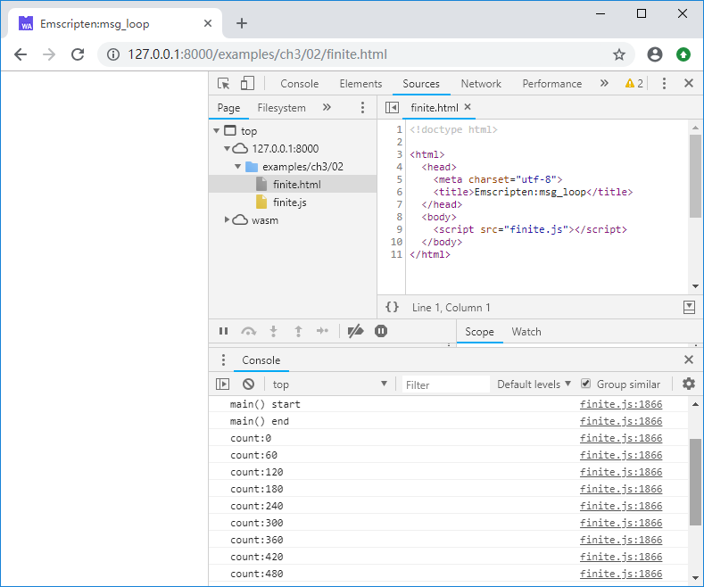

# 3.2 消息循环

除了一次性执行立即退出的程序外，大多数C/C++程序都存在类似下列伪代码的消息循环：

```c
int main() {
    while(1) {
        msg_loop();
    }
    return 0;
}
```

但网页中的JavaScript脚本是单线程运行的，一个带有消息循环的C/C++程序如果不加处理，直接使用Emscripten编译后导入网页中运行，消息循环不退出，会阻塞页面程序的运行，导致DOM无法更新，整个页面失去响应。为此Emscripten提供了一组函数用于消息循环的模拟及调度执行。

## 3.2.1 `emscripten_set_main_loop()`

函数声明：

`void emscripten_set_main_loop(em_callback_func func, int fps, int simulate_infinite_loop)`

参数：

- `func`：消息处理回调函数。
- `fps`：消息循环的执行帧率。如果该参数小等于0，则使用页面的`requestAnimationFrame`机制调用消息处理函数，该机制可以确保页面刷新率与显示器刷新率对齐，对于需要执行图形渲染任务的程序，使用该机制可以得到平滑的渲染速度。
- `simulate_infinite_loop`：是否模拟“无限循环”，用法后续介绍。

返回值：

- 无

先来看一个简单的例子：

```c
//msg_loop.cc
#include <emscripten.h>
#include <stdio.h>

void msg_loop() {
	static int count = 0;
	if (count % 60 == 0) {
		printf("count:%d\n", count);
	}
	count++;
}

int main() {
	printf("main() start\n");
	emscripten_set_main_loop(msg_loop, 0, 1);
	printf("main() end\n");
	return 0;
}
```

编译后导入页面，控制台输出如下：


注意控制台输出了“main() start”，但是没有输出“main() end”！这是因为调用`emscripten_set_main_loop`时，`simulate_infinite_loop`参数设为了1。

若调用`emscripten_set_main_loop`时，`simulate_infinite_loop`参数设为了0，控制台将输出如下：



无论`simulate_infinite_loop`参数是否为1，消息处理函数都会按照设定的帧率无限执行，区别仅在于，当其为1时：

- `emscripten_set_main_loop`后续代码不执行。
- `main()`函数栈未销毁。

从直观上来说，此时，程序的行为最接近本节开头的伪代码。

> **info** `simulate_infinite_loop`参数为1时，`emscripten_set_main_loop()`函数会抛出`SimulateInfiniteLoop`异常，JavaScript中的胶水代码截获该异常终止后续代码执行。

## 3.2.2 消息循环的暂停、继续及终止

函数声明：

`void emscripten_pause_main_loop(void)`

`void emscripten_resume_main_loop(void)`

`void emscripten_cancel_main_loop(void)`

这三个函数分别用于暂停消息循环、继续消息循环、终止消息循环。例如：

```c
//pause_resume_cancel.cc
#include <emscripten.h>
#include <stdio.h>

void msg_loop() {
	static int count = 0;
	if (count % 60 == 0) {
		printf("count:%d\n", count);
	}
	count++;
}

EM_PORT_API(void) pause_main_loop() {
	emscripten_pause_main_loop();
	printf("pause_main_loop()\n");
}

EM_PORT_API(void) resume_main_loop() {
	emscripten_resume_main_loop();
	printf("resume_main_loop()\n");
}

EM_PORT_API(void) cancel_main_loop() {
	emscripten_cancel_main_loop();
	printf("cancel_main_loop()\n");
}

int main() {
	printf("main() start\n");
	emscripten_set_main_loop(msg_loop, 0, 1);
	printf("main() end\n");
	return 0;
}
```

页面部分：

```html
	<button id = pause onclick=Pause() disabled = true>Pause</button>
	<button id = resume onclick=Resume() disabled = true>Resume</button>
	<button id = cancel onclick=Cancel() disabled = true>Cancel</button>
	<script>
	function Pause() {
		Module._pause_main_loop();
	}
	function Resume() {
		Module._resume_main_loop();
	}
	function Cancel() {
		Module._cancel_main_loop();
	}
	
	Module = {};
	Module.onRuntimeInitialized = function() {
		document.getElementById("pause").disabled = false;
		document.getElementById("resume").disabled = false;
		document.getElementById("cancel").disabled = false;
	}
	</script>
	<script src="pause_resume_cancel.js"></script>
```

页面打开后，依次按下“Pause”、“Resume”、“Cancel”按钮，控制台输出如下：


> **tips** 事实上使用Emscripten提供的消息循环函数对C/C++代码来说是侵入式的，因此笔者建议在工程应用中尽可能避免使用Emscripten消息循环，4.1节将对此进行更多讨论。