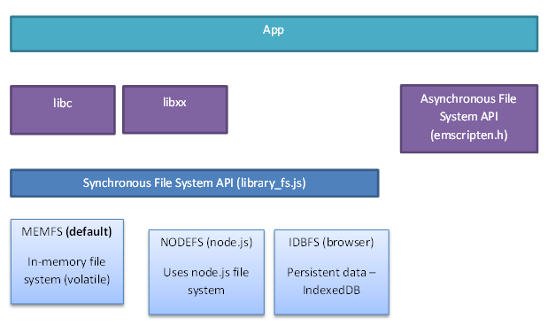
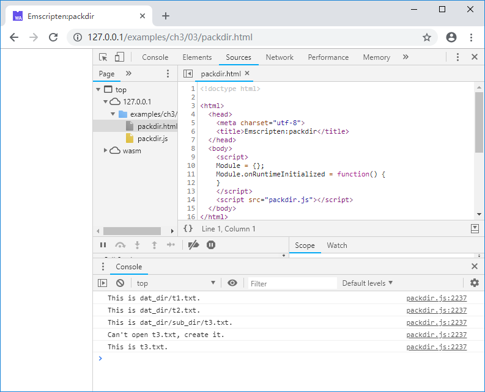

# 3.3 文件系统

跨平台的C/C++程序常使用`fopen()`/`fread()`/`fwrite()`等libc/libcxx提供的同步文件访问函数。在文件系统这一问题上，通常的JavaScript程序与C/C++本地程序有巨大的差异，主要体现在：

1. 运行在浏览器中的JavaScript程序无法访问本地文件系统；
1. 在JavaScript中，无论AJAX还是`fetch()`，都是异步操作。

Emscripten提供了一套虚拟文件系统，以兼容libc/libcxx的同步文件访问函数。

## 3.3.1 Emscripten虚拟文件系统架构

Emscripten虚拟文件系统架构如下图：



> **tips** 异步文件系统API是一组声明于emscripten.h中的函数，只能在Emscripten环境下使用，不符合本书“编译目标不敏感”的理念，故不予介绍。

在最底层，Emscripten提供了三种文件系统，分别为：
1. `MEMFS`：内存文件系统。该系统的数据完全存储于内存中，程序运行时写入的数据在页面刷新或程序重载后将丢失；
1. `NODEFS`：Node.js文件系统。该系统可以访问本地文件系统，可以持久化存储，但只能用于Node.js环境；
1. `IDBFS`：IndexedDB文件系统。该系统基于浏览器的IndexedDB对象，可以持久化存储，但只能用于浏览器环境。

Emscripten同步文件系统API通过JavaScript对象`FS`封装了上述三种文件系统，进而供`fopen()`/`fread()`/`fwrite()`等libc/libcxx文件访问函数调用。

从调用语法的角度来看，C/C++代码与生成本地代码时无异，但要注意不同的底层文件系统有各自的特性，以及由此引发的业务逻辑差异。Emscripten虚拟文件系统所包含的内容非常多，单独成书亦不为过，限于篇幅关系，本节简要介绍基于`MEMFS`的打包文件系统，`NODEFS`与`IDBFS`只给出简单例子，不作过多展开。

## 3.3.2 `MEMFS`/打包文件系统

文件导入`MEMFS`之前，需要先将其打包。文件打包可以在`emcc`命令行中完成，也可以使用单独的文件打包工具`file_packager.py`。

打包时有2种模式：`embed`以及`preload`。在`embed`模式下，文件数据被转换为JavaScript代码；在`preload`模式下，除了生成.js文件外，还会额外生成同名的.data文件，其中包含了所有文件的二进制数据，生成的.js文件中将包含.data文件包下载、装载操作的胶水代码。

> **tips** `embed`模式需要将数据文本化编码，所产生的文件包体积大于`preload`模式，因此除非需要打包的文件总数据量非常小，尽可能使用`preload`模式。

使用`emcc`命令时，`--preload-file`参数用于以`preload`模式打包指定文件或文件夹，相对的，`--embed-file`参数用于以`embed`模式打包指定的文件或文件夹。

例如C代码文件`packfile.cc`所在目录下有一个名为`hello.txt`的文本文件，在`packfile.cc`所在目录下执行以下命令：

```
emcc packfile.cc -o packfile.js --preload-file hello.txt
```

将生成`packfile.js`以及`packfile.data`。`packfile.data`中打包了`hello.txt`。C代码读取`hello.txt`文件内容并执行打印：

```c
//packfile.cc
int main() {
	FILE* fp = fopen("hello.txt", "rt");
	if (fp) {
		while (!feof(fp)) {
			char c = fgetc(fp);
			if (c != EOF) {
				putchar(c);
			}
		}
		fclose(fp);
	}
	return 0;
}
```

控制台将输出：


`--preload-file`参数不仅可以打包单个文件，还可以打包整个目录，例如C代码文件`packdir.cc`所在目录下有一个名为`dat_dir`的文件夹，其结构如下：

```
|--packdir.cc
|--dat_dir
   |--t1.txt
   |--t2.txt
   |--sub_dir
      |--t3.txt
```

在`packdir.cc`所在目录下执行以下命令：

```
emcc packdir.cc -o packdir.js --preload-file dat_dir
```

将生成打包文件`packdir.data`，其中包括了`dat_dir`的所有内容。C代码如下：

```c
//packdir.cc
void read_fs(const char* fname) {
	FILE* fp = fopen(fname, "rt");
	if (fp) {
		while (!feof(fp)) {
			char c = fgetc(fp);
			if (c != EOF) {
				putchar(c);
			}
		}
		fclose(fp);
	}
}

void write_fs() {
	FILE* fp = fopen("t3.txt", "wt");
	if (fp) {
		fprintf(fp, "This is t3.txt.\n");
		fclose(fp);
	}
}

int main() {
	read_fs("dat_dir/t1.txt");
	read_fs("dat_dir/t2.txt");
	read_fs("dat_dir/sub_dir/t3.txt");

	write_fs();
	read_fs("t3.txt");
	return 0;
}
```

控制台将输出：



Emscripten使用UNIX风格的目录分隔符“/”，从C/C++代码的角度来看，打包文件将被载入当前路径下。载入打包文件后，可以创建文件及文件夹，并写入数据，但是这些写入的数据实际上位于JavaScript管理的内存中，当页面刷新后，所有的写入都会丢失。

位于`<emsdk>/<sdk_ver>/tools/`下的Python脚本`file_packager.py`可以单独执行文件打包，例如下列命令以`preload`模式将`dat_dir`目录打包为`fp.data`以及`fp.js`：

```
python emsdk/1.38.11/tools/file_packager.py fp.data --preload dat_dir --js-output=fp.js
```

使用外挂文件包时，主程序编译时必须增加`-s FORCE_FILESYSTEM=1`参数以强制启用文件系统，如：

```
emcc packdir.cc -o packdir_sep.js -s FORCE_FILESYSTEM=1
```

在网页中，必须先引入外挂文件包js，再引入主程序js：

```js
//packdir_sep.html
	<script src="fp.js"></script>
	<script src="packdir_sep.js"></script>
```

上述例子在控制台输出依然为：


> **info** 虽然下载文件包是异步的，但是Emscripten可以确保当运行时准备就绪时，文件系统初始化完成，因此在`Module.onRuntimeInitialized`回调函数中使用文件系统是安全的。

## 3.3.3 `NODEFS`

下面是一个使用`NODEFS`的例子：

```c
//nodefs.cc
void setup_nodefs() {
	EM_ASM(
		FS.mkdir('/data');
		FS.mount(NODEFS, {root:'.'}, '/data');
	);
}

int main() {
	setup_nodefs();

	FILE* fp = fopen("/data/nodefs_data.txt", "r+t");
	if (fp == NULL) fp = fopen("/data/nodefs_data.txt", "w+t");
	int count = 0;
	if (fp) {
		fscanf(fp, "%d", &count);
		count++;
		fseek(fp, 0, SEEK_SET);
		fprintf(fp, "%d", count);
		fclose(fp);
		printf("count:%d\n", count);
	}
	else {
		printf("fopen failed.\n");
	}

	return 0;
}
```

注意`setup_nodefs()`使用`EM_ASM`宏执行了挂接`NODEFS`的JavaScript脚本：`FS.mkdir('/data')`在虚拟文件系统中创建了“/data”目录，`FS.mount(NODEFS, {root:'.'}, '/data')`将当前的本地目录挂接到了上述目录。`main()`函数每次运行会打开`/data/nodefs_data.txt`——对应当前本地目录中的`nodefs_data.txt`，从中读取一个整数，加1后写回。用`emcc`编译上述代码：

```
emcc nodefs.cc -o nodefs.js
```

使用Node多次运行`nodefs.js`，输出如下：

```
> node nodefs.js
count:2
> node nodefs.js
count:3
> node nodefs.js
count:4
```

## 3.3.4 `IDBFS`

下面是一个使用`IDBFS`的例子：

```c
void sync_idbfs() {
	EM_ASM(
		FS.syncfs(function (err) {});
	);
}

EM_PORT_API(void) test() {
	FILE* fp = fopen("/data/nodefs_data.txt", "r+t");
	if (fp == NULL) fp = fopen("/data/nodefs_data.txt", "w+t");
	int count = 0;
	if (fp) {
		fscanf(fp, "%d", &count);
		count++;
		fseek(fp, 0, SEEK_SET);
		fprintf(fp, "%d", count);
		fclose(fp);
		printf("count:%d\n", count);

		sync_idbfs();
	}
	else {
		printf("fopen failed.\n");
	}
}

int main() {
	EM_ASM(
		FS.mkdir('/data');
		FS.mount(IDBFS, {}, '/data');
		FS.syncfs(true, function (err) {
			assert(!err);
			ccall('test', 'v');
		});
	);

	return 0;
}
```

与`NODEFS`类似，`IDBFS`的挂接是通过`FS.mount()`方法完成。事实上在运行时，`IDBFS`仍然是使用内存来存储虚拟文件系统，只不过`IDBFS`可以通过`FS.syncfs()`方法进行内存数据与IndexedDB的双向同步，以达到数据持久化存储的目的。`FS.syncfs()`是异步操作，因此在上述例子中，读写文件的`test()`函数必须在`FS.syncfs()`的回调函数中调用。上述程序在每次刷新页面后，控制台输出的count加1：


