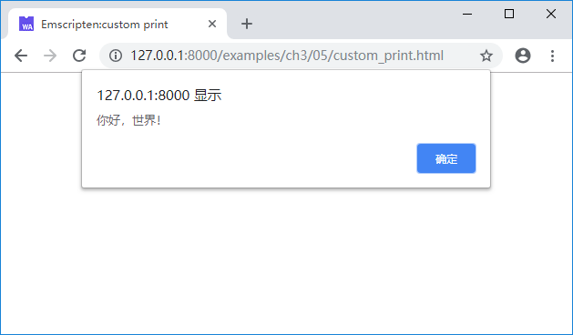
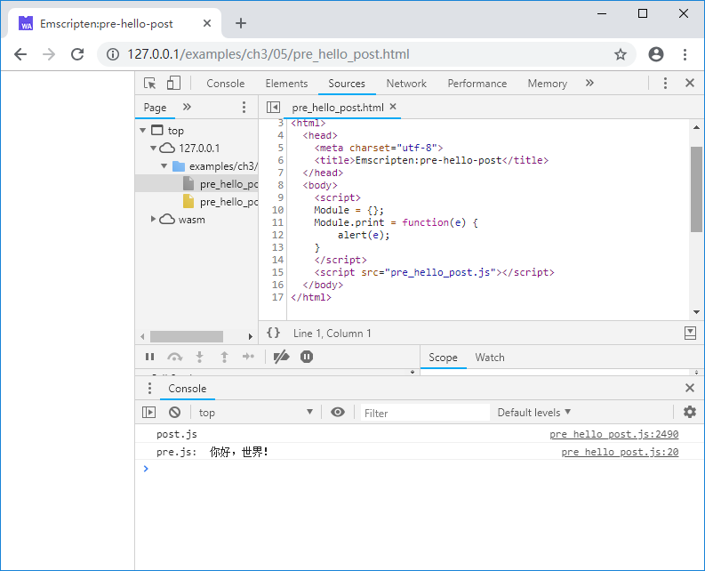

# 3.5 Module定制及其他

JavaScript对象`Module`控制了运行时相关的很多行为。在之前的章节中，我们尝试了：

- 使用`Module.onRuntimeInitialized`回调在运行时准备就绪后执行测试代码。
- 通过更改`Module.TOTAL_MEMORY`设置内存容量。

我们可以使用类似的方法更改`Module`的标准输出行为，例如：

```html
<!--custom_print.html-->
	<script>
	Module = {};
	Module.print = function(e) {
		alert(e);
	}
	</script>
	<script src="hello.js"></script>
```

上述代码将`Module.print`的更改为使用`alert()`函数弹出提示框，上述页面载入1.2节的helloworld例程的.js文件后，输出如下：



除此之外，`Module`对象中提供了`Module.arguments`、`Module.onAbort`、`Module.noInitialRun`等一系列可自定义的对象/方法，具体使用详见Emscripten官方文档[https://kripken.github.io/emscripten-site/docs/api_reference/module.html](https://kripken.github.io/emscripten-site/docs/api_reference/module.html)。

在某些情况下，我们希望在Emscripten生成的.js胶水代码的前后分别插入一些自定义代码（比如在其前部插入C/C++代码将要调用的JavaScript方法、设置`Module`自定义参数等），此时可以使用两个特殊的编译参数：`--pre-js <file>`与`--post-js <file>`。

例如`hello.cc`如下：

```c
//hello.cc
#include <stdio.h>

int main() {
	printf("你好，世界！\n");
	return 0;
}
```

`pre.js`如下：

```js
//pre.js
Module = {};
Module.print = function(e) {
	console.log('pre.js: ', e);
}
```

`post.js`如下：

```js
//post.js
console.log('post.js');
```

使用下列命令编译：

```
emcc hello.cc --pre-js pre.js --post-js post.js -o pre_hello_post.js
```

生成的`pre_hello_post.js`部分内容截取如下：

```js
...
// --pre-jses are emitted after the Module integration code, so that they can
// refer to Module (if they choose; they can also define Module)
Module = {};
Module.print = function(e) {
	console.log('pre.js: ', e);
}
// Sometimes an existing Module object exists with properties
// meant to overwrite the default module functionality. Here
// we collect those properties and reapply _after_ we configure
// the current environment's defaults to avoid having to be so
// defensive during initialization.
var moduleOverrides = {};

...

run();
// {{POST_RUN_ADDITIONS}}
// {{MODULE_ADDITIONS}}
console.log('post.js');
```

可见其中将包含三个部分：

1. `pre.js`中的内容；
1. `hello.cc`编译后产生的.js文件中的内容；
1. `post.js`中的内容。

上述页面运行后输出如下：



> **tips** 注意控制台先输出了“post.js”，因为wasm模块是异步加载的。
