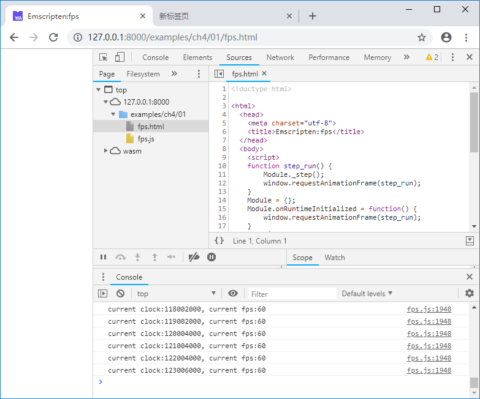

# 4.1 消息循环分离

3.2节我们介绍了使用`emscripten_set_main_loop()`维护消息循环的方法，本节将讨论不推荐使用该系列函数的理由及解决方法。

# 4.1.1 `emscripten_set_main_loop()`的不足

大体上，消息循环的作用可以归结为：

1. 保持程序处于活动状态；
1. 解析并处理各种消息（输入事件、定时事件等）。

针对上述第1点，3.1节中提到，在新版的Emscripten（v1.37.26以后）环境下，运行时默认不随`main()`函数退出而退出，`Module`在网页关闭前一直可用，因此无需使用`emscripten_set_main_loop()`来保持程序处于活动状态。

参考`em_callback_func`的定义：

```c
typedef void (*em_callback_func)(void);
```

不难发现，消息回调函数没有参数，这事实上导致**Emscripten内建的消息循环并不能携带消息信息**，它并不具备事件分发及处理功能，在大多数情况下只能起到循环定时器的作用，如果需要完整的基于事件驱动的模块，仍然需要提供额外的事件入口。

大多数操作系统级消息循环都是围绕着特定的`消息体`展开的（比如Windows的`MSG`结构体），跨平台编程时（WebAssembly事实上也是平台的一种），将这些与操作系统紧密相关的部分从核心逻辑代码中分离出去是通行的做法。在实际工程项目中，笔者倾向于将C/C++代码封装为C API形式的带状态库，消息循环外置，以达到兼容WebAssembly环境和本地环境的目的。

# 4.1.2 在JavaScript中创建定时循环

JavaScript本身是事件驱动型的语言，因此对于仅由事件驱动而无需定时执行的C/C++模块来说，只要在JavaScript中特定事件发生时调用模块提供的对应事件处理函数即可——第7章将介绍GUI事件驱动的例子。

对于需要定时执行的应用，JavaScript中有很多方法可以实现，包括：`setTimeout()`、`setInterval()`、`window.requestAnimationFrame()`等。需要定时执行的应用中，有相当一部分是基于Web的动态图形渲染应用，这类应用往往需要稳定的执行间隔和平滑的帧率，此时使用`window.requestAnimationFrame()`是最佳选择，语法：

```js
requestId = window.requestAnimationFrame(cb_func);
```

参数`cb_func`是一个回调函数，浏览器下一帧重绘之前会调用该函数。实际应用中会在回调函数内部再次调用`window.requestAnimationFrame()`，形如：

```js
    function step_func() {
        //do sth.
        window.requestAnimationFrame(step_func);
    }
```

这样每次浏览器重绘前都会执行`step_func()`函数。

浏览器的重绘帧率与显示设备的重绘帧率是同步对齐的，例如下列C代码中`step()`函数统计并输出帧率：

```c
//loop.cc
#include <emscripten.h>
#include <stdio.h>
#include <time.h>

EM_PORT_API(void) step() {
	static int count = 0;
	static long cb = clock();	

	long t = clock();
	if (t - cb >= CLOCKS_PER_SEC) {
		cb = t;
		printf("current clock:%ld, current fps:%d\n", t, count);
		count = 0;
	}
	count++;
}
```

JavaScript代码如下：

```html
<!--loop.html-->
	<script>
	function step_run() {
		Module._step();
		window.requestAnimationFrame(step_run);
	}
	Module = {};
	Module.onRuntimeInitialized = function() {
		window.requestAnimationFrame(step_run);
	}
	</script>
	<script src="fps.js"></script>
```

浏览器控制台将输出：



> **tips** 事实上Emscripten内建的消息循环使用的也是类似的机制，把它单独拿出来一方面是为了让大家更好的理解Emscripten的运行过程；另一方面笔者认为大多数C/C++程序员对代码有很强的“控制欲”。