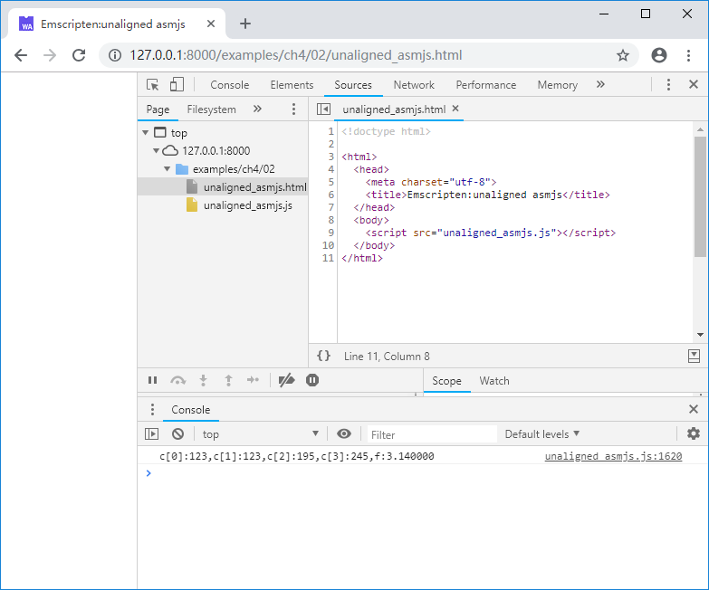
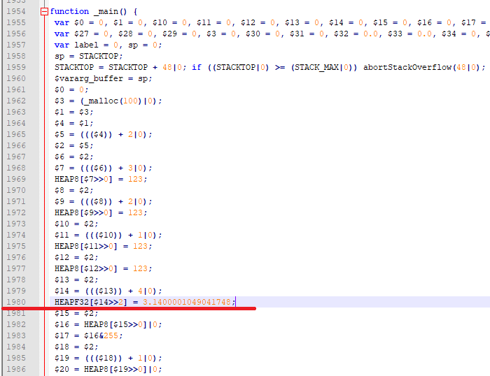
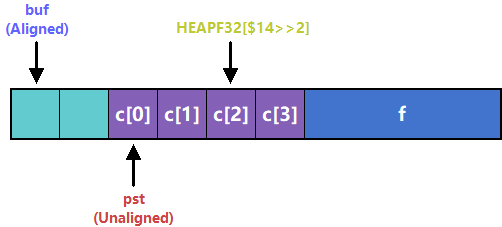
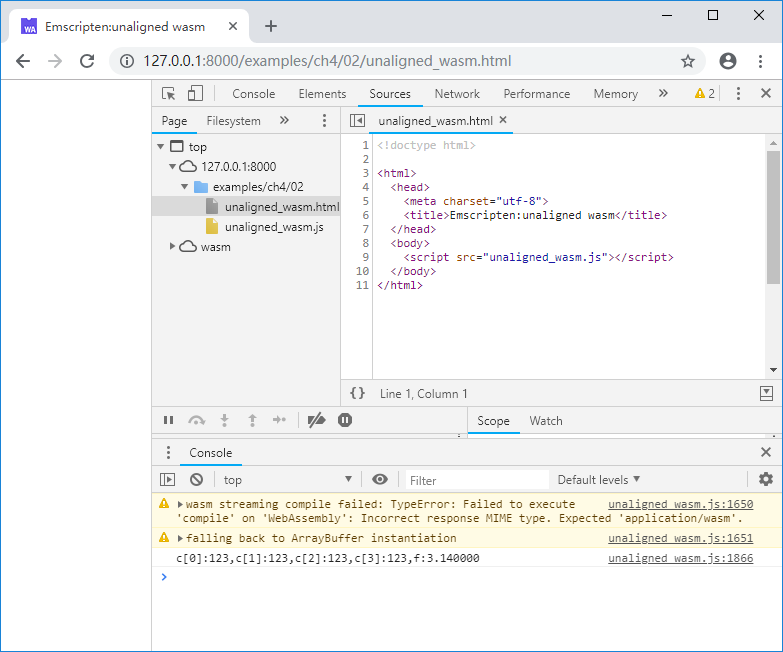
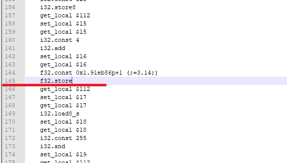
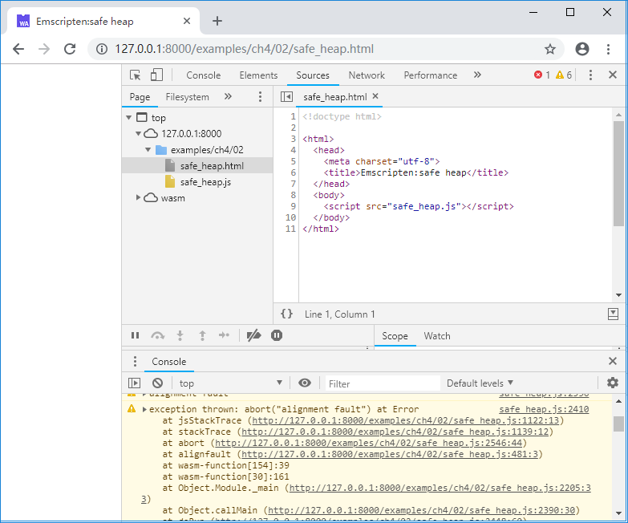

# 4.2 内存对齐

当目标指令集为x86/x64时，未对齐的内存读写不会导致错误的结果；而在Emscripten环境下，编译目标为`asm.js`与WebAssembly时，情况又各有不同。

> **info** 这里“未对齐”的含义是：欲访问的内存地址不是欲访问的数据类型大小的整数倍。

## 4.2.1 `asm.js`

C代码如下：

```c
//unaligned.cc
struct ST {
	uint8_t	c[4];
	float	f;
};

int main() {
	char *buf = (char*)malloc(100);
	ST *pst = (ST*)(buf + 2);

	pst->c[0] = pst->c[1] = pst->c[2] = pst->c[3] = 123;
	pst->f = 3.14f;

	printf("c[0]:%d,c[1]:%d,c[2]:%d,c[3]:%d,f:%f\n",
		pst->c[0], pst->c[1], pst->c[2], pst->c[3], pst->f);

	free(buf);
	return 0;
}
```

使用下列命令以`asm.js`为目标进行编译：

```
emcc unaligned.cc -s WASM=0 -o unaligned_asmjs.js
```

浏览页面后控制台输出如下：



发生了什么？`pst->c[2]`、`pst->c[3]`的值为何变了？我们来看生成的JavaScript代码：



注意看C代码`pst->f = 3.14f;`对应的第1980行：

```js
 HEAPF32[$14>>2] = 3.1400001049041748;
```

以`asm.js`为目标时，读写内存中某种基本类型的数据，是通过该类型对应的`HEAP`视图（`TypedArray`）完成的，如上例中访问`float`型变量时使用的是类型为`Float32Array`的`HEAPF32`，而`TypedArray`天然是对齐的，无法正确读写未对齐的地址所指向的数据。

对C语言来说，`malloc`函数返回的地址可以确保与所有基本数据类型对齐（至少为8字节，对应`double`类型），上述例子中`ST *pst = (ST*)(buf + 2);`导致`pst->f`的地址无法满足`float`型的4字节对齐，因此访问`pst->f`的C代码编译为`asm.js`后实际上是向前越界的：



## 4.2.2 WebAssembly

上述例子，如果将编译目标恢复为WebAssembly：

```
emcc unaligned.cc -o unaligned_wasm.js
```

浏览页面后控制台输出如下：



很戏剧化吧，为何编译为WebAssembly后数据是正确的？

因为WebAssembly虚拟机的内存读写指令即使地址未按相应类型对齐，也可以正确执行，比如本例编译为wasm后的`f32.store`指令：



这是否意味着以WebAssembly为编译目标就可以忽略内存对齐的问题呢？不，原因在于：

1. 地址未对齐时，WebAssembly指令的执行性能会下降；
1. 当需要通过内存在C/C++与JavaScript之间传递大量数据时，仍然绕不过内存的`TypedArray`视图（比如在C/C++中组合渲染数据后交由WebGL进行绘制）。

## 4.2.3 避免及检测未对齐的内存操作

大多数未对齐的内存操作都源自强制变更指针类型，比如本节例程中将`char *`变更为`ST *`，然而这种用法很难彻底避免，比如序列化/反序列化、使用缓冲池存储多种类型的数据等。当混用缓冲区时，应仔细设计存储结构，使其每种类型的数据均对齐到最大长度的数据类型——比如某个缓冲区中需要同时存储字符串和`double`，那么字符串长度应向上对齐到8字节，以保证对其中的所有数据访问都是对齐的。

在默认编译选项下，未对齐的内存操作引发的数据错误是静默的，难以排查错误。使用`SAFE_HEAP=1`选项进行编译可以检查未对齐的内存操作。使用该选项后，运行中产生未对齐的内存读写时，会抛出异常。例如使用以下命令编译：

```
emcc unaligned.cc -s SAFE_HEAP=1 -o safe_heap.js
```

浏览页面后控制台将输出：



从控制台输出的异常信息栈我们可以知道引发了未对齐内存操作的函数及该操作在函数中的大致位置。

无论编译目标是`asm.js`还是WebAssembly，`SAFE_HEAP`模式都可以检测未对齐的内存操作。当然在该模式下，程序的运行性能会受较大影响，应仅在测试时使用。