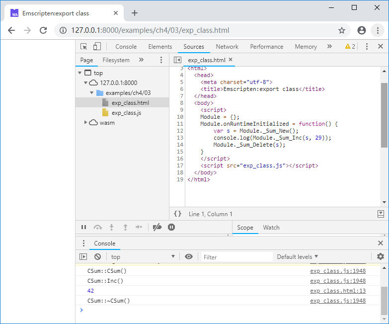
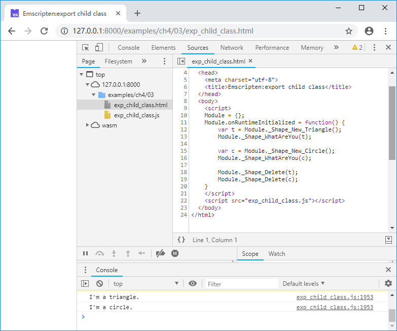

# 4.3 使用C接口导出C++对象

在Emscripten中使用`Embind`和`WebIDL Binder`都可以将C++对象导出至JavaScript，但笔者在实际工程中并没有使用这两种方法，一方面是因为这些方法是侵入式的，另一方面更重要的是，笔者对于“是否应该使用C++类作为库接口”本身持保留态度——设计出一个糟糕的C++接口的可能性远高于设计出一个糟糕的C接口——当然这并不意味着反对使用C++，事实上C++是笔者日常使用的主力语言，只不过从接口设计的角度来说，笔者认为应该避免让C++类的复杂性溢出库边界，因此使用C接口导出C++对象就成了自然的选择。

我们先定义一个简单的类`CSum`，它有一个公有函数`Inc()`用于执行累加操作，一个私有成员`m_nSum`用于存放累加值：

```cpp
//exp_class.cpp
class CSum {
public:
	CSum() {
		printf("CSum::CSum()\n");
		m_nSum = 13;
	}
	virtual ~CSum() {
		printf("CSum::~CSum()\n");
	}

	int Inc(int i){
		printf("CSum::Inc()\n");
		m_nSum += i;
		return m_nSum;
	}
private:
	int m_nSum;
};
```

接下来我们定义两个导出函数，分别用于执行`CSum`类的`new`和`delete`操作：

```cpp
//exp_class.cpp
struct Sum;

EM_PORT_API(struct Sum*) Sum_New() {
	CSum *obj = new CSum();
	return (struct Sum*)obj;
}

EM_PORT_API(void) Sum_Delete(struct Sum* sum) {
	CSum *obj = (CSum*)sum;
	delete obj;
}
```

`Sum_New()`的返回值和`Sum_Delete()`的参数，事实上就是`CSum`对象在堆中的地址。这里额外定义了空结构体`Sum`，并使用`Sum*`作为`CSum`对象的指针类型，既避免了使用`void*`导致的类型不明，又可以在编译阶段提供强制类型检测。

接下来我们定义导出函数`Sum_Inc()` ，它的首个参数是一个`Sum*`型的指针（既`CSum`对象的地址）：

```cpp
//exp_class.cpp
EM_PORT_API(int) Sum_Inc(struct Sum* sum, int i) {
	CSum *obj = (CSum*)sum;
	return obj->Inc(i);
}
```

至此就完成了`CSum`类的导出，在JavaScript中调用`Sum_New()`创建`CSum`对象并调用其公有成员函数：

```js
//exp_class.html
	Module.onRuntimeInitialized = function() {
		var s = Module._Sum_New();
		console.log(Module._Sum_Inc(s, 29));
		Module._Sum_Delete(s);
	}
```

浏览页面后控制台输出如下：



> **tips** 由于内存模型的差异，C++中的`对象`和JavaScript中的`对象`结构完全不同，`Module._Sum_New()`返回的是新建的`CSum`对象在Module堆中地址，**而非JavaScript对象**。这种方法本质上是将C++对象的地址用作JavaScript和C++沟通的桥梁。

显然带有继承关系的子类对象也可以用同样的方法导出，例如：

```cpp
//exp_child_class.cpp
class CShape {
public:
	CShape() {};
	virtual ~CShape() {};

	virtual void WhatAreYou() = 0;
};

class CTriangle : public CShape {
public:
	CTriangle() {}
	virtual ~CTriangle() {}

	void WhatAreYou(){ printf("I'm a triangle.\n") ;}
};

class CCircle : public CShape {
public:
	CCircle() {}
	virtual ~CCircle() {}

	void WhatAreYou(){ printf("I'm a circle.\n") ;}
};

//-----------------------------------

struct Shape;

EM_PORT_API(struct Shape*) Shape_New_Triangle() {
	CTriangle *obj = new CTriangle();
	return (struct Shape*)obj;
}

EM_PORT_API(struct Shape*) Shape_New_Circle() {
	CCircle *obj = new CCircle();
	return (struct Shape*)obj;
}

EM_PORT_API(void) Shape_Delete(struct Shape* shape) {
	CShape *obj = (CShape*)shape;
	delete obj;
}

EM_PORT_API(void) Shape_WhatAreYou(struct Shape* shape) {
	CShape *obj = (CShape*)shape;
	obj->WhatAreYou();
}
```

在JavaScript中分别创建2个子类对象：

```js
//exp_child_class.html
	Module.onRuntimeInitialized = function() {
		var t = Module._Shape_New_Triangle();
		Module._Shape_WhatAreYou(t);

		var c = Module._Shape_New_Circle();
		Module._Shape_WhatAreYou(c);

		Module._Shape_Delete(t);
		Module._Shape_Delete(c);
	}
```

浏览页面后控制台输出如下：


