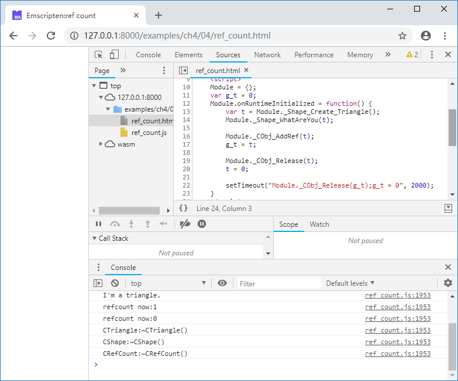

# 4.4 C++对象生命周期控制

C++没有GC机制，当C++对象被导出到JavaScript环境后，必须使用某种方法进行对象生命周期管理，以彻底杜绝野指针、内存泄漏，引用计数无疑是最常用的方法。

## 4.4.1 引用计数基类

对象生命周期管理需要解决的问题是：当一个对象可能在多个地方被引用时，如何决定何时将其销毁。引用计数法解决这一问题的途径非常简单：

- 每个对象自带一个初值为0的引用计数；
- 对象的每个使用者，在获得一个对象的引用时，将其引用计数加1；
- 对象的使用者在使用完该对象后，并不直接销毁它，而是将其引用计数减1；当引用计数降为0时，说明已经没有任何使用者持有该对象的引用，可以将其安全的销毁。

C++中一般通过在基类中添加`AddRef()`和`Release()`成员函数来实现引用计数的增减，例如：

```cpp
#include <atomic>

#ifndef SAFE_RELEASE
	#define SAFE_RELEASE(p) { if(p) { (p)->Release(); (p)=NULL; } }
#endif

class CRefCount {
public:
	CRefCount() : m_ref_count(1) {}
	virtual ~CRefCount() {}

	void AddRef() {
		m_ref_count++;
	}
	
	int Release() {
		int t = --m_ref_count;
		if (t == 0) delete this;
		return t;
	}

protected:
	std::atomic<int> m_ref_count;
};
```

`CRefCount`构造时其引用计数成员`m_ref_count`设为1，因为当我们创建`CRefCount`的实例时立即获得了该对象的引用（指针），此时引用计数就应为1。计数成员`m_ref_count`为`std::atomic<int>`型，该类型可以保证在多线程条件下的原子操作，避免并发读写错误。

## 4.4.2 `AddRef()`/`Release()`使用规则

`AddRef()`/`Release()`的使用一般遵循以下规则：

1. 当对象的引用从一个内存位置拷贝到另一个内存位置的时候，应该调用`AddRef()`；当一个内存位置所指向的内存引用不再使用时，应该调用`Release()`并将该内存位置设为`null`；
1. 如果一个内存位置之前保存了一个非空对象A的引用，在向其中写入另一个非空对象B的引用时，应该先调用A对象的`Release()`，以通知A对象不再被使用，然后再调用B对象的`AddRef()`；
1. 多个内存位置之间的对象引用的关系有特殊约定时，可以省略多余的`AddRef()`/`Release()`。

第1条与第2条相对好理解，比较麻烦的是第3条，例如：

```cpp
	CRefCount* obj = new CRefCount();

	obj->AddRef();
	//do sth. with obj:
	Func(obj);
	obj->Release();
	
	SAFE_RELEASE(obj);
```

围绕`Func(obj)`上下的`AddRef()`和`Release()`事实上是不必要的，因为`obj`在执行`Func(obj)`的过程中始终是有效的；再比如：

```cpp
void Func(CRefCount* obj) {
	if (!obj) return;

	obj->AddRef();
	CRefCount* temp = obj;
	//do sth. with temp:
	//...
	SAFE_RELEASE(temp);
}
```

`obj->AddRef()`和`temp->Release()`也是无必要的，因为局部变量`temp`的生命周期与`Func()`函数一致，已被包含在`obj`的生命周期中。

引用计数增减规则可以简化为：
1. 对于传入的对象，如果将其保存到了其他的位置，调用`AddRef()`，否则可不调用；
1. 对于传出的对象，无论是通过返回值传出，还是通过指针参数传出，都要调用`AddRef()`；
1. 对于传入/传出的对象（既使用指针引用参数，在函数内部更改了引用参数的情况），先`Release()`，更改后`AddRef()`；
1. 不清楚的情况下，一律加上`AddRef()`/`Release()`。

第1~3条分别对应以下例子：

第1条：
```cpp
void Func(CRefCount* obj) {
	//do sth. with obj:
	//...
}
```

第2条：

```cpp
CRefCount* g_obj = new CRefCount();
CRefCount* GetGlobalObj() {
	g_obj->AddRef();
	return g_obj;
}
```

第3条：

```cpp
CRefCount* g_obj = new CRefCount();
void UpdateObj(CRefCount*& obj) {
	SAFE_RELEASE(obj);
	g_obj->AddRef();
	obj = g_obj;
}
```

## 4.4.3 导出`AddRef()`/`Release()`

根据4.3节的介绍，如果所有的C++对象都继承自同一个`CRefCount`基类，那么只需要导出`CRefCount`的`AddRef()`/`Release()`即可，无需单独为每个子类导出引用计数增减函数。例如：

```cpp
//ref_count.cpp
#include <stdio.h>
#include <atomic>

#ifndef SAFE_RELEASE
	#define SAFE_RELEASE(p) { if(p) { (p)->Release(); (p)=NULL; } }
#endif

class CRefCount {
public:
	CRefCount() : m_ref_count(1) {}
	virtual ~CRefCount() { printf("CRefCount:~CRefCount()\n"); }

	void AddRef() {
		m_ref_count++;
	}
	
	int Release() {
		int t = --m_ref_count;
		printf("refcount now:%d\n", t);
		if (t == 0) delete this;
		return t;
	}

protected:
	std::atomic<int> m_ref_count;
};

struct RefCount;

EM_PORT_API(void) CObj_AddRef(struct RefCount* obj) {
	CRefCount *ro = (CRefCount*)obj;
	ro->AddRef();
}

EM_PORT_API(int) CObj_Release(struct RefCount* obj) {
	CRefCount *ro = (CRefCount*)obj;
	if (ro) {
		return ro->Release();
	}
	else return 0;
}

//-----------------------------------

class CShape : public CRefCount{
public:
	CShape() {}
	virtual ~CShape() { printf("CShape:~CShape()\n"); }

	virtual void WhatAreYou() = 0;
};

struct Shape;

EM_PORT_API(void) Shape_WhatAreYou(struct Shape* shape) {
	CShape *obj = (CShape*)shape;
	obj->WhatAreYou();
}

//-----------------------------------

class CTriangle : public CShape {
public:
	CTriangle() {}
	virtual ~CTriangle() { printf("CTriangle:~CTriangle()\n"); }
	
	void WhatAreYou(){ printf("I'm a triangle.\n"); }
};

EM_PORT_API(struct Shape*) Shape_Create_Triangle() {
	CTriangle *obj = new CTriangle();
	return (struct Shape*)obj;
}
```

JavaScript代码如下：
```js
//ref_count.html
	Module = {};
	var g_t = 0;
	Module.onRuntimeInitialized = function() {
		var t = Module._Shape_Create_Triangle();
		Module._Shape_WhatAreYou(t);

		Module._CObj_AddRef(t);
		g_t = t;

		Module._CObj_Release(t);
		t = 0;
		
		setTimeout("Module._CObj_Release(g_t);g_t = 0", 2000);
	}
```

浏览页面，过2秒后控制台输出如下：



至此，我们完成了C++对象的导出及生命周期控制。