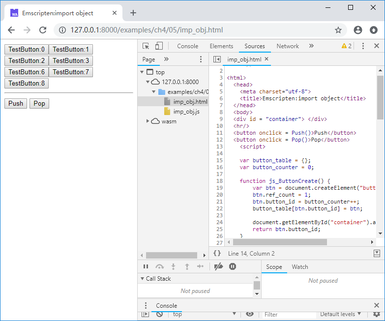
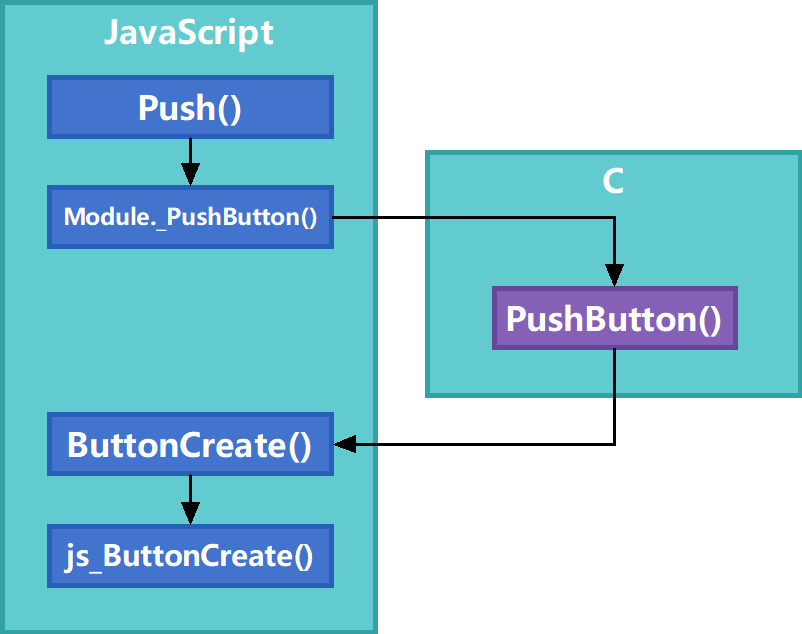

# 4.5 使用C接口注入JavaScript对象

4.3、4.4节介绍了如何将C++对象导出到JavaScript环境，本节将介绍其逆操作，既：将JavaScript对象注入到C环境。

## 4.5.1 创建JavaScript对象/ID表

无论从内存模型的角度，还是从运行模型的角度，C原生代码都无法直接访问JavaScript中的对象。为此，我们需要提供一种途径，让C环境可以识别不同的JavaScript对象，最容易想到的，就是使用对象/ID表，该方法的核心是：

- 为每个将要被注入C环境的JavaScript对象分配一个不重复的整数ID，并将对象/ID的关系记录在一张表中；
- 将对象的ID传入C环境，C环境使用该整数ID指代实际的JavaScript对象；
- C环境中的代码通过注入函数操作某个对象时，注入函数通过ID反查实际的JavaScript对象并操作它。

> **tips** 事实上这种方法与4.3节中介绍的C++对象导出方法使用的是相同的思路，区别仅在于4.3节中使用的是C++对象的地址来指代C++对象本身。

下面的JavaScript代码是一个简单的使用对象/ID表的例子：

```js
var obj_table = {};
var obj_counter = 0;

function MyObj_Create() {
	this.name = "MyObj";
	this.obj_id = obj_counter++;
	obj_table[this.obj_id] = this;
}

function MyObj_Func(obj_id) {
	if (!obj_table[obj_id]) return;
	//do sth. with obj_table[obj_id]
}
```

`obj_table`是对象/ID表；构造器方法`MyObj_Create()`创建一个新的对象时，将为该对象分配ID，并在`obj_table`中保存对应关系；`MyObj_Func()`方法通过传入的`obj_id`参数反查对应的对象，并使用它。

## 4.5.2 注入JavaScript对象的生命周期控制

JavaScript对象注入C环境后，仍然需要对其进行生命周期控制。4.4节使用的`AddRef()`/`Release()`方法同样可行。

例如我们定义一组JavaScript方法如下：

```js
//imp_obj.html
	var button_table = {};
	var button_counter = 0;

	function js_ButtonCreate() {
		var btn = document.createElement("button");
		btn.ref_count = 1;
		btn.button_id = button_counter++;
		button_table[btn.button_id] = btn;

		document.getElementById("container").appendChild(btn);
		return btn.button_id;
	}

	function js_ButtonAddRef(button_id) {
		if (!button_table[button_id]) return;

		button_table[button_id].ref_count++;
	}

	function js_ButtonRelease(button_id) {
		if (!button_table[button_id]) return -1;

		var btn = button_table[button_id];
		btn.ref_count--;
		var rc = btn.ref_count;
		if (rc == 0) {
			document.getElementById("container").removeChild(btn);
			delete button_table[button_id];
		}
		return rc;
	}

	function js_ButtonSetInnerHtml(button_id, name) {
		if (!button_table[button_id]) return;
		button_table[button_id].innerHTML = name;
	}
```

`js_ButtonCreate()`用于在DOM中创建按钮，`js_ButtonAddRef()`/`js_ButtonRelease()`分别用于增减按钮的引用计数，`js_ButtonSetInnerHtml()`用于设置指定按钮的内部html内容。参照4.5.1节，这4个函数围绕按钮/ID表`button_table`工作。

然后我们使用2.2节的方法将这些方法注入到C环境中，导入库代码如下：

```js
//pkg.js
mergeInto(LibraryManager.library, {
	ButtonCreate: function () {
		return js_ButtonCreate();
	},

	ButtonAddRef: function (button_id) {
		js_ButtonAddRef(button_id);
	},

	ButtonRelease: function (button_id) {
		return js_ButtonRelease(button_id);
	},

	ButtonSetInnerHtml: function(button_id, str) {
		js_ButtonSetInnerHtml(button_id, Pointer_stringify(str));
	}
})
```

C接口及导出函数如下：

```c
//imp_obj.cpp
struct JS_BUTTON;
EM_PORT_API(struct JS_BUTTON*) ButtonCreate();
EM_PORT_API(void) ButtonAddRef(struct JS_BUTTON* btn);
EM_PORT_API(int) ButtonRelease(struct JS_BUTTON* btn);
EM_PORT_API(void) ButtonSetInnerHtml(struct JS_BUTTON* btn, const char* str);

//-----------------------------------

std::vector<struct JS_BUTTON*> g_buttons;

EM_PORT_API(void) PushButton() {
	JS_BUTTON* btn = ButtonCreate();
	char name[256];
	sprintf(name, "TestButton:%d", (int)btn);
	ButtonSetInnerHtml(btn, name);
	g_buttons.push_back(btn);
}

EM_PORT_API(void) PopButton() {
	if (g_buttons.size() <= 0) return;
	JS_BUTTON* btn = g_buttons.back();
	ButtonRelease(btn);
	g_buttons.pop_back();
}
```

使用下列命令编译：

```
emcc imp_obj.cpp --js-library pkg.js -o imp_obj.js
```

然后我们在网页中创建两个按钮，并分别在其`onclick`事件中调用`PushButton()`/`PopButton()`：

```html
  <button onclick = Push()>Push</button>
  <button onclick = Pop()>Pop</button>
	<script>
	......

	function Push(){
		Module._PushButton();
	}

	function Pop(){
		Module._PopButton();
	}
```

浏览页面，点击`Push`/`Pop`，可以看到DOM中创建/删除了多个按钮：



调用顺序如下图所示：

