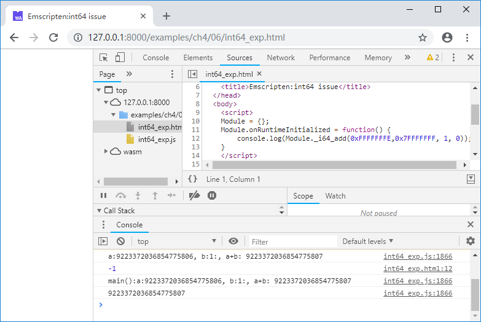
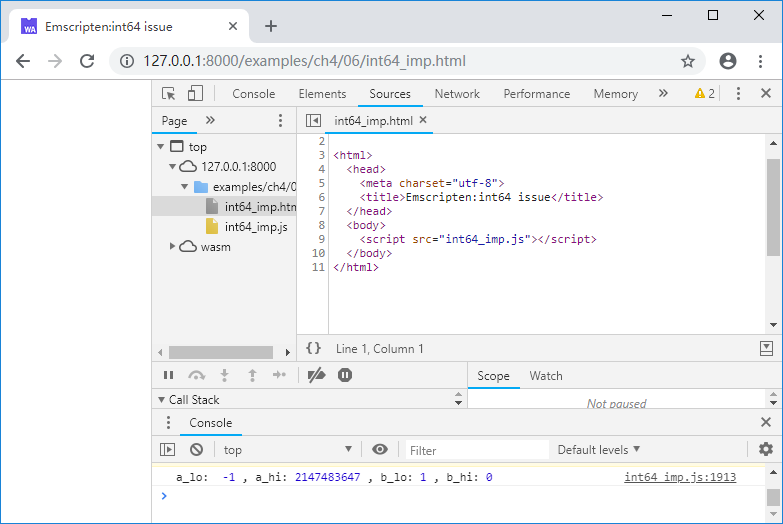

# 4.6 小心`int64`

本节将介绍Emscripten中64位整型数支持的一些问题。

## 4.6.1 WebAssembly原生支持`int64`

首先，WebAssembly原生支持64位整型数算术运算。例如C代码如下：

```c
//int64.cc
int main() {
	int64_t a = 9223372036854775806; //0x7FFFFFFFFFFFFFFE
	a += 1;
	printf("%lld\n", a);
}
```

浏览页面后控制台输出如下：


可见`int64`加法运算可以正常执行，`printf()`亦可正常输出结果。然而，如果C/C++试图与JavaScript交换64位整型数就会遇到麻烦。

## 4.6.2 导出函数包含`int64`

JavaScript只有一种数值类型：`number`——等同于C语言中的`double`，JavaScript本质上无法直接表达64位整型数，因此目前的WebAssembly规范中存在这么一条尴尬的限制：

> **info** WebAssembly导出函数不能使用64位整型数作为参数或返回值，一旦在JavaScript中调用参数或返回值类型为64位整型数的WebAssembly函数，将抛出`TypeError`，详见《WebAssembly标准入门》3.7节。

由于该限制的存在，Emscripten做了如下妥协：

- 当导出函数的某个参数为64位整型数时，将其拆分为低32位、高32位两个参数进行传送；
- 当导出函数的返回值为64位整型数时，在JavaScript中仅能接收其低32位。

例如下列C函数定义：

```c
int64_t func(int64_t a, int64_t b)
```

导出至JavaScript后将变为：

```c
int32_t func(int32_t a_lo, int32_t a_hi, int32_t b_lo, int32_t b_hi)
```

其中`a_lo`/`a_hi`分别为`a`的低32位/高32位；`b_lo`/`b_hi`类同。

例如C代码如下：

```c
//int64_exp.cc
EM_PORT_API(int64_t) i64_add(int64_t a, int64_t b) {
	int64_t c = a + b;
	printf("a:%lld, b:%lld:, a+b: %lld\n", a, b, c);
	return c;
}

int main() {
	printf("main():");
	printf("%lld\n", i64_add(9223372036854775806, 1));
}
```

在JavaScript中调用导出函数`i64_add()`时应使用如下方法：

```js
//int64_exp.html
	Module = {};
	Module.onRuntimeInitialized = function() {
		console.log(Module._i64_add(0xFFFFFFFE,0x7FFFFFFF, 1, 0));
	}
```

浏览页面后控制台输出如下：



注意前两行输出对应JavaScript中的`console.log(Module._i64_add(0xFFFFFFFE,0x7FFFFFFF, 1, 0));`，可以看到每个`int64`切分为2个`int32`后传入C代码中正确执行了加法，但返回值仅保留了低32位（0xFFFFFFFF）为-1。而后两行输出对应C中的`printf("%lld\n", i64_add(9223372036854775806, 1));`算术运算的结果和输出都是正确的。

## 4.6.2 注入函数包含`int64`

使用2.2节的方法，在JavaScript中实现C函数接口时，如果该函数接口的参数包含了64位整型数，也会按照同样的方式进行低32位/高32位的拆分，例如C函数`i64_func()`接口如下：

```c
//int64_imp.cc
EM_PORT_API(void) i64_func(int64_t a, int64_t b);

int main() {
	i64_func(0x7FFFFFFFFFFFFFFF, 1);
}
```

注入库的JavaScript方法会收到4个参数，依次为`a_lo`、`a_hi`、`b_lo`、`b_hi`：

```js
//pkg.js
mergeInto(LibraryManager.library, {
	i64_func: function (a_lo, a_hi, b_lo, b_hi) {
		console.log('a_lo: ', a_lo, ', a_hi:', a_hi, ', b_lo:', b_lo, ', b_hi:', b_hi);
	}
})
```

使用下列命令编译：

```
emcc int64_imp.cc --js-library pkg.js  -o int64_imp.js
```

浏览页面后控制台输出如下：



## 4.6.3 小结

由上述例子可见，由于JavaScript自身的缺陷，包含`int64`参数/返回值的C函数在Emscripten中导入导出时会发生意外的形变。 修改JavaScript标准，使其原生支持64位整型数的呼声一直很高，在这一天真的到来之前，笔者的建议是：尽量不要在JavaScript与C/C++之间交换`int64`。
