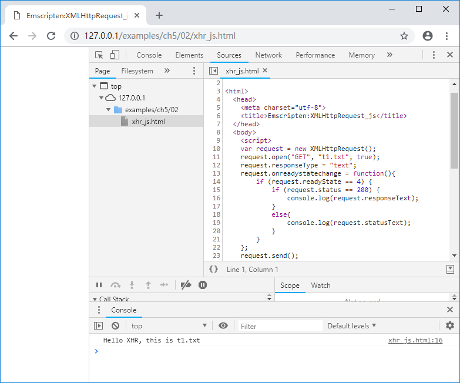
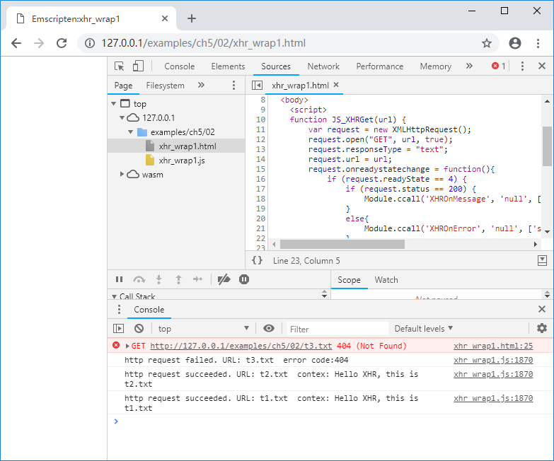
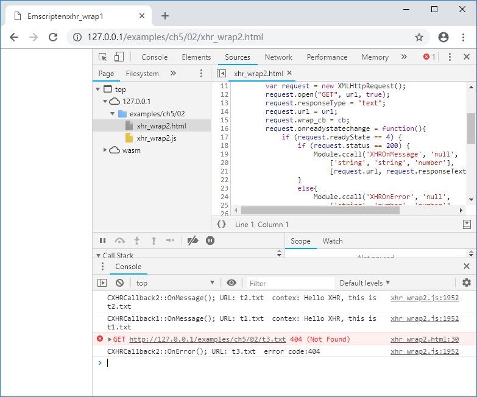

# 5.1 XMLHttpRequest

HTTP协议是Web环境下最常用的传输协议，本节将介绍在Emscripten中使用`XMLHttpRequest`对象进行HTTP数据传输。

## 5.1.1 XMLHttpRequest对象简介

下列JavaScript代码是使用`XMLHttpRequest`对象获取HTTP数据的例子：

```js
	var request = new XMLHttpRequest();
	request.open("GET", "t1.txt", true);
	request.responseType = "text";	
	request.onreadystatechange = function(){
		if (request.readyState == 4) {
			if (request.status == 200) {
				console.log(request.responseText);
			}
			else{
				console.log(request.statusText);
			}
		}
	};
	request.send();
```

上述代码创建了一个`XMLHttpRequest`对象`request`，使用异步`GET`方法获取远端*t1.txt*的数据，并通过设置的`onreadystatechange`回调事件打印获取到的字符串。浏览页面，控制台输出如下：



> **info**  关于`XMLHttpRequest`的更多详细资料，可参考[https://developer.mozilla.org/zh-CN/docs/Web/API/XMLHttpRequest](https://developer.mozilla.org/zh-CN/docs/Web/API/XMLHttpRequest)

## 5.1.2 `XMLHttpRequest`对象的C接口封装

为了避免UI挂起，通常情况下我们使用异步模式发起HTTP请求，因此`XMLHttpRequest`对象的C封装接口分为两个部分：

1. 由JavaScript实现，供C调用。包括创建`XMLHttpRequest`对象、发起HTTP请求等主动行为；
1. 由C实现，供JavaScript调用。包括各种事件的回调。

来看C部分的代码：

```c
//xhr_wrap1.cpp

//imp by JavaScript, call by C:
EM_PORT_API(void) XHRGet(const char* url);

//imp by C, call by JavaScript:
EM_PORT_API(void) XHROnMessage(const char* url, const char* data){
	printf("http request succeeded. URL: %s  contex: %s\n", url, data);
}

EM_PORT_API(void) XHROnError(const char* url, const int error_code){
	printf("http request failed. URL: %s  error code:%d\n", url, error_code);
}

int main(){
	XHRGet("t1.txt");
	XHRGet("t2.txt");
	XHRGet("t3.txt");
}
```

`XHRGet()`是在JavaScript中实现的，导入库部分代码如下：

```js
//pkg1.js
mergeInto(LibraryManager.library, {
    XHRGet: function (url) {
        return JS_XHRGet(Pointer_stringify(url));
    },
})
```

`XHRGet()`调用了`JS_XHRGet()`方法，其位于"xhr_wrap1.html"中：

```js
//xhr_wrap1.html
	function JS_XHRGet(url) {
		var request = new XMLHttpRequest();
		request.open("GET", url, true);
		request.responseType = "text";	
		request.url = url;
		request.onreadystatechange = function(){
			if (request.readyState == 4) {
				if (request.status == 200) {
					Module.ccall('XHROnMessage', 'null',
						['string', 'string'], [request.url, request.responseText]);
				}
				else{
					Module.ccall('XHROnError', 'null',
						['string', 'number'], [request.url, request.status]);
				}
			}
		};
		request.send();
	}
```

使用以下命令编译：

```
emcc  xhr_wrap1.cpp --js-library pkg1.js -s "EXTRA_EXPORTED_RUNTIME_METHODS=['ccall']" -o xhr_wrap1.js
```

浏览器打开页面后，控制台输出：



可以看到程序正确的处理了返回值，并且**由于使用了异步HTTP请求，返回的顺序与请求的顺序并不一致**。

## 5.1.3 扩展回调处理

有时候我们在C++中有多个对象都需要发起HTTP请求，而每个对象处理HTTP返回的方式各不相同，此时5.1.2节中的封装方法将无法满足需要。因此，我们需要参考4.3节的方法对封装进行改进，C代码如下：

```c
//xhr_wrap2.cpp
struct XHR_CB;

//imp by JavaScript, call by C:
EM_PORT_API(void) XHRGet(const char* url, XHR_CB* cb);

//XHR callback interface:
class CXHRCallbackInterface{
public:
	CXHRCallbackInterface(){}
	virtual ~CXHRCallbackInterface(){}
	
	virtual void OnMessage(const char* url, const char* data) = 0;
	virtual void OnError(const char* url, const int code) = 0;
};

//XHR callback1:
class CXHRCallback1 : public CXHRCallbackInterface{
public:
	CXHRCallback1(){}
	virtual ~CXHRCallback1(){}
	
	void OnMessage(const char* url, const char* data) {
		printf("CXHRCallback1::OnMessage(); URL: %s  contex: %s\n", url, data);
	}
	void OnError(const char* url, const int code) {
		printf("CXHRCallback1::OnError(); URL: %s  error code:%d\n", url, code);
	}
};

//XHR callback2:
class CXHRCallback2 : public CXHRCallbackInterface{
public:
	CXHRCallback2(){}
	virtual ~CXHRCallback2(){}
	
	void OnMessage(const char* url, const char* data) {
		printf("CXHRCallback2::OnMessage(); URL: %s  contex: %s\n", url, data);
	}
	void OnError(const char* url, const int code) {
		printf("CXHRCallback2::OnError(); URL: %s  error code:%d\n", url, code);
	}
};

//imp by C, call by JavaScript:
EM_PORT_API(void) XHROnMessage(const char* url, const char* data, XHR_CB* cb){
	CXHRCallbackInterface* ci = (CXHRCallbackInterface*)cb;
	ci->OnMessage(url, data);
}

EM_PORT_API(void) XHROnError(const char* url, const int code, XHR_CB* cb){
	CXHRCallbackInterface* ci = (CXHRCallbackInterface*)cb;
	ci->OnError(url, code);
}

CXHRCallback1 cb1;
CXHRCallback2 cb2;

int main(){
	XHRGet("t1.txt", (XHR_CB*)&cb1);
	XHRGet("t2.txt", (XHR_CB*)&cb2);
	XHRGet("t3.txt", (XHR_CB*)&cb2);
}
```

JavaScript导入库代码如下：

```js
//xhr_wrap2.pkg
mergeInto(LibraryManager.library, {
    XHRGet: function (url, cb) {
        return JS_XHRGet(Pointer_stringify(url), cb);
    },
})
```

```js
//xhr_wrap2.html
	function JS_XHRGet(url, cb) {
		var request = new XMLHttpRequest();
		request.open("GET", url, true);
		request.responseType = "text";	
		request.url = url;
		request.wrap_cb = cb;
		request.onreadystatechange = function(){
			if (request.readyState == 4) {
				if (request.status == 200) {
					Module.ccall('XHROnMessage', 'null',
						['string', 'string', 'number'],
						[request.url, request.responseText, request.wrap_cb]);
				}
				else{
					Module.ccall('XHROnError', 'null',
						['string', 'number', 'number'],
						[request.url, request.status, request.wrap_cb]);
				}
			}
		};
		request.send();
	}
```

以上代码的核心思想在于：我们为每个`XHRGet()`请求绑定了一个回调处理对象`cb`，当HTTP请求完成时，将调用绑定的`cb`对象用于处理事件。

使用以下命令编译：

```
emcc  xhr_wrap2.cpp --js-library pkg2.js -s "EXTRA_EXPORTED_RUNTIME_METHODS=['ccall']" -o xhr_wrap2.js
```

浏览页面后，控制台输出如下：

