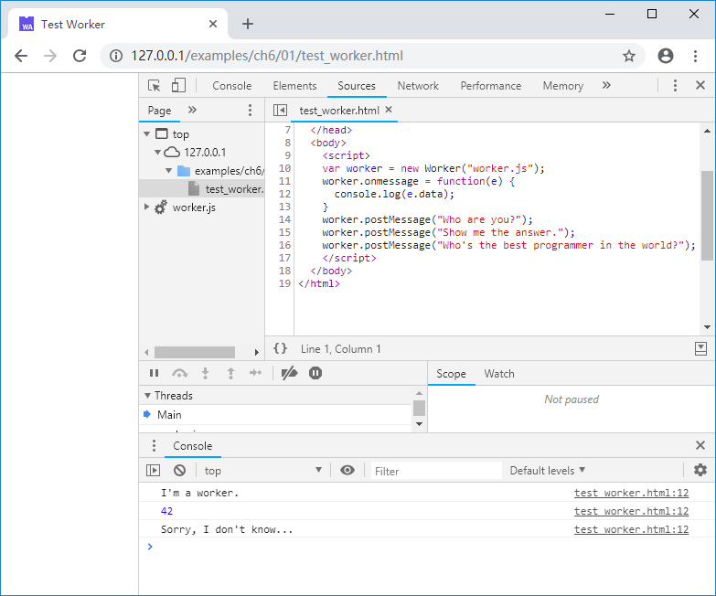

# 6.1 JavaScript中的并发模型

本节将通过实例介绍JavaScript中的并发模型。

## 6.1.1 JavaScript并发模型简介

使用C语言开发过本地多线程程序的开发者想必对进程、线程的关系并不陌生，其中最重要的莫过于：

> 进程内的所有线程共享相同的内存地址空间。

因此上大部分多线程的C程序都工作于**共享内存**的模式下，线程之间可以无障碍的通过内存交换数据，但与此同时，对竞争性资源的管理事实上成为了多线程编程中最常遇到的问题——相信被写同步、死锁折磨过的开发员不在少数。

与此形成鲜明对比的是，在JavaScript中虽然能通过`Worker`对象启动多个线程并发执行，但是`Worker`与`Worker`之间、`Worker`与主线程之间不能共享内存，从这个角度来看，`Worker`的行为更接近进程而非线程。

> **info** 部分最新的浏览器支持可在`Worker`间共享的`SharedArrayBuffer`对象，但这种仅针对特定对象的共享与C语境下的线程间完全共享内存并不在同一层次。目前使用`SharedArrayBuffer`有可能遇到兼容性问题，因此本书的讨论基于`Worker`间无法共享内存的假设。

C语言开发者或许不太习惯于“不依赖共享内存的并发模型”，然而这类模型并不鲜见，比如Go语言所采用的CSP模型。类似的，JavaScript中父子`Worker`之间可以通过互相发送消息来进行任务的分发和并发执行。

## 6.1.2 `Worker`使用例子

在JavaScript中，创建一个`Worker`需要指定该`Worker`对应的JavaScript脚本文件的URL地址，例如下列代码：

```js
//test_worker.html
    var worker = new Worker("worker.js");
    worker.onmessage = function(e) {
      console.log(e.data);
    }
    worker.postMessage("Who are you?");
    worker.postMessage("Show me the answer.");
    worker.postMessage("Who's the best programmer in the world?");
```

`new Worker("worker.js");`创建了一个`Worker`对象，并指定该`Worker`使用`worker.js`。`worker.onmessage`回调函数用于处理`worker`发送过来的消息。`worker.postMessage()`用于向`worker`发送消息。

`Worker`部分的代码如下：

```js
//worker.js
onmessage = function(e){
  if (e.data == "Who are you?") {
    postMessage("I'm a worker.");
  }
  else if (e.data == "Show me the answer.") {
    postMessage(42);
  }
  else {
    postMessage("Sorry, I don't know...")
  }
}
```

在`Worker`中，`onmessage`回调函数用于处理父线程发送过来的消息，`postMessage()`用于向父线程发送消息。在本例中，根据来自父线程的不同消息，作出了不同的回应。浏览页面，控制台输出如下：

